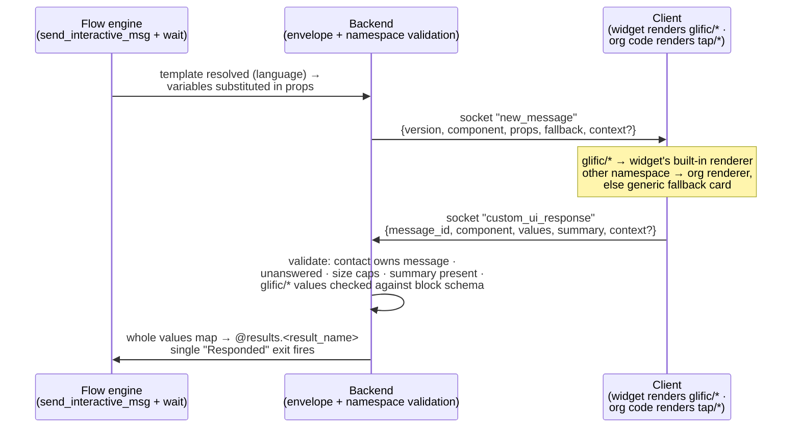

# Glific Web Channel — Custom UI Messages

**Status:** Draft for review · **Author:** Vignesh Rajasekaran

Design for a new kind of interactive message that carries **rich UI as JSON** to web-channel
contacts. It has two tiers, split by a **namespace on the component name**:

- **`glific/*` — built-in blocks.** A small catalog Glific owns, publishes schemas for, and
  **pre-renders in its own widget**: a selectable image panel, a selectable image carousel, and a
  simple inline form. Composed from shared primitives (`text`, `image`, `input`, `option`).
- **Any other namespace (e.g. `tap/*`) — custom components.** Org-owned and opaque: the org's own
  client (their PWA, a forked widget, an API consumer) renders them however it wants. Glific
  enforces a **fallback text**, which is all Glific surfaces and other channels show.

Both tiers ride one envelope contract: payload out, response back — the response carries a
required human-readable `summary` (printed in history and the inbox) plus a `values` JSON map
that lands in flow results.

Motivation: on WhatsApp the UI ceiling is Meta's (lists, reply buttons, WhatsApp Flows). On the web
there is no such ceiling, and partner orgs (TAP, Reapbenefit, Antarang, ATREE) are already building
their own front-ends. Built-in blocks give no-dev orgs rich UI out of the box; the custom namespace
is the escape hatch for experiences Glific never anticipated — without Glific building or reviewing
any org UI.

**Parent doc:** [Web channel technical design](./tech-design.md) — transport, deployment, and
message-path architecture this builds on.

---

## 1. The contract

One round trip: the flow sends an envelope, the client answers with a response, the flow continues.



**Outbound envelope** (org-authored server-side; `@contact.fields.x` / `@results.x` substituted
anywhere inside `props` at send time):

```jsonc
{
  "version": "1",                    // envelope version; client below it renders fallback
  "component": "tap/course_picker",  // namespaced: glific/* reserved, anything else org-owned
  "props": { "...": "anything" },    // opaque for org namespaces; schema-checked for glific/*
  "fallback": "Pick a course: reply with its name",   // required plain text — every template
  "context": { "...": "optional" }   // author-set, echoed back verbatim
}
```

**Response** (client → socket) — identical shape for both tiers:

```jsonc
{
  "message_id": 4211,                 // the outbound custom-UI message being answered
  "component": "tap/course_picker",   // echo
  "values": { "selected": "c2", "score": 8 },  // keyed by ids from props → flow results
  "summary": "Picked Digital skills", // required plain string → history + inbox
  "context": { "...": "echoed" }
}
```

Key properties:

- **The namespace decides who interprets `props`.** `glific/*` props are validated against
  Glific's published block schemas at template save and render natively in the widget. Any other
  namespace is opaque — Glific validates only the envelope, never the org's vocabulary. What
  `tap/course_picker` means is between the org's template and the org's client, even if its JSON
  happens to reuse primitive-like field names.
- **`fallback` is first-class and required on every template**, both tiers. It is the outbound
  message `body`, so the staff inbox, notifications, non-web channels, and any client without a
  renderer show meaningful text — the same pattern as Slack's top-level `text` and Adaptive
  Cards' `fallbackText` (§8). For `glific/*` blocks the editor pre-fills a suggested fallback
  derived from block content; for custom components the author writes it.
- **`summary` is the human-readable result** — rendered as the contact's reply bubble in history
  and the staff inbox — while `values` carries the machine-readable result into flow results.
  The widget auto-builds the summary for `glific/*` blocks (e.g. the selected option's label);
  org clients supply their own.
- **Single-submit.** One response per message; late or duplicate responses are rejected. Answered
  messages carry a completed state so every surface renders them disabled with the summary.

## 2. Built-in blocks (`glific/*`)

The v0 catalog is deliberately small — three blocks that cover the demo-proven needs (the
course-picker use case, product/course browsing, short structured input):

| Block | What the widget renders | Response `values` |
|-------|------------------------|-------------------|
| `glific/image_panel` | Grid of tappable images with labels; single-select | `{ "<id>": "<option id>" }` |
| `glific/carousel` | Swipeable image cards (image, title, description) with a select action | `{ "<id>": "<card id>" }` |
| `glific/form` | Inline form of labelled fields with a submit button | `{ "<field id>": "<value>", ... }` |

Blocks are **composed from shared primitives**, so the catalog grows by composition rather than
one-off schemas:

- `text` — static copy (labels, headings, helper text)
- `image` — an image with alt text
- `input` — a typed entry field (`text` in v0; `number`, `date`, `select`, `multiselect` are the
  natural next primitives — see §10)
- `option` — a selectable item (id + label + optional image)

Example — the Marathi course-picker as a built-in block, no org code at all:

```jsonc
{
  "version": "1",
  "component": "glific/image_panel",
  "props": {
    "id": "course",
    "body": "Hi @contact.fields.name, pick a course",
    "options": [
      { "id": "c1", "image": "https://…/english.png", "label": "Spoken English" },
      { "id": "c2", "image": "https://…/digital.png", "label": "Digital skills" }
    ]
  },
  "fallback": "Reply with a course: Spoken English or Digital skills"
}
```

Rules of the namespace:

- **`glific/*` is reserved.** Templates may only use `glific/*` names that exist in the published
  catalog — unknown `glific/foo` is rejected at save. Orgs publish under their own prefix
  (`tap/*`, `reapbenefit/*`); the org namespace is free-form and never validated beyond the
  envelope.
- **Typing follows rendering control.** `glific/*` blocks are typed and schema-validated — both
  `props` at save and `values` on response — because Glific renders and therefore interprets
  them. Org namespaces stay generic: a type system with no Glific-side interpreter could only
  drift from the org's real client and then lie. (This resolves the typed-vs-generic props
  question: both positions are right, in different namespaces.)

## 3. Authoring — a fourth interactive message type

Custom UI is **not a new flow node**. It is a new type on the existing Interactive Messages page —
"Custom UI", next to Reply buttons / List / Location request — and flows attach it through the
existing *Send Interactive Message* node. That reuses, unchanged: template storage
(`interactive_templates.interactive_content`), per-language translations, whole-map variable
substitution, and the flow editor itself (**zero floweditor fork changes**).

The v0 authoring form ([interactive mockup][mockup], reviewable in-browser):

1. **Type**: "Custom UI" — badged *web-only for now*, with an inline hint that flows serving
   WhatsApp contacts should route them around it (publishing warns if they don't).
2. **Start from** — a preset gallery seeded with the built-in blocks (Image panel / Carousel /
   Form) plus Blank. Block presets pre-fill valid `glific/*` payloads that the widget renders
   richly as-is; Blank starts an org-namespace payload.
3. **Payload** — a JSON editor with validation on save (envelope for all; full block schema for
   `glific/*`) and a live size meter.
4. **Fallback text** — required, translatable per language tab; pre-suggested for block presets.
5. **Preview** — truthful per namespace: `glific/*` payloads show the real block rendering;
   org-namespace payloads show exactly what Glific surfaces will show — the generic fallback card
   ("Interactive · ‹component›", fallback text, collapsible payload, text input) — and the
   answered state (dimmed card + "✓ Answered" + response summary).

[mockup]: https://claude.ai/code/artifact/564d091f-4386-47fe-9932-1475312b3952

A visual **block builder** (compose blocks from a form instead of writing JSON) remains v1 — it
emits the same `glific/*` payloads, so nothing in this contract changes when it arrives.

**One template, channel renderings inside.** The committed long-term authoring model is a single
template record whose *renderings* vary per channel (the same axis as translations, resolved at
delivery time), never one-template-per-channel picked in the flow editor. The shared core — option
ids, title, fallback, translations — lives once, so the response ids that flows branch on
(`@results.picker.selected`) are identical on every channel *by construction*. In v0 this is a
two-entry waterfall in miniature: web rendering = the payload; every other channel = the fallback
text. Channel tabs join the language tabs in the editor only when a third rendering actually
exists.

## 4. Flow-engine behaviour

- **Send**: the existing `send_interactive_msg` action resolves the template, substitutes variables
  across the payload map, and creates a message (`type: :custom_ui`, `body` = fallback text,
  `interactive_content` = envelope). Delivery rides the channel seam from the
  [parent design](./tech-design.md) unchanged.
- **Wait + route**: the standard wait applies. A `custom_ui_response` takes a **single "Responded"
  exit** (mirroring how `whatsapp_form_response` routes today); branching happens on
  *split-by-expression* nodes reading `@results`. No new router case operators, no new floweditor UI.
- **Results**: the whole `values` map is copied into `@results.<result_name>` in one shot,
  normalized the same way webhook responses are (nested maps kept, lists become index-keyed maps).
  Note the expression parser resolves at most 5 dot-segments (`@results.a.b.c.d`), so response
  values should stay reasonably flat — the built-in blocks' values are flat by design.
- **Contact updates are explicit.** The response never auto-writes contact fields — authors chain
  `set_contact_field` nodes copying from `@results`. Deliberate: the response originates in an
  untrusted browser, and auto-applying it would let any end user write arbitrary contact fields
  (see §6).
- **Typed responses on fallback surfaces**: the generic card accepts typed text — valid JSON object
  → sent as `values` verbatim (testers can hand-type exact payloads in the simulator); anything
  else → `{"input": "<text>"}`. Either way the Responded exit fires, so flows behave identically
  whether a block renderer, an org renderer, or the fallback card answered.

## 5. Channel model — how this survives RCS / Telegram / Signal

Everything is named and gated **channel-neutrally from day one**, even though only web renders it
in v0:

- Enum values `:custom_ui` / `:custom_ui_response` (PG enum values cannot be renamed — only added —
  so a web-branded name would either lie on future channels or force a data migration).
- A small **channel capability module** — `ChannelCapability.supports?(channel, :custom_ui)` —
  replaces hardcoded `channel == "web"` checks. Only web returns true in v0; a future channel adds
  one declaration, never a rename, migration, or flow change.
- **Unsupported channels send the fallback text** (plus a staff notification) rather than skipping
  silently. The contact always sees something and can reply; their text reply routes through the
  router's ordinary text cases (authors add keyword cases or an Other exit for non-web contacts).
  No flow ever parks silently at the wait. This *is* the generic degradation path Signal/SMS will
  need — built once, in v0.

The two namespaces have different long-term portability:

| Tier | Who defines it | Portability |
|------|----------------|-------------|
| `glific/*` blocks (partially v0) | Glific | Portable: Glific can ship per-channel translators — native web rendering now; later RCS rich cards, Telegram inline keyboards, WhatsApp interactive approximations — falling back to text where nothing fits. Translation is possible precisely because Glific owns the semantics. |
| Org namespaces (v0) | The org | Only channels where the org controls the client (web, embedded apps). Everywhere else → fallback text, always. Glific *cannot* translate what it doesn't define. |

Plus an escape hatch on the template: **per-channel payload variants** (the renderings axis from
§3) for orgs that want exact native control on a specific channel. One flow node, N channel
renderings, same response ids everywhere — flows stay intact as channels are added.

## 6. Security

The response JSON comes from an end user's browser: **attacker-controlled input**. The model
follows the platform baseline (Slack mandates verifying interaction payloads server-side; §8):

- **Transport identity**: the OTP-authenticated socket is the identity — a response is accepted
  only on the contact's own channel topic.
- **Correlation**: the response must reference an *outstanding, unanswered* custom-UI message
  belonging to that contact. Unknown ids, duplicates, and late responses are rejected
  (single-submit).
- **Namespace enforcement**: templates may not use unpublished `glific/*` names (reserved
  namespace, validated at save). `glific/*` responses are validated against the block's expected
  values shape; org-namespace responses get envelope-only validation.
- **Envelope validation for all**: `component` and `summary` required, summary length-capped,
  whole response within a byte cap, bounded JSON depth. Org-namespace `values` are stored and
  exposed to flows as opaque, untrusted data.
- **No trusted side effects from the response**: no auto contact-field writes (§4); the only
  authority the response has is filling `@results`, which the org's flow author explicitly chose to
  read.
- **Size caps**: outbound payload ~64 KB (Intercom's canvas cap magnitude), inbound response
  ~16 KB. Suggested magnitudes, to be finalized in implementation.

## 7. Changes by repository

| Repo | Changes |
|------|---------|
| **glific** (backend) | Enum migration adding `:custom_ui` + `:custom_ui_response`; `ChannelCapability` module; envelope validation on template save and response receipt + block-schema validation for `glific/*` (catalog module with published block schemas); `send_interactive_msg` path handles the custom template type (fallback-text body, unsupported-channel fallback send + notification); publish-time flow validation warning; one router clause (response → results, mirroring `whatsapp_form_response`); socket `handle_in("custom_ui_response")` with correlation checks; answered-state persistence on the outbound message; serializer passes envelope + answered state through. |
| **glific-frontend** (staff console) | "Custom UI" type in the Interactive Messages page: block preset gallery, JSON editor + per-namespace validation, required translatable fallback field, per-namespace preview (§3). Staff Chat inbox + flow simulator render the generic fallback card and answered states (native block rendering in staff surfaces can follow later). |
| **glific-web-channel** (widget) | Built-in renderers for `glific/image_panel`, `glific/carousel`, `glific/form` (shared primitive components: text/image/input/option); renderer registry (`register(component, fn)`) for org namespaces, resolved before the generic fallback card; auto-built summaries for block responses; lenient typed-response input on the fallback card; answered/disabled rendering in history; `custom_ui_response` socket push. |
| **floweditor** (fork) | **None.** The existing Send Interactive Message node carries the new template type; no new node, no fork release. |

Lands on the prototype branches first (`web-channel-prototype` + widget + staff frontend), like the
rest of the channel. Chosen-carefully-because-permanent regardless of branch: the two enum values,
the template type name, the envelope field names, and the `glific/*` block names + their schemas.

## 8. Prior art (verified against primary docs)

The envelope follows conventions that Slack Block Kit, Microsoft Adaptive Cards, and Intercom
Canvas Kit — three independent platforms shipping JSON-described UI to third-party renderers —
**all converged on**:

- **String discriminator per payload** (`type` everywhere; ours is `component` to avoid colliding
  with Glific's message-level type). [Slack Block Kit], [Adaptive Cards], [Canvas Kit]
- **Responses keyed by author-assigned ids, never position** — Slack's `state.values`
  (block_id → action_id → value), Intercom's `input_values` keyed by component id. Ours: `values`
  keyed by ids in `props`.
- **A required plain-text fallback travels with every rich payload** — Slack's top-level `text`
  (also the accessibility/notification text), Adaptive Cards' `fallbackText` with
  version-negotiation semantics ("client below `version` renders `fallbackText`") — the exact rule
  our `version` + `fallback` pair adopts.
- **Author context echoed verbatim** — Slack's `value`, Adaptive Cards' `Action.Submit data`
  ("essentially hidden properties"). Ours: `context`.
- **Client interaction payloads are untrusted and verified server-side** — Slack mandates
  signing-secret verification; our socket auth + correlation checks are the equivalent (§6).
- **Answered messages get replaced, not left live** — Intercom replaces the submitted canvas with a
  new state and emits a `completed` event for bots to continue; our answered-card + summary +
  single Responded exit mirrors this.
- **Typed where the platform renders, opaque where it doesn't** — Slack types its block elements
  but passes `value` through untyped; Adaptive Cards types card inputs but `Action.Submit data` is
  an opaque blob. Our namespace split (`glific/*` typed, org namespaces generic) draws the same
  boundary.

Where platforms diverge (wrapper nesting, version placement, single-vs-multi submit), Glific chose
the simplest shape that fits single-valued flow results: a flat envelope and single-submit.

[Slack Block Kit]: https://docs.slack.dev/block-kit/
[Adaptive Cards]: https://adaptivecards.io/explorer/
[Canvas Kit]: https://developers.intercom.com/docs/canvas-kit

## 9. Design decisions & alternatives considered

- **Namespaced two-tier vocabulary** — `glific/*` built-in blocks (typed, schema-validated,
  widget-rendered) + free org namespaces (generic, opaque, org-rendered). *Alternatives
  considered:* a single opaque tier with no built-ins (rejected: no-dev orgs get nothing rich, and
  the PM-raised need for typed elements — date/number/dropdown — has nowhere enforceable to
  live); a single Glific-typed vocabulary for everything (rejected: caps orgs at what Glific
  builds — the exact WhatsApp limitation being escaped — and types without a Glific-side
  interpreter can only drift from the org's real client). The boundary rule: **typing follows
  rendering control**.
- **Org-namespace components stay opaque even when their JSON resembles Glific primitives** —
  Glific never interprets `tap/*` props. *Alternative:* letting orgs compose Glific primitives so
  the widget could auto-render org blocks (deferred as an open question — attractive, but it turns
  the primitive set into a public API overnight).
- **New template type on the existing node, not a new floweditor node** — *Alternative:* a
  dedicated `send_custom_ui` node with inline JSON (rejected: floweditor fork is the costliest
  repo to change; a node textarea is worse authoring UX than a full-page editor; template-level
  JSON is reusable across flows).
- **New message type mirroring `whatsapp_form_response`** — *Alternatives:* reusing
  `:whatsapp_form_response` (rejected: wired to Gupshup nfm post-processing — GCS/Sheets workers —
  and a lying name forever); JSON in a text body (rejected: raw JSON in the inbox, pollutes keyword
  matching, ambiguous with real text).
- **Results-only; no auto contact-field writes** — *Alternatives:* template-allowlisted auto-apply
  (viable, deferred — adds a trust surface for a convenience `set_contact_field` already provides);
  unrestricted auto-apply (rejected: any end user could overwrite any contact field via DevTools).
- **Single Responded exit** — *Alternatives:* routing on a summary-as-body string (rejected in
  favour of the whatsapp-form precedent; `summary` still gives inbox readability); new JSON case
  operators (rejected: fork UI + router surface for power split-by-expression already has).
- **Fallback text sent on unsupported channels** — supersedes an earlier warn-and-skip position;
  once `fallback` became a required envelope field, sending it costs nothing and no flow parks
  silently. *Alternative:* skip + park at wait (rejected: dead silence for WhatsApp contacts in
  shared flows).
- **One template with channel renderings vs per-channel templates + flow picker** — argued both
  ways; one-template wins on correctness: response ids stay identical across channels by
  construction rather than by convention, the flow graph stays channel-agnostic, and no fork
  changes. Per-channel independence (lifecycle, fidelity) is recoverable later as channel tabs
  and linked overrides *inside* the single record.

## 10. Scope

| | v0 (prototype) | v1+ |
|---|---|---|
| Contract | Full envelope + response, namespace rules, validation, single-submit, answered state | Envelope `version` bumps as needed |
| Built-in blocks | `glific/image_panel`, `glific/carousel`, `glific/form` rendered natively in the end-user widget; `input` primitive = text only | More primitives (`number`, `date`, `select`, `multiselect`), more blocks by composition; native block rendering in staff inbox + simulator |
| Custom namespaces | Full support: opaque payloads, org renderers via registry, enforced fallback | Possible org-shared renderer packages |
| Authoring | Custom UI type: block preset gallery + JSON editor + fallback; per-namespace preview | Visual block builder emitting the same `glific/*` payloads; channel-rendering tabs |
| Channels | Web renders; all others send fallback text | RCS / Telegram capability declarations + block translators; template channel variants |
| Fields | `@results` only | Possible template-allowlisted contact-field auto-apply |

## 11. Open questions

1. **Block schema spec** — freeze the exact `props`/`values` schemas for the three v0 blocks and
   the primitive set (`text`, `image`, `input`, `option`), including how block schemas version
   independently of the envelope `version`.
2. **Byte caps** — finalize outbound/inbound limits (64 KB / 16 KB are researched magnitudes, not
   measurements against our payloads).
3. **Org blocks from Glific primitives** — should a future version let orgs compose the published
   primitives under their own namespace and get widget auto-rendering (making the primitive set a
   public API), or do org namespaces stay permanently opaque?
4. **WhatsApp Flows alignment** — should the response wrapper align field-for-field with the
   `nfm_reply.response_json` shape Glific already consumes, so flow logic can treat a WhatsApp Flow
   and a web Custom UI response uniformly?
5. **Preset/doc home** — where the block schemas and org-namespace payload documentation live for
   org developers.
6. **History depth for answered state** — whether answered-state updates re-broadcast to open
   sockets or only apply on next history fetch.
