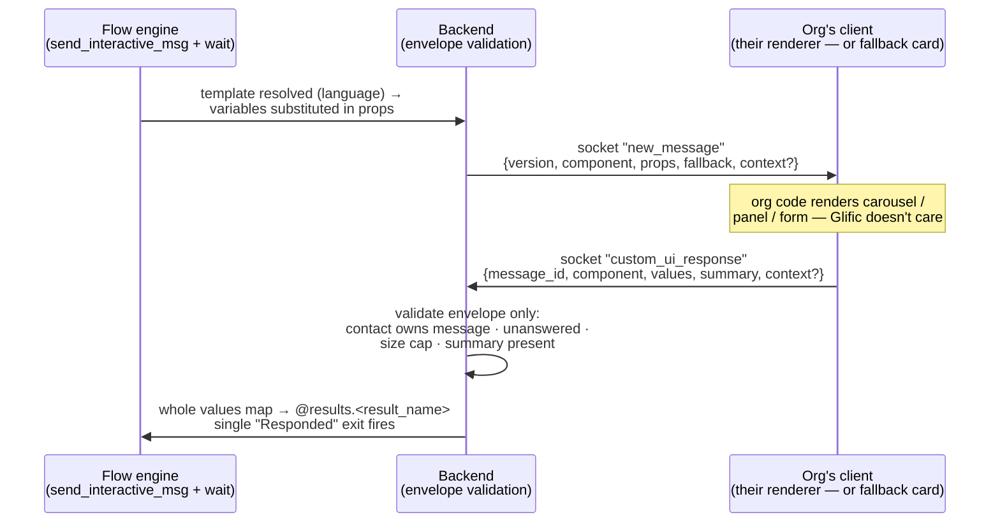

# Glific Web Channel — Custom UI Messages

**Status:** Draft for review · **Author:** Vignesh Rajasekaran

Design for a new kind of interactive message that lets an org ship **rich, org-designed UI**
(carousels, image panels, multi-field forms) to web-channel contacts. Glific defines only a small
**JSON envelope contract** — payload out, response back — and never the component vocabulary: the
org's own client (their PWA, a forked widget, or any API consumer) renders the UI however it wants.
Every Glific-owned surface (default widget, staff inbox, flow simulator) shows a **generic fallback
card** instead.

Motivation: on WhatsApp the UI ceiling is Meta's (lists, reply buttons, WhatsApp Flows). On the web
there is no such ceiling, and partner orgs (TAP, Reapbenefit, Antarang, ATREE) are already building
their own front-ends. This is the seam that lets them design experiences Glific never anticipated —
without Glific building or reviewing any of their UI.

**Parent doc:** [Web channel technical design](./tech-design.md) — transport, deployment, and
message-path architecture this builds on.

---

## 1. The contract

One round trip: the flow sends an envelope, the client answers with a response, the flow continues.



**Outbound envelope** (org-authored server-side; `@contact.fields.x` / `@results.x` substituted
anywhere inside `props` at send time):

```jsonc
{
  "version": "1",                    // envelope version; client below it renders fallback
  "component": "carousel",           // org's opaque discriminator
  "props": { "...": "anything" },    // opaque body — never schema-checked by Glific
  "fallback": "Pick a course: reply with its name",   // required plain text
  "context": { "...": "optional" }   // author-set, echoed back verbatim
}
```

**Response** (client → socket):

```jsonc
{
  "message_id": 4211,                 // the outbound custom-UI message being answered
  "component": "carousel",            // echo
  "values": { "selected": "c2", "score": 8 },  // keyed by org-assigned ids → flow results
  "summary": "Picked Digital skills", // required plain string → history + inbox
  "context": { "...": "echoed" }
}
```

Key properties:

- **`props` and `values` are opaque.** Glific validates the envelope (fields present, sizes, JSON
  shape) and *never* the org's component vocabulary. What "carousel" means is between the org's
  template and the org's client.
- **`fallback` is first-class and required.** It is the outbound message `body`, so the staff inbox,
  notifications, and any client that can't render the component show meaningful text — the same
  pattern as Slack's top-level `text` and Adaptive Cards' `fallbackText` (see §7).
- **`summary` is the human-readable result** — rendered as the contact's reply bubble in history and
  in the staff inbox, while `values` carries the machine-readable result into flow results.
- **Single-submit.** One response per message; late or duplicate responses are rejected. Answered
  messages carry a completed state so every surface renders them disabled with the summary.

## 2. Authoring — a fourth interactive message type

Custom UI is **not a new flow node**. It is a new type on the existing Interactive Messages page —
"Custom UI", next to Reply buttons / List / Location request — and flows attach it through the
existing *Send Interactive Message* node. That reuses, unchanged: template storage
(`interactive_templates.interactive_content`), per-language translations, whole-map variable
substitution, and the flow editor itself (**zero floweditor fork changes**).

The v0 authoring form ([interactive mockup][mockup], reviewable in-browser):

1. **Type**: "Custom UI" — badged *web-only for now*, with an inline hint that flows serving
   WhatsApp contacts should route them around it (publishing warns if they don't).
2. **Start from** — a preset gallery (Blank / Carousel / Image panel / Form) that pre-fills the
   editor with a documented example payload. Presets are starting points, not features: Glific does
   not render them richly.
3. **Payload** — a JSON editor with envelope validation on save (`version`/`component`/`props`
   present, size within cap; `props` never schema-checked) and a live size meter.
4. **Fallback text** — required, translatable per language tab like every other field.
5. **Preview** — shows exactly what Glific-owned surfaces will show: the generic fallback card
   ("Interactive · ‹component›", fallback text, collapsible payload, text input), and the answered
   state (dimmed card + "✓ Answered" + response summary). No fake rich rendering.

[mockup]: https://claude.ai/code/artifact/564d091f-4386-47fe-9932-1475312b3952

**One template, channel renderings inside.** The committed long-term authoring model is a single
template record whose *renderings* vary per channel (the same axis as translations, resolved at
delivery time), never one-template-per-channel picked in the flow editor. The shared core — option
ids, title, fallback, translations — lives once, so the response ids that flows branch on
(`@results.picker.selected`) are identical on every channel *by construction*. In v0 this is a
two-entry waterfall in miniature: web rendering = the custom payload; every other channel = the
fallback text. Channel tabs join the language tabs in the editor only when a third rendering
actually exists.

## 3. Flow-engine behaviour

- **Send**: the existing `send_interactive_msg` action resolves the template, substitutes variables
  across the payload map, and creates a message (`type: :custom_ui`, `body` = fallback text,
  `interactive_content` = envelope). Delivery rides the channel seam from the
  [parent design](./tech-design.md) unchanged.
- **Wait + route**: the standard wait applies. A `custom_ui_response` takes a **single "Responded"
  exit** (mirroring how `whatsapp_form_response` routes today); branching happens on
  *split-by-expression* nodes reading `@results`. No new router case operators, no new floweditor UI.
- **Results**: the whole `values` map is copied into `@results.<result_name>` in one shot,
  normalized the same way webhook responses are (nested maps kept, lists become index-keyed maps).
  Note the expression parser resolves at most 5 dot-segments (`@results.a.b.c.d`), so orgs should
  keep response values reasonably flat.
- **Contact updates are explicit.** The response never auto-writes contact fields — authors chain
  `set_contact_field` nodes copying from `@results`. Deliberate: the response originates in an
  untrusted browser, and auto-applying it would let any end user write arbitrary contact fields
  (see §5).
- **Typed responses on fallback surfaces**: the generic card accepts typed text — valid JSON object
  → sent as `values` verbatim (testers can hand-type exact payloads in the simulator); anything
  else → `{"input": "<text>"}`. Either way the Responded exit fires, so flows behave identically
  whether the org's renderer or the fallback card answered.

## 4. Channel model — how this survives RCS / Telegram / Signal

Everything is named and gated **channel-neutrally from day one**, even though only web supports it
in v0:

- Enum values `:custom_ui` / `:custom_ui_response` (PG enum values cannot be renamed — only added —
  so a web-branded name would either lie on future channels or force a data migration).
- A small **channel capability module** — `ChannelCapability.supports?(channel, :custom_ui)` —
  replaces hardcoded `channel == "web"` checks. Only web returns true in v0; a future channel adds
  one declaration, never a rename, migration, or flow change.
- **Unsupported channels send the fallback text** (plus a staff notification) rather than skipping
  silently. The contact always sees something and can reply; their text reply routes through the
  router's ordinary text cases (authors add keyword cases or an Other exit for non-web contacts).
  No flow ever parks silently at the wait. This *is* the generic degradation path Signal/SMS will
  need — built once, in v0.

**Blessed cross-channel direction** (documented here, built later): rich content has two tiers with
different portability.

| Tier | Who defines it | Portability |
|------|----------------|-------------|
| Opaque custom JSON (v0, this doc) | The org | Only channels where the org controls the client (web, embedded apps). Everywhere else → fallback text. Glific *cannot* translate it — it doesn't know what org X's `"carousel"` means. |
| Block vocabulary `glific/blocks` (v1) | Glific | Portable: Glific ships per-channel translators — native web rendering, RCS rich cards, Telegram inline keyboards, WhatsApp interactive approximations — falling back to text where nothing fits. |

Plus an escape hatch on the template: **per-channel payload variants** (the renderings axis from
§2) for orgs that want exact native control on a specific channel. One flow node, N channel
renderings, same response ids everywhere — flows stay intact as channels are added.

## 5. Security

The response JSON comes from an end user's browser: **attacker-controlled input**. The model
follows the platform baseline (Slack mandates verifying interaction payloads server-side; §7):

- **Transport identity**: the OTP-authenticated socket is the identity — a response is accepted
  only on the contact's own channel topic.
- **Correlation**: the response must reference an *outstanding, unanswered* custom-UI message
  belonging to that contact. Unknown ids, duplicates, and late responses are rejected
  (single-submit).
- **Envelope-only validation**: `component` and `summary` required, summary length-capped, whole
  response within a byte cap, bounded JSON depth. `values` is stored and exposed to flows as
  opaque, untrusted data.
- **No trusted side effects from the response**: no auto contact-field writes (§3); the only
  authority the response has is filling `@results`, which the org's flow author explicitly chose to
  read.
- **Size caps**: outbound payload ~64 KB (Intercom's canvas cap magnitude), inbound response
  ~16 KB. Suggested magnitudes, to be finalized in implementation.

## 6. Changes by repository

| Repo | Changes |
|------|---------|
| **glific** (backend) | Enum migration adding `:custom_ui` + `:custom_ui_response`; `ChannelCapability` module; envelope validation on template save and on response receipt; `send_interactive_msg` path handles the custom template type (fallback-text body, unsupported-channel fallback send + notification); publish-time flow validation warning; one router clause (response → results, mirroring `whatsapp_form_response`); socket `handle_in("custom_ui_response")` with correlation checks; answered-state persistence on the outbound message; serializer passes envelope + answered state through. |
| **glific-frontend** (staff console) | "Custom UI" type in the Interactive Messages page: preset gallery, JSON editor + validation, required translatable fallback field, truth-telling preview (§2). Staff Chat inbox + flow simulator render the generic fallback card and answered states. |
| **glific-web-channel** (widget) | Renderer registry (`register(component, fn)`) resolved before the built-in fallback card; generic fallback card + lenient typed-response input; answered/disabled rendering in history; `custom_ui_response` socket push. |
| **floweditor** (fork) | **None.** The existing Send Interactive Message node carries the new template type; no new node, no fork release. |

Lands on the prototype branches first (`web-channel-prototype` + widget + staff frontend), like the
rest of the channel. Chosen-carefully-because-permanent regardless of branch: the two enum values,
the template type name, and the envelope field names.

## 7. Prior art (verified against primary docs)

The envelope follows conventions that Slack Block Kit, Microsoft Adaptive Cards, and Intercom
Canvas Kit — three independent platforms shipping JSON-described UI to third-party renderers —
**all converged on**:

- **String discriminator per payload** (`type` everywhere; ours is `component` to avoid colliding
  with Glific's message-level type). [Slack Block Kit], [Adaptive Cards], [Canvas Kit]
- **Responses keyed by author-assigned ids, never position** — Slack's `state.values`
  (block_id → action_id → value), Intercom's `input_values` keyed by component id. Ours: `values`
  keyed by ids the org put in `props`.
- **A required plain-text fallback travels with every rich payload** — Slack's top-level `text`
  (also the accessibility/notification text), Adaptive Cards' `fallbackText` with
  version-negotiation semantics ("client below `version` renders `fallbackText`") — the exact rule
  our `version` + `fallback` pair adopts.
- **Author context echoed verbatim** — Slack's `value`, Adaptive Cards' `Action.Submit data`
  ("essentially hidden properties"). Ours: `context`.
- **Client interaction payloads are untrusted and verified server-side** — Slack mandates
  signing-secret verification; our socket auth + correlation checks are the equivalent (§5).
- **Answered messages get replaced, not left live** — Intercom replaces the submitted canvas with a
  new state and emits a `completed` event for bots to continue; our answered-card + summary +
  single Responded exit mirrors this.

Where platforms diverge (wrapper nesting, version placement, single-vs-multi submit), Glific chose
the simplest shape that fits single-valued flow results: a flat envelope and single-submit.

[Slack Block Kit]: https://docs.slack.dev/block-kit/
[Adaptive Cards]: https://adaptivecards.io/explorer/
[Canvas Kit]: https://developers.intercom.com/docs/canvas-kit

## 8. Design decisions & alternatives considered

- **Org-rendered opaque contract, no renderer delivery** — Glific ships no mechanism to load org
  code into its widget. *Alternatives considered:* a Glific-defined component schema the widget
  renders (rejected for v0: caps orgs at what Glific builds — the exact limitation being escaped;
  returns as the v1 block tier); org-hosted remote bundles loaded into the widget (rejected:
  remote-code-execution surface in a Glific-served origin).
- **New template type on the existing node, not a new floweditor node** — *Alternative:* a
  dedicated `send_custom_ui` node with inline JSON (rejected: floweditor fork is the costliest
  repo to change; a node textarea is worse authoring UX than a full-page editor; template-level
  JSON is reusable across flows).
- **New message type mirroring `whatsapp_form_response`** — *Alternatives:* reusing
  `:whatsapp_form_response` (rejected: wired to Gupshup nfm post-processing — GCS/Sheets workers —
  and a lying name forever); JSON in a text body (rejected: raw JSON in the inbox, pollutes keyword
  matching, ambiguous with real text).
- **Results-only; no auto contact-field writes** — *Alternatives:* template-allowlisted auto-apply
  (viable, deferred — adds a trust surface for a convenience `set_contact_field` already provides);
  unrestricted auto-apply (rejected: any end user could overwrite any contact field via DevTools).
- **Single Responded exit** — *Alternatives:* routing on a summary-as-body string (rejected in
  favour of the whatsapp-form precedent; `summary` still gives inbox readability); new JSON case
  operators (rejected: fork UI + router surface for power split-by-expression already has).
- **Fallback text sent on unsupported channels** — supersedes an earlier warn-and-skip position;
  once `fallback` became a required envelope field, sending it costs nothing and no flow parks
  silently. *Alternative:* skip + park at wait (rejected: dead silence for WhatsApp contacts in
  shared flows).
- **One template with channel renderings vs per-channel templates + flow picker** — argued both
  ways; one-template wins on correctness: response ids stay identical across channels by
  construction rather than by convention, the flow graph stays channel-agnostic, and no fork
  changes. Per-channel independence (lifecycle, fidelity) is recoverable later as channel tabs
  and linked overrides *inside* the single record.

## 9. Scope

| | v0 (prototype) | v1+ |
|---|---|---|
| Contract | Full envelope + response, validation, single-submit, answered state | Envelope `version` bumps as needed |
| Authoring | Custom UI type: preset gallery + JSON editor + fallback | Block-builder mode (`glific/blocks`), channel-rendering tabs |
| Rendering | Org clients + generic fallback card everywhere | Native block rendering in the widget; per-channel translators |
| Channels | Web delivers; all others send fallback text | RCS / Telegram capability declarations + translators; template channel variants |
| Fields | `@results` only | Possible template-allowlisted contact-field auto-apply |

## 10. Open questions

1. **Byte caps** — finalize outbound/inbound limits (64 KB / 16 KB are researched magnitudes, not
   measurements against our payloads).
2. **WhatsApp Flows alignment** — should the response wrapper align field-for-field with the
   `nfm_reply.response_json` shape Glific already consumes, so flow logic can treat a WhatsApp Flow
   and a web Custom UI response uniformly?
3. **Block vocabulary spec (v1)** — which blocks ship first (text, image panel, carousel?) and what
   their WhatsApp/RCS translations approximate to.
4. **Preset library contents** — which documented examples ship in the gallery, and where their
   payload documentation lives for org developers.
5. **History depth for answered state** — whether answered-state updates re-broadcast to open
   sockets or only apply on next history fetch.
