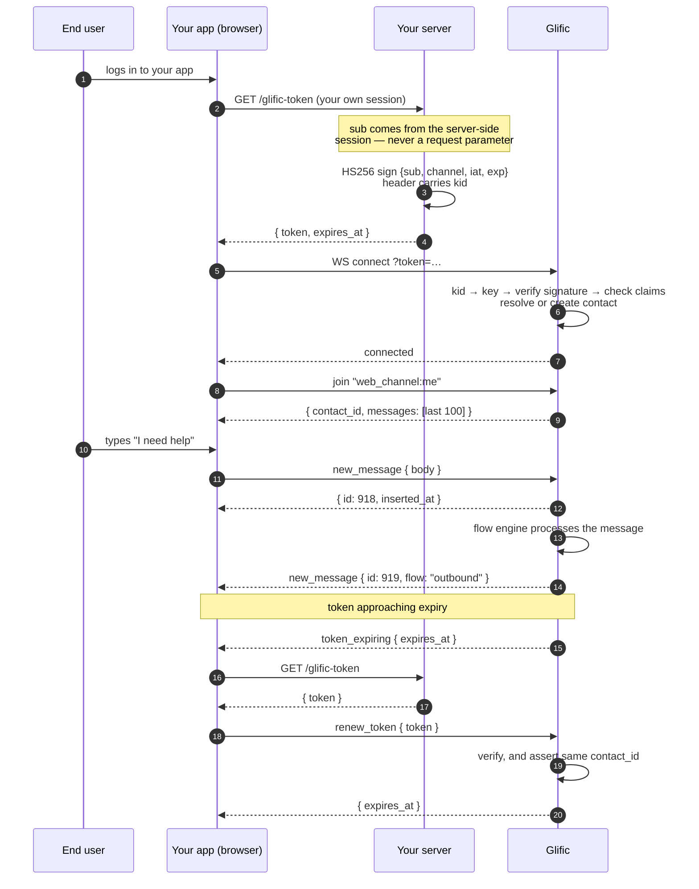

# Glific Web Channel — API Integration Guide

**Status: PROPOSAL.** Nothing described here is built yet. We are circulating this to confirm the
shape of the API before we implement it. Please push back on anything that would be awkward
against your stack — changing a design document is free, changing a shipped API is not.

**Audience:** engineers integrating a web or mobile application with Glific messaging.

---

## 0. What this is

Glific is a two-way messaging platform. Today, conversations reach a person over WhatsApp. The
**web channel** adds a second route: your own application — a web app, a portal, eventually a mobile
app — talks to Glific directly over a WebSocket, and the same Glific flows, staff inbox, and contact
records serve it.

You get:

- a **WebSocket API** carrying messages in both directions in real time
- **conversation history** on connect, with paging further back
- an **authentication model where you mint your own credentials**, so your users never enter a second
  password and Glific never sees yours

What this document does *not* cover: the staff-facing GraphQL API, WhatsApp template management, or
flow authoring. Those are unchanged.

### What exists today vs. what this proposes

| | Today | Proposed |
|---|---|---|
| End-user auth | phone + OTP, issued by Glific | **you mint a JWT** |
| Credential | opaque Glific token, no expiry control | short-lived JWT you control |
| Key management | none | up to 5 signing keys per organization, rotatable |
| Contact identity | phone number only | phone **or** your own identifier |
| Session renewal | reconnect from scratch | in-place renewal over the live socket |

---

## 1. Authentication

### 1.1 The model: you mint, we verify

Your server already knows who your users are. Rather than making them prove that a second time to
Glific, **you sign a short-lived token asserting who they are, and Glific verifies your signature.**

```
  ┌──────────┐   already logged in    ┌─────────────┐
  │ End user │ ─────────────────────► │  Your app   │
  └──────────┘                        └──────┬──────┘
                                             │ "give me a Glific token"
                                             ▼
                                      ┌─────────────┐
                                      │ Your server │  ← holds the signing key
                                      └──────┬──────┘
                                             │ signed JWT
                                             ▼
                                      ┌─────────────┐
                                      │   Glific    │  ← holds the same key, verifies
                                      └─────────────┘
```

Glific never sees your user database, and you never see a Glific password. The only thing shared is
a signing key.

This is the model Intercom uses for its Messenger, and they moved *to* it from a simpler HMAC scheme
specifically to gain token expiry and controlled attribute updates — both of which this design
requires from day one.

### 1.2 Signing keys

An organization administrator creates signing keys in the Glific console.

| Property | Value |
|---|---|
| Algorithm | **HS256** (HMAC-SHA256, symmetric) |
| Keys per organization | up to **5** active at once |
| Key identifier | `kid` — **generated by Glific**, e.g. `gws_7f3a91c4`. Not secret; safe to put in config |
| Secret | shown **once**, at creation. Glific stores it encrypted and cannot show it again |
| Revocation | immediate, per key |

Both halves come back together when you create the key: Glific generates the `kid` and the secret,
displays them once, and stores only an encrypted copy of the secret. You never choose or change a
`kid`.

**Why symmetric and not RSA.** A shared secret means Glific *could* technically mint a token for one
of your users. That is already true — Glific hosts the conversation data. Asymmetric signing would
add PEM handling in every language you deploy and roughly fifty times the verification cost on every
reconnect, in exchange for a property the trust relationship doesn't actually need. Intercom reached
the same conclusion and supports HS256 exclusively.

**Rotation without downtime.** Because the `kid` travels in the token header, you can:

1. Create a second key. Both are now valid.
2. Point your minting code at the new `kid`. Tokens signed with the old one keep working.
3. Once no live token can still carry the old `kid` — i.e. after one token lifetime — revoke it.

No user is logged out at any point. Five slots exist so you can hold production, staging, and a
rotation spare simultaneously.

**Storing the secret.** Environment variable or secret manager. Never in source control, never in
anything shipped to a browser or a mobile binary.

### 1.3 The token

```
Header
{
  "alg": "HS256",
  "typ": "JWT",
  "kid": "gws_7f3a91c4"
}

Payload
{
  "sub":     "member_4471",
  "channel": "web",
  "iat":     1755590400,
  "exp":     1755591300,
  "phone":   "+919876543210",
  "name":    "Asha Kumari",
  "email":   "asha@example.org"
}
```

| Claim | Required | Meaning |
|---|---|---|
| `sub` | **yes** | Your identifier for this person. Opaque to Glific, max 255 characters. Unique within your organization. |
| `channel` | **yes** | Always `"web"`. Reserved so the format stays stable as other channels arrive. Any other value is rejected. |
| `iat` | **yes** | Issued-at, Unix seconds. |
| `exp` | **yes** | Expiry, Unix seconds. At most one hour after `iat`. |
| `phone` | no | Links this person to an existing WhatsApp contact. **Read §2.3 before sending it.** |
| `name` | no | Display name for this web login. Scoped to the login — never overwrites the contact's WhatsApp-facing name. See §2.4. |
| `email` | no | Stored on the contact record. |

**You do not send an organization id.** The `kid` identifies your key, your key belongs to exactly
one organization, and the signature proves you hold that key — so the organization is established by
the signature itself and does not need to be claimed.

`iat` and `exp` are optional in the JWT specification and **mandatory here.** Expiry is what limits
the damage if a token leaks; `iat` is what makes revocation possible for tokens Glific has never
seen.

**Recommended lifetime: 15 minutes.** Long enough that renewal is infrequent, short enough that a
leaked token is nearly worthless. The renewal mechanism in §5 makes short lifetimes cheap.

### 1.4 What Glific rejects

Each rule closes a specific attack.

| # | Rule | Closes |
|---|---|---|
| 1 | Algorithm must be `HS256`. The token's own `alg` never *selects* the algorithm | `alg: none`, algorithm confusion |
| 2 | The secret is resolved strictly by `kid` — never "try every key for this org" | silently keeping a revoked key alive |
| 3 | A revoked key is rejected | — |
| 4 | `sub`, `channel`, `iat`, `exp` must all be present. Clock leeway 60s | — |
| 5 | `exp - iat` greater than one hour is rejected even if you set it | year-long tokens shipped by accident |
| 6 | The organization owning the `kid` must match the organization resolved from the request host | a valid token replayed against another organization's subdomain |
| 7 | `channel` must be `"web"` | — |

A rejected token fails the connection. There is no partial or degraded session.

### 1.5 Minting a token — Python

Requires `PyJWT >= 2.8`.

```python
import os
import time
import jwt

GLIFIC_SIGNING_KEY = os.environ["GLIFIC_SIGNING_KEY"]   # from the Glific console, shown once
GLIFIC_KID         = os.environ["GLIFIC_KID"]           # e.g. "gws_7f3a91c4"

TOKEN_TTL_SECONDS = 900   # 15 minutes


def mint_glific_token(request) -> dict:
    # ─────────────────────────────────────────────────────────────────────
    #  The single most important line in this file.
    #
    #  `sub` MUST come from your own authenticated server-side session.
    #  If it comes from a request parameter, then anyone who can call this
    #  endpoint can mint a token for anyone else, and read that person's
    #  entire conversation history.
    # ─────────────────────────────────────────────────────────────────────
    member_id = request.session["member_id"]        # ✅  server-side session
    # member_id = request.args.get("member_id")     # ❌  NEVER do this

    now = int(time.time())
    expires_at = now + TOKEN_TTL_SECONDS

    claims = {
        "sub":     str(member_id),
        "channel": "web",
        "iat":     now,
        "exp":     expires_at,
    }

    # Optional. Only include this if the number is VERIFIED on your side —
    # see §2.3. If your web users never reach you on WhatsApp, omit it.
    phone = lookup_verified_phone(member_id)
    if phone:
        claims["phone"] = phone

    token = jwt.encode(
        claims,
        GLIFIC_SIGNING_KEY,
        algorithm="HS256",
        headers={"kid": GLIFIC_KID},
    )

    # Return expires_at so the browser can renew *before* it lapses (§5).
    return {"token": token, "expires_at": expires_at}
```

Expose this behind your own authentication, on your own domain. It is an ordinary authenticated
endpoint in your app — treat it exactly as you would "fetch my profile".

### 1.6 Revocation

| To revoke | Do this | Effect |
|---|---|---|
| One signing key | revoke it in the console | every token bearing that `kid` stops verifying |
| One person's live session | Glific drops their socket | immediate disconnect |

Note the timing: **revoking a key stops new connections and blocks renewals immediately, but a socket
already connected on a still-valid token survives until that token expires** — at most one token
lifetime, which is another reason to keep the lifetime short. To cut a session instantly, use the
session-drop lever as well.

---

## 2. Contact identity

### 2.1 One human, one contact

A person who reaches you on WhatsApp and later logs into your portal should be **one contact** in
Glific — one conversation history, one set of flow results — not two records that staff have to
mentally join.

Glific does this by letting a contact carry **one identity per channel**: a phone number for
WhatsApp, your own identifier for the web.

```
             Contact #1183  ("Asha Kumari")
                    │
      ┌─────────────┴─────────────┐
      │                           │
 channel: phone             channel: web
 identifier: +919876543210  identifier: member_4471
```

What happens when a token arrives:

| Token carries | Existing contact? | Result |
|---|---|---|
| `sub`, first time ever | — | new contact with one `web` identity |
| `sub`, returning user | matched on `sub` | the same contact, every time |
| `sub` + `phone`, first time | a contact has that phone | **web identity added to that contact** — history available immediately |
| `sub` + `phone`, first time | no contact has that phone | new contact carrying both identities |
| `sub` + `phone`, returning user | matched on `sub` | phone ignored — see §2.3 |

Matching is always on `sub` first. A returning user is found by their web identity, never by their
phone number.

Linking is an **insert**, not a rewrite: attaching a web login to Asha's existing contact touches
neither her WhatsApp identity nor a single historical message.

### 2.2 Choosing `sub`

`sub` is **your** identifier. A member id, a UUID, a hashed email — whatever is stable in your
system. Glific treats it as opaque and never parses it. The pair `(organization, sub)` identifies one
person within your organization, permanently.

**Choose it carefully — it is effectively permanent.** If you later change what `sub` means, every
affected user becomes a new contact with an empty history. Pick your most stable internal
identifier, not an email address or a username the user can edit.

### 2.3 Linking a web login to an existing WhatsApp contact

If someone already talks to you on WhatsApp and then logs into your app, you probably want one
conversation rather than two. Include their phone number in the token and Glific attaches the web
identity to the existing contact.

```
"sub":   "member_4471",
"phone": "+919876543210"
```

**Do you actually need this?** Only if the same people reach you on both WhatsApp and the web. If
your web users are a separate population, or you don't message them on WhatsApp at all, **omit the
claim.** It is optional, and leaving it out carries none of what follows.

**Glific does not verify the number.** We have no way to. Including it in a signed token is you
telling us, on your signature, that this person owns this number — and we act on that.

**The risk, stated plainly.** A phone number identifies a contact that may hold a long WhatsApp
history. If the number in your token can be influenced by the user — a self-editable profile field,
an unverified signup form, a request parameter reaching your minting code — then anyone who enters
someone else's number receives that person's conversation history.

> **Send `phone` only if you verified it.** If your users type their number into a profile page and
> nothing checks it, do not send it.

Four behaviours to know:

| Situation | What Glific does |
|---|---|
| Phone matches a contact with no web identity | attaches the web identity to it — history carries over |
| Phone matches no contact | creates a new contact carrying both identities |
| Phone matches a contact that already has a *different* web identity | **ignores the phone** and proceeds web-only. One number is never shared between two web logins |
| Phone changes on a later token for the same `sub` | **silently ignored.** Once a web identity is attached to a contact, it stays there |

The last two are deliberate. Re-pointing an established web identity at a different contact — because
a number changed, or because a second person claimed it — would move someone's live session onto
another person's history. Once attached, the link is fixed. A genuine re-link is a support
operation, not something a token can perform.

### 2.4 Display names on a shared number

The `name` claim (§1.3) is **scoped to this web login.** It does not overwrite the contact's
WhatsApp-facing name.

This matters when several people share one number. If two students in a family each sign in with
their own `sub`, each web session carries its own name, and neither changes what your staff see for
the parent's contact on WhatsApp, nor what a WhatsApp flow reads when it greets that contact by
name.

Your app stays the authority on how a person is displayed. Send `name` so staff have context, but
render your own UI from your own records.

---

## 3. APIs

### 3.1 Connecting the WebSocket

```
wss://<your-org>.glific.com/web_channel_socket/websocket?token=<jwt>
```

The organization is resolved from the host and cross-checked against the organization that owns your
signing key (§1.4, rule 6).

```js
import { Socket } from "phoenix"

const socket = new Socket("wss://your-org.glific.com/web_channel_socket", {
  // MUST be a function, not an object.
  //
  // phoenix.js calls params() on *every* connection attempt, including
  // automatic reconnects. Passing a plain object freezes the token at
  // construction time, so every reconnect after the first expiry replays
  // a dead credential — forever.
  params: () => ({ token: tokenStore.current() }),
})

socket.connect()
```

### 3.2 Joining the conversation

```js
const channel = socket.channel("web_channel:me", {})

channel.join()
  .receive("ok", ({ contact_id, messages }) => {
    render(messages)            // oldest first, ready to render top-to-bottom
  })
  .receive("error", ({ reason }) => console.error(reason))
```

The topic `web_channel:me` resolves to whichever contact the token authenticated. You do not need to
know the Glific `contact_id` in advance — the join reply gives it to you, which is useful for
support and for correlating with the staff inbox.

The join reply carries the **most recent 100 messages**, ordered oldest-first.

> **Reconnection replays this.** `phoenix.js` rejoins automatically after any network interruption,
> and every rejoin returns the last 100 messages again. Reconcile by message `id` rather than
> appending blindly — see §4.3.

### 3.3 Loading older messages

```js
channel.push("load_more", { offset: 100 })
  .receive("ok", ({ messages }) => prepend(messages))
```

Returns the next 100 older messages.

> Open question — offset paging drifts if new messages arrive between pages. We are considering a
> cursor instead. Tell us whether page-back is important to your UI before we decide.

### 3.4 Calls from your backend

The socket API is scoped to **one contact**: a token for `member_4471` can read and write only that
person's conversation. There is no way to read another contact's messages with it, by design.

If your backend needs organization-wide access — bulk export, reporting, an admin view — that is the
existing Glific **GraphQL API**, authenticated with staff credentials, and it is unchanged by this
proposal. If you go that route, create a **dedicated service user** with the narrowest role that
works, rather than reusing a person's login.

### 3.5 Ending a session

```
POST /api/v1/web_channel/logout
Authorization: Bearer <jwt>
```

This is the supported way to end a session — when someone signs out of your app, and **especially
when a shared device passes from one person to the next.**

It does two things:

1. **Invalidates every token issued for that person up to now**, including tokens Glific has never
   seen. This is what `iat` is for: Glific records the logout time and rejects any token issued at
   or before it.
2. **Drops their live socket** immediately.

Two consequences worth knowing:

- **Logout is per person, not per device.** Signing out anywhere signs that person out everywhere.
  On a shared classroom tablet that is exactly what you want. If you also support one student on a
  phone and a laptop at once, signing out of one ends both.
- **Your client must still clear its own state** — the stored token, and any messages already
  rendered. Logout stops the token working; it does not empty your app's memory.

> On a shared device, call this **before** the next person signs in, not after. A stale token that
> is still inside its lifetime will otherwise connect successfully and load the previous person's
> conversation.

---

## 4. WebSocket message catalogue

### 4.1 Client → server

| Event | Payload | Reply |
|---|---|---|
| `new_message` | `{ "body": "I need help", "web_message_id": "6f1c…" }` | `{ "id": 918, "inserted_at": "…" }` |
| `new_media_message` | `{ "type": "image", "url": "…", "caption": "…", "content_type": "image/jpeg" }` | `:ok` |
| `new_location_message` | `{ "latitude": 12.97, "longitude": 77.59 }` | `:ok` |
| `load_more` | `{ "offset": 100 }` | `{ "messages": [ … ] }` |
| `renew_token` | `{ "token": "<jwt>" }` | `{ "expires_at": 1755594900 }` |

`type` for media must be one of `image`, `audio`, `video`, `document`.

**Media is uploaded over HTTP first, not over the socket.** `POST /api/v1/web_channel/upload`
returns a URL; you then reference that URL in `new_media_message`. No file bytes travel over the
WebSocket.

### 4.2 Server → client

| Event | Payload | Meaning |
|---|---|---|
| `new_message` | a message object (§4.3) | a message was sent to this contact |
| `contact_updated` | `{ "name": "Asha" }` | display name changed, usually captured by a flow |
| `token_expiring` | `{ "expires_at": 1755591300 }` | renew now (§5) |
| `session_expired` | `{ "reason": "token_expired" }` | the channel is closing; reconnect with a fresh token |

### 4.3 Message shape

> **This structure is provisional.** It reflects Glific's current internal message shape and is
> likely to change over the coming weeks as we finalise the API. Field *names* are more stable than
> the overall shape; treat unknown fields as ignorable and expect additions. We will confirm the
> final structure before you build against it.

```json
{
  "id": 918,
  "body": "Namaste! How can we help today?",
  "type": "text",
  "flow": "outbound",
  "inserted_at": "2026-08-25T09:14:22Z",
  "interactive_content": {},
  "media": {
    "url": "https://storage.example/…/photo.jpg",
    "content_type": "image/jpeg",
    "caption": "the receipt",
    "thumbnail": "https://storage.example/…/thumb.jpg"
  }
}
```

| Field | Notes |
|---|---|
| `id` | Glific's message id. Stable. Use it to deduplicate on rejoin. |
| `flow` | **`"inbound"` means the contact sent it; `"outbound"` means your organization did.** The naming is from Glific's internal perspective and catches people out. |
| `type` | `text`, `image`, `audio`, `video`, `document`, `location`, `quick_reply`, `list` |
| `media` | `null` unless the message carries an attachment |
| `interactive_content` | present for `quick_reply` and `list` — buttons and list options to render. Shape to be defined. |

**Deduplicating an optimistic send.** Render locally with a temporary id, replace it with the `id`
from the `new_message` reply, and on any later join or `load_more` discard messages whose `id` you
already hold. Without this, a reconnect duplicates everything the user sent in that session.

### 4.4 Retries and duplicate messages

On a poor connection the reply to `new_message` can be lost *after* Glific has already accepted the
message. If your client retries, the message arrives twice — and because Glific runs flows, a
duplicate is not merely a repeated bubble. It can advance a flow a second time: a question answered
twice, a quiz scored twice.

Send an optional `web_message_id` with every message to make retries safe:

```js
const id = crypto.randomUUID()
channel.push("new_message", { body, web_message_id: id })
```

The value is **opaque** to Glific — any string works, and we never parse it. We suggest a UUID: the
value needs to be unique within your organization, and a UUID gets you that without any
coordination. A short counter like `msg-1` risks two different people generating the same value.

If a message carrying the same `web_message_id` has already been accepted, Glific returns the
original `{ id, inserted_at }` and does not create a second message. Retry as often as you need.

---

## 5. Session renewal and reconnection

### 5.1 Why this section exists

A token authenticates the socket **once, at connect**. Without something that re-checks a live
connection, a 15-minute token would in practice grant a session lasting as long as the browser tab
stays open — which defeats the point of a short lifetime.

So Glific tracks each connection's expiry and acts on it.

### 5.2 Renewing in place

```
  exp − 5 min   ──►  Glific pushes  token_expiring { expires_at }
                     you fetch a fresh token from YOUR server
                     you send        renew_token   { token }
                     Glific replies  { expires_at }        ← session continues, socket never drops

  exp + grace   ──►  no renewal arrived
                     Glific pushes  session_expired
                     channel closes; reconnect with a fresh token
```

```js
channel.on("token_expiring", async () => {
  const { token } = await fetch("/glific-token").then(r => r.json())
  tokenStore.set(token)
  channel.push("renew_token", { token })
    .receive("ok", ({ expires_at }) => scheduleRenewal(expires_at))
})

channel.on("session_expired", async () => {
  const { token } = await fetch("/glific-token").then(r => r.json())
  tokenStore.set(token)
  socket.disconnect(() => socket.connect())   // params() picks up the new token
})
```

A renewal token is verified exactly as strictly as the original — same key resolution, same claim
checks, same organization cross-check — **and it must resolve to the same contact.** A token for a
different person is rejected rather than swapped in; renewal exists to extend a session, never to
change who is on it.

If your user was offline longer than the token lifetime, nothing special happens: the app mints a
fresh token and connects normally.

> On a shared device, be careful with the `session_expired` handler above: it re-mints and
> reconnects automatically. That is right for one person on their own phone, and wrong when the
> device has changed hands. Gate it on your own app still having a signed-in user — and see §3.5.

### 5.3 Two client requirements

**`params` must be a function** (§3.1). This is the single most common integration bug with
`phoenix.js` and it stays invisible until the first token expires.

**Add jitter to reconnects.** `phoenix.js` retries on a fixed ladder ending at a flat 5000 ms with no
randomisation, and reconnects immediately when a hidden tab becomes visible. If your users share a
network — a school, an office, a training centre — they will retry in lockstep after any outage.
Randomise your reconnect delay, including the first attempt after coming back online.

---

## 6. End-to-end sequence



---

## 7. Notes

### 7.1 Message retention — please read this one

**Glific is not your system of record.** Messages older than roughly **two months** are eligible for
permanent deletion, and:

- deletion runs as a periodic batch, so a message may survive well past two months, and
- it is not on a guaranteed schedule, so **you cannot rely on old messages being present, and you
  cannot rely on them being gone** by any particular date.

If you need conversation history for reporting, audit, or a compliance obligation, **store it on your
side.** Mirror messages into your own database as they arrive over the socket, or export
periodically via the GraphQL API. Do not build a feature that reads year-old messages back out of
Glific.

### 7.2 Rate limiting

The HTTP endpoints (token exchange, media upload) are rate limited per client IP. The WebSocket does
not currently have a per-connection message rate limit — we expect to add one, and would rather hear
your expected message volume now than surprise you with a limit later.

### 7.3 Media

Uploads go to `POST /api/v1/web_channel/upload` and return a URL you reference in
`new_media_message`. In this proposal that endpoint is authenticated with the same token as the
socket. Content type and size limits will be documented before implementation.

### 7.4 Who is responsible for what

| Yours | Ours |
|---|---|
| Keep the signing key server-side and out of source control | Verify every token, on every connection and renewal |
| Derive `sub` from an authenticated session, never from user input | Scope every token to exactly one contact |
| **Verify a phone number before putting it in a token** (§2.3) | Never attach one number to two web logins |
| Keep token lifetimes short | Enforce the one-hour lifetime ceiling |
| Rotate keys and revoke compromised ones | Make revocation immediate and per-key |
| Retain history you need long-term | Multi-tenant isolation |

One shared exposure worth naming: the token lives in your page's memory or storage, so **an XSS
vulnerability on your site is a session takeover.** Every embedded chat product shares this property.
Short lifetimes limit the window; they do not close it.

---

## 8. Open questions

Things we have deliberately not decided, several of which your answer should drive.

1. **Page-back.** Is loading older history important to your UI? The answer decides whether we invest
   in cursor-based paging or keep simple offsets.
2. **Socket message rate limits.** What is your expected peak — messages per user per minute, and
   concurrent users?
3. **Multiple devices.** Should one person hold several simultaneous sessions, phone plus laptop?
   Today nothing forbids it; we have not designed for it either.
4. **Profiles — several people on one phone.** Glific already supports one contact carrying several
   people, each with their own name, language, flow variables and history. Today a person picks
   between them from a menu inside a WhatsApp conversation. On the web that would only make sense if
   an adult manages several students — a parent, or a teacher with a classroom device — and switches
   between them without signing out and back in. **Is that how your app would work?** If so we would
   want to design for it deliberately, rather than have you build one login per student.
5. **Embedded widget.** If you would rather embed a Glific-built chat widget than build your own UI,
   the same token model applies, but we would need to allowlist the domains permitted to embed it.
   Is that of interest?

---

## Feedback

Send comments against section numbers. The parts most worth your attention are **§1.5** (does the
minting code fit your stack?), **§2.3** (is your phone number verified, and do you need linking at
all?), **§7.1** (does two-month retention break anything you had assumed?), and **§8**.
