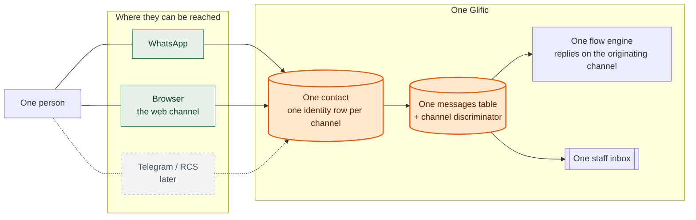
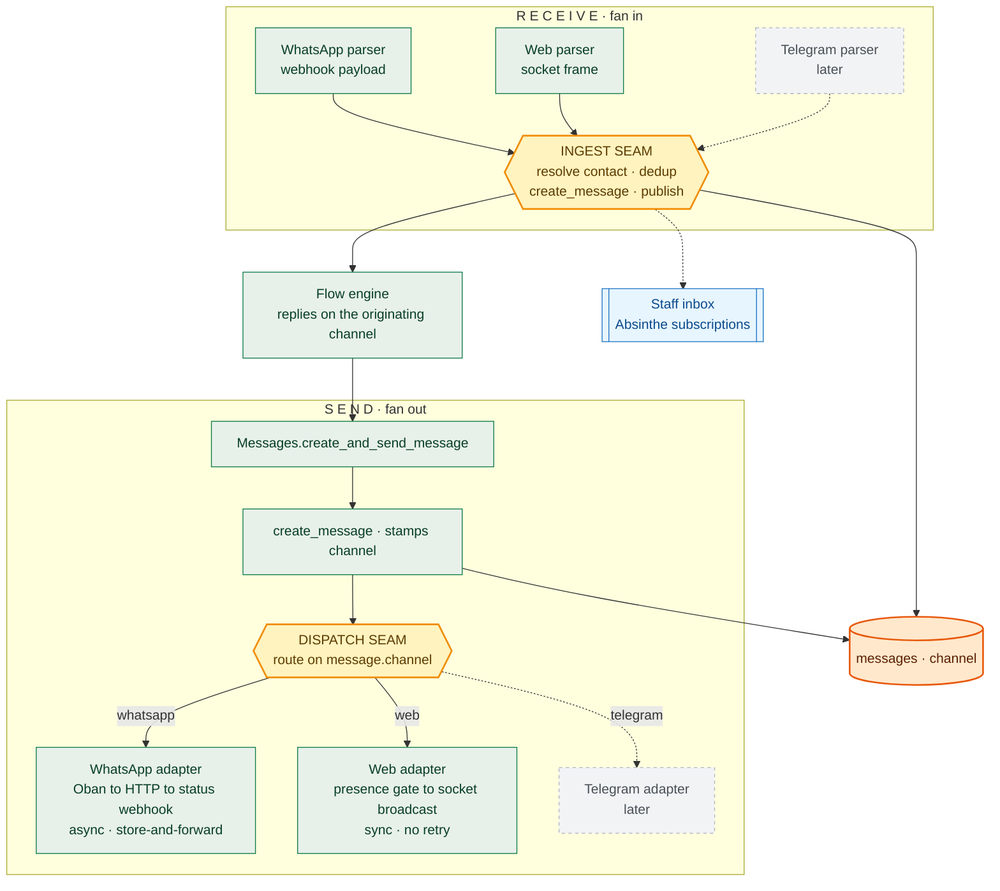
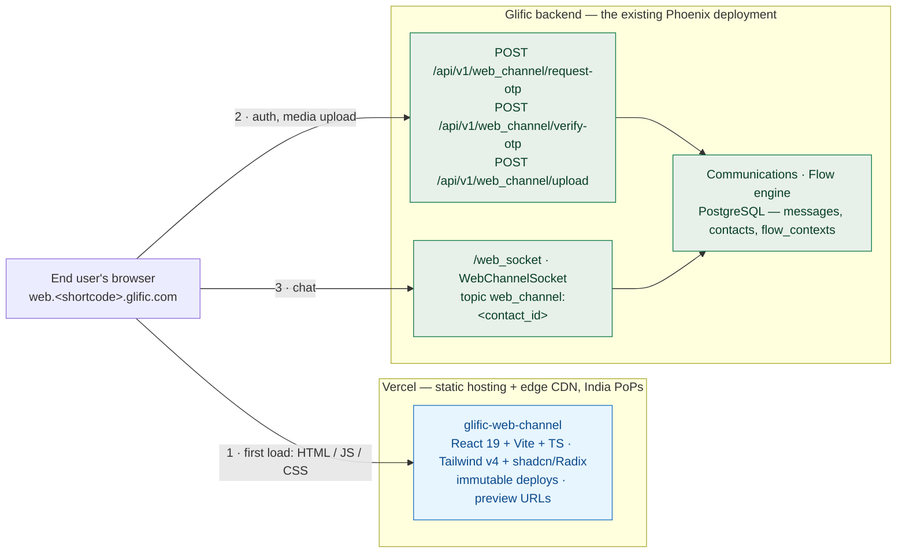

# Glific Omnichannel Messaging — Technical Design

**Status:** Draft for engineering review · **Author:** Vignesh Rajasekaran

Glific today is a WhatsApp product. This document describes the work that makes it a
**channel-plural** product — one where a contact can be reached over WhatsApp, a browser, and
later Telegram or RCS, through one inbox, one flow engine, and one `messages` table.

The **web channel** is the first channel built on that foundation and the only one being built
now. It is covered end-to-end in [Part III](#part-iii--building-the-web-channel-engineers).
Everything in Parts I and II is deliberately channel-general: if it only makes sense for the web
channel, it belongs in Part III instead.

### How to read this

| Part | Audience | Question it answers |
|---|---|---|
| **I** | Everyone, incl. non-engineering stakeholders | What are we building, and what does it make possible? |
| **II** | Tech leads, reviewers, anyone who will extend this | Which technical choices did we make, and why those? |
| **III** | The engineers implementing the web channel | How is it actually built? |

**Status markers.** This design spans shipped code, prototype code, and intended work, so every
non-obvious claim is marked:

- **`[Today]`** — on `master`, in production.
- **`[Prototype]`** — exists on `web-channel-prototype`, verified working, not yet merged.
- **`[Target]`** — agreed direction, not yet written.

**Companion docs.** This doc is the map; these carry the detail:

| Doc | What it owns |
|---|---|
| [API authentication](./api-auth-design.md) | How a partner org's app authenticates its end users — NGO-minted HS256 JWTs, `kid`-scoped per-org signing keys, revocation, expiry on a live socket. Also owns the **channel-general contact identity model** (§3). |
| [Custom UI messages](./custom-ui-design.md) | Rich UI as JSON: built-in `glific/*` blocks, opaque org-namespace components, the envelope contract, and the cross-channel direction. |
| [Frontend hosting decision](./frontend-hosting-decision.md) | The provider comparison behind the Vercel choice, egress model, and cost. |
| [NGO API integration](./ngo-api-integration.md) | The external-facing proposal we send to partner orgs. |

> **A note on this file's path.** It lives at `plans/web-channel/` although it is now
> channel-general. The four companion docs cross-link by relative path; moving it would break
> those links for no reader benefit. The directory name is historical, not a scope statement.

---

# Part I — What we are building (everyone)

## 1.1 Where we are today

Glific is built on one assumption that runs deeper than any single module: **a contact is a phone
number, and a message goes to WhatsApp.**

That assumption is not a mistake — it bought years of simplicity. But it is load-bearing in
places that are surprising, and it is visible in the code as three concrete facts **`[Today]`**:

1. **A message has no channel.** The `messages` table has no column saying how the message
   travelled. There is nothing to route on.
2. **Routing is per-organisation, not per-message.** `Glific.Communications.provider_handler/1`
   reads the org's BSP credential and returns *one* handler module for that whole org
   (`lib/glific/communications.ex:13`). Every message that org sends goes to whatever that one
   handler is. There is no way to express "this message goes to the browser, that one to
   WhatsApp" for the same organisation, because the decision was never per-message.
3. **A contact is a phone number.** `Contacts.maybe_create_contact/1` — the function every
   inbound message runs through — resolves a human by `phone`. A person with no phone number
   cannot be represented.

Everything in Part II follows from those three facts.

## 1.2 What "omnichannel" means here — and what it does not



**It means:** one contact record per human regardless of how many channels they use; one
conversation history; one flow that runs the same way and replies over whichever channel the
person actually wrote in on; one staff inbox where a reply reaches the person wherever they are.

**It does not mean** any of the following, and each exclusion is deliberate:

- **Not a second backend.** The web channel is served by the same Phoenix deployment and the
  same PostgreSQL. No new service, no umbrella app.
- **Not message bridging.** We are not relaying a WhatsApp message into a browser session or
  vice versa. Each message belongs to exactly one channel and stays there. A contact reading
  their web history does **not** see their WhatsApp history —
  `Messages.list_conversation_messages/3` filters on `channel` (`lib/glific/messages.ex:68` **`[Prototype]`**),
  and that filter is the containment boundary.
- **Not WhatsApp Groups.** Maytapi / WhatsApp Groups look like "another channel" and are not
  one — see [§2.8](#28-what-stays-off-this-axis-whatsapp-groups).
- **Not a channel picker for staff or flow authors.** Nobody chooses a channel. The channel is
  a property of the incoming message, and replies follow it.

## 1.3 What changes for the people using Glific

| Who | What they notice |
|---|---|
| **An end user with no phone** — a student on a school's shared device, someone using a parent's handset | They can hold their own conversation with the NGO, in a browser, under their own identity. This is the population the web channel exists for. |
| **NGO programme staff** | Nothing new to learn. The same inbox, the same flows. Conversations from the web appear alongside WhatsApp ones. |
| **NGO flow authors** | Nothing new to learn. Flows are omnichannel by default; a flow's reach is *derived* from what it does, not declared ([§2.5](#25-a-flows-reach-is-derived-not-declared)). |
| **A partner org with its own app** | They can embed messaging in their own product and authenticate their own users, without Glific issuing credentials to those users ([API auth](./api-auth-design.md)). |
| **Report authors / BigQuery users** | One new nullable `channel` column, eventually. Existing dashboards keep working; historical rows read `NULL`, for which `COALESCE(channel,'whatsapp')` is the documented idiom. |

## 1.4 The claim we are making — and its price

The reason to do this work as a platform change rather than a web-chat feature is a claim about
**channel N+1**. Stated concretely, adding a channel after this lands costs:

| To add a channel, you write | Roughly |
|---|---|
| One inbound parser — provider payload → normalised message params | 1 module |
| One outbound adapter implementing the send contract | 1 module |
| One dispatch clause routing that channel's sends to it | ~3 lines |
| Its capability declarations — what it can render | ~1 line per capability |
| Its identity namespace — how a human is named on it | 1 row type, no schema change |
| Its ingress — a webhook route or a socket | 1 route |

| And you do **not** touch | Because |
|---|---|
| The `messages` schema | `channel` is a plain string, not an enum ([§2.2](#22-a-plain-string-not-a-postgres-enum)) |
| The `contacts` schema | Identities are their own table, added once ([§2.6](#26-identity-one-contact-one-row-per-channel)) |
| The flow engine or flow editor | Flows are channel-neutral; reach is derived ([§2.5](#25-a-flows-reach-is-derived-not-declared)) |
| The staff inbox | It reads `messages`, which is already channel-plural |
| BigQuery | It emits the `channel` string; a new value needs no schema patch |

**The price is paid once, now, and it is not small.** Making a contact not-necessarily-a-phone
touches roughly 34 phone-keyed lookup sites, each of which has to be individually classified as
*"who is this"* (→ identities) or *"how do I reach them on WhatsApp"* (→ `contacts.phone`). A
mechanical rename produces code that compiles and is wrong. That audit is enumerated in
[API auth §3.5–3.6](./api-auth-design.md).

This is the honest trade: a bounded, well-understood cost now, in exchange for channel N+1 being
a week rather than a quarter. If we only ever ship the web channel, we overpaid. The bet is that
we will not.

---

# Part II — The technical choices (tech leads and reviewers)

Eight choices. Each states the decision, the reason, and what we rejected.

## 2.1 The channel lives on the message, not on the contact

**Decision.** `messages.channel` is the single discriminator. A contact carries no channel.

A contact is a *human*; a channel is a *route*. The same person may be reachable three ways at
once, so a channel field on the contact would need to be a set, and even then it could not tell
you which route a particular message took. Putting it on the message means every message is
self-describing: the row itself says how it travelled, which is what both the flow engine and the
staff inbox need in order to reply correctly.

The corollary is that channel-plurality on the *contact* side is a different problem with a
different answer — a channel does not describe a contact, an **identity** does
([§2.6](#26-identity-one-contact-one-row-per-channel)).

*Rejected:* a `channel` column on `contacts`. It cannot answer "which route did this message
take", so the message would still need its own field, and we would maintain two.

## 2.2 A plain string, not a Postgres enum

**Decision.** `channel` is `varchar` with a default of `"whatsapp"` and `NOT NULL` **`[Prototype]`**:

```elixir
# priv/repo/migrations/20260715000000_add_channel_to_messages.exs
add :channel, :string, default: "whatsapp", null: false
create index(:messages, [:contact_id, :channel])
```

Glific uses Postgres enums elsewhere, so this is a deliberate departure. The reason is that
**a Postgres enum value cannot be removed and cannot be renamed inside a transaction**, so every
new channel becomes a migration, and every mistaken one is permanent. `telegram`, `rcs`, `sms`,
`fb_messenger`, `instagram` should each cost zero migrations. A string buys that.

The cost is that the database will not reject a typo. We accept it because the values are written
in exactly two places (a send adapter and an ingest parser), both of which are covered by tests,
and because the read side is guarded by a capability registry
([§2.4](#24-a-capability-registry-instead-of-channel--web)) rather than by scattered string
equality.

The composite index `[:contact_id, :channel]` matches the only hot read: "this contact's
conversation on this channel", paged newest-first.

*Rejected:* a PG enum (irreversible, one migration per channel); an integer FK to a `channels`
table (a join on the hottest table in the schema, to look up a value nothing else hangs off).

## 2.3 Two seams: dispatch on send, ingest on receive

This is the structural heart of the design. **A channel is not a subsystem; it is two functions
plugged into two seams.**



**The two seams are in very different states today, and the difference matters for planning.**

**The ingest seam already exists `[Today]`.** Every inbound provider already converges on one
provider-agnostic function. The Gupshup controller is three lines and the shape is exactly right
(`lib/glific_web/providers/gupshup/controllers/message_controller.ex:30`):

```elixir
params
|> Gupshup.Message.receive_text()                                    # channel-specific
|> update_message_params(%{organization_id: conn.assigns[:organization_id]})
|> Communications.Message.receive_message()                          # channel-agnostic
```

Gupshup Enterprise and Maytapi follow the same pattern. Receive is close to done by accident of
good earlier design; what it needs is a `channel` stamped on the normalised params, and a contact
resolution that is not phone-only.

**The dispatch seam does not exist `[Today]`.** `Communications.Message.send_message/2` resolves
the handler from the *organisation*, then picks the function by message *type*
(`lib/glific/communications/message.ex:60`):

```elixir
apply(
  Communications.provider_handler(message.organization_id),  # org → module
  @type_to_token[message.type],                              # type → function
  [message, attrs]
)
```

There is no channel dimension anywhere in that call. **`[Target]`** is to route on
`message.channel` first, then let each channel resolve its own provider — for WhatsApp that
remains `provider_handler/1` picking Gupshup vs Gupshup Enterprise, which becomes a *nested* BSP
seam rather than the top-level one.

Two hazards in that function are worth knowing before touching it:

- **The bare rescue.** `send_message/2` ends in `rescue _ -> log_error(message, "Could not send
  message to contact: Check Gupshup Setting")`. Any exception from any adapter — including a new
  one — is swallowed and reported to the user as a Gupshup configuration problem. A new channel
  inherits a misleading error path on day one. **`[Target]`** narrow it, or at minimum make the
  message reflect the actual channel.
- **`@type_to_token` has no catch-all.** An unmapped message type raises rather than returning an
  error. This is why the prototype's `:blocks` type has to be intercepted upstream of this
  function — see [§3.4](#34-the-send-path-end-to-end).

## 2.4 A capability registry instead of `channel == "web"`

**Decision.** What a channel can *render* is declared in one registry, not tested inline
**`[Prototype]`** (`lib/glific/channels/channel_capability.ex`):

```elixir
@capabilities %{
  blocks: MapSet.new(["web"])
}

def supports?(channel, capability) do
  @capabilities |> Map.get(capability, MapSet.new()) |> MapSet.member?(channel)
end
```

The failure mode this prevents is specific and, in our experience, inevitable: a feature ships
gated on `if channel == "web"`, that check spreads to five call sites, and the second channel that
can render the feature has to find all five. `ChannelCapability.supports?(channel, :blocks)` reads
as a question about the capability, so adding RCS is one entry in one map.

Note what this is **not** for. `supports?/2` answers *"can this channel render X"*. It must not
be used for *"is this the web channel"* — questions about presence, sockets, or OTP are genuinely
web-specific and belong in web-specific code. Conflating the two is how a capability registry
turns into a second, worse channel enum.

The registry also unlocks graceful degradation rather than failure: on a channel that cannot
render Blocks, the prototype downgrades to the message's derived plain-text body and raises a
flow notification, instead of erroring
(`Messages.route_blocks_message/2`, `send_blocks_fallback/2` **`[Prototype]`**).

*Rejected:* per-channel adapter callbacks like `supports_blocks?/0`. It reads as a property of
the adapter rather than the channel, and the flow engine would have to load an adapter module to
ask a question about rendering.

## 2.5 A flow's reach is derived, not declared

**Decision.** Flows are omnichannel by default. `flows.channels` records which channels a flow can
reach, and it is **computed from the flow definition on every save**, never chosen by the author
**`[Prototype]`**:

```elixir
# priv/repo/migrations/20260813155534_add_channels_to_flows.exs
add :channels, {:array, :string}, default: ["whatsapp", "web"], null: false
```

`Flows.maybe_update_flow_type_and_channels/2` calls `Flow.derive_channels/2` after each save and
writes only on change (`lib/glific/flows.ex:501`). A flow narrows itself: it becomes web-only once
a node sends a Blocks template, WhatsApp-only when a node does a broadcast or a templated HSM
send, and stays omnichannel otherwise.

This is the choice most likely to be questioned, so the reasoning is worth stating plainly. Asking
authors to declare channels would mean every existing flow needs a migration decision, every new
flow needs a decision from someone who does not think in channels, and a flow that is *actually*
omnichannel gets marked single-channel by a cautious author. Deriving it means an author writes a
flow and the system works out where it can run. The default in the migration —
`["whatsapp", "web"]`, applied to every existing flow — is the concrete expression of
"omnichannel unless proven otherwise".

**Open, and it blocks nothing yet:** whether `channels` (an array) or `flow_type` (an enum) is the
long-term model. The enum already has a `web_message` value, which the migration backfills from.
An enum value cannot be reversed, so this needs settling before we add a third channel — carried
forward in [Part IV](#part-iv--open-questions).

## 2.6 Identity: one contact, one row per channel

**Decision.** A `contact_identities` table, one row per human per channel. `contacts.phone` stops
being the identity and becomes purely the WhatsApp reachability field.

This is specified in full in [API auth §3](./api-auth-design.md) and not repeated here. The three
points that matter at this altitude:

- **Per-channel rows are forced by disjoint namespaces.** A phone number, a web username and a
  Telegram user id are three different kinds of thing. One column holds one of them; a second
  column per channel is the same problem deferred.
- **Linking is an insert, not a merge.** Attaching a web login to an existing WhatsApp contact is
  one row. It is reversible by deleting that row, and it rewrites no message history. The
  alternative — rewriting the contact, or merging two contacts — is destructive, and merge is
  precisely where comparable products have had cross-account vulnerabilities.
- **This is what makes Telegram a data migration.** The schema already accommodates it; a new
  channel adds rows, not columns.

## 2.7 Delivery semantics differ per channel, and the send contract must admit it

Two channels, two fundamentally different delivery models:

| | WhatsApp | Web |
|---|---|---|
| Transport | HTTPS to the BSP | WebSocket to the browser |
| Timing | Async — Oban job | Sync — inline broadcast |
| Recipient offline | Provider queues and retries | **Nothing to deliver to** |
| Failure retried? | Yes, by Oban | No |
| Status source | Provider status webhook | Client ack |
| Send eligibility | 24-hour session window, HSM rules | None apply |

The last row is the sharpest. WhatsApp's session window and template rules are a *WhatsApp*
constraint, not a messaging constraint, and applying them to the web channel would be wrong —
which is why web sends bypass those checks entirely
([§3.4](#34-the-send-path-end-to-end)).

The consequence for the shared contract: `Glific.Providers.MessageBehaviour` **`[Today]`** already
types its returns as a union — `{:ok, Oban.Job.t()} | {:error, Ecto.Changeset.t()} |
{:error, String.t()}`. That union is what lets an async and a sync channel implement the same
behaviour. **`[Target]`** it grows one more case, `{:ok, :deferred}`, for a send that could not be
delivered now and has paused the flow at that node.

**The genuinely unresolved question** is what "sent" means when the recipient is not connected.
The prototype's answer is: persist the message, mark `bsp_status: :error`, do not retry, log. That
is defensible for a prototype and wrong for production — the message is silently lost. The
**`[Target]`** is to pause the flow at the node and resume on reconnect, which is real work and is
called out in [§3.11](#311-known-sharp-edges).

## 2.8 What stays off this axis: WhatsApp Groups

Maytapi / WhatsApp Groups will be proposed as "just another channel" in review, so the reasoning
is recorded here.

Groups already have their own table, `wa_messages`, and their own domain. The reason is not
historical accident: the `messages` axis is *one contact, one conversation*, and a group message
has many recipients and a group identity that is not a contact. Folding groups into
`messages.channel` would mean either a nullable `contact_id` on the hottest table in the schema,
or synthetic contacts for groups.

Maytapi is also a *provider*, not an identity namespace — it addresses people by phone number,
just as Gupshup does. Listing it beside `web` and `telegram` would put a provider and a channel in
the same enum.

**Decision:** groups stay a separate domain. The two axes are allowed to differ.

## 2.9 Decisions and alternatives, at a glance

| Decision | Chosen | Rejected | Why |
|---|---|---|---|
| Channel discriminator | `messages.channel` | Column on `contacts` | A channel describes a route, not a person |
| Column type | `varchar` | PG enum; FK to `channels` table | Enum values are irreversible; a join on the hottest table buys nothing |
| Send routing | Route on channel, nest the BSP choice inside | Keep org-scoped `provider_handler/1` | Org-scoped routing cannot express two channels for one org |
| Receive routing | Keep the existing converged `receive_message/2` | Per-channel ingest paths | It already works; the pattern predates this design |
| Feature gating | `ChannelCapability` registry | Inline `channel == "web"`; adapter callbacks | One place to add channel N+1 |
| Flow reach | Derived from the definition | Author-declared | No migration decision per flow; no wrong guesses by cautious authors |
| Groups | Separate `wa_messages` domain | `messages.channel = "maytapi"` | Groups are not one-contact conversations; Maytapi is a provider |
| Transport for web | Raw Phoenix Channels, separate socket | Absinthe subscriptions; long-polling | End users are contacts, not staff — see [§3.3](#33-the-transport-socket-channel-presence) |
| Backend topology | Same Phoenix deployment | New service; Phoenix umbrella | Shared DB and flow engine already couple them; an umbrella adds structure without isolation |

---

# Part III — Building the web channel (engineers)

Everything from here is web-specific. This is the deep dive: what exists, where it lives, and what
still has to be written.

## 3.1 Deployment shape



**`glific-web-channel`** is a standalone repo (React 19 + Vite + TypeScript, yarn, Tailwind v4
with shadcn/Radix, react-hook-form + zod, `phoenix` JS client + axios — no Apollo). Keeping it out
of `glific-frontend` avoids shipping the staff GraphQL schema in a public bundle and avoids
entangling two unrelated auth models. Staff-side changes stay in `glific-frontend`.

**Hosted on Vercel**, with each org's `web.<shortcode>.glific.com` pointed at it by CNAME. The
reasoning, cost model, and the conditions under which we would revisit Google CDN or Cloudflare
are in the [frontend hosting decision](./frontend-hosting-decision.md).

**No new backend service.** Same Phoenix app, same database.

> **Correction to earlier drafts.** Previous versions of this document described the backend
> contract as "the `/web/` scope". That is not what was built. REST lives under
> `/api/v1/web_channel/*` alongside the other v1 controllers, and the socket is mounted at
> `/web_socket` (`lib/glific_web/endpoint.ex:28`). Earlier drafts also said realtime chat "rides
> the stack's native subscription capabilities (Absinthe)" — it does not. See
> [§3.3](#33-the-transport-socket-channel-presence).

## 3.2 Data model changes

Three migrations, all additive and rewrite-safe **`[Prototype]`**:

| Migration | Change |
|---|---|
| `20260715000000_add_channel_to_messages` | `messages.channel` varchar, default `"whatsapp"`, `NOT NULL`; index on `[:contact_id, :channel]` |
| `20260715085302_add_channel_to_flow_contexts` | `flow_contexts.channel` varchar, default `"whatsapp"`, `NOT NULL` |
| `20260813155534_add_channels_to_flows` | `flows.channels` `{:array, :string}`, default `["whatsapp","web"]`, `NOT NULL`; backfills `["web"]` where `flow_type = 'web_message'` |

`flow_contexts.channel` is what makes a flow reply on the channel it was triggered from: the
inbound message's channel is written onto the context, and every outbound send in that flow reads
it back. Without it, a flow triggered from a browser would answer over WhatsApp.

The defaults matter for safety. Every existing row reads `"whatsapp"`, and the migrations do not
bump `updated_at` — so nothing re-syncs, and no existing behaviour changes on deploy.

**Still to come `[Target]`:** `contact_identities` and making `contacts.phone` nullable
([API auth §3](./api-auth-design.md)). The web channel currently works *because* OTP login gives
every web contact a phone number. A phone-less contact is the next milestone, not this one.

## 3.3 The transport: socket, channel, presence

Three separate concerns that are easy to conflate. **`[Prototype]`**

### The socket — `GlificWeb.WebChannelSocket`

Mounted at `/web_socket`, deliberately separate from the staff `/socket`
(`GlificWeb.UserSocket`, which carries Absinthe GraphQL subscriptions). The split exists because
the principals are different kinds of thing: a staff connection authenticates as a `User`, a web
connection authenticates as a `Contact`. Sharing one socket would mean one `connect/3` that
resolves two incompatible principals.

`connect/3` does four things in order (`lib/glific_web/channels/web_channel_socket.ex:18`):

```elixir
def connect(%{"token" => token}, socket, _connect_info) do
  with {:ok, %{contact_id: contact_id, org_id: org_id}} <- Token.verify_contact_token(token),
       :ok <- put_org_context(org_id),
       %Contacts.Contact{} = contact <- Contacts.get_contact!(contact_id) do
    {:ok, socket |> assign(:current_contact, contact) |> assign(:organization_id, org_id)}
  else
    _ -> :error
  end
rescue
  Ecto.NoResultsError -> :error
end
```

Two things here are non-obvious and both are load-bearing:

**The process-context rule.** `Repo.put_process_state(org_id)` sets the tenant *and* a current
user — the organisation's root user — into the process dictionary. Without it,
permission-checked context calls like `Contacts.get_contact!/1` raise `"Invalid user"`. This is
the same rule an Oban worker follows, for the same reason: there is no staff user behind a web
connection.

**It must be done twice.** `connect/3` runs in one process; the channel runs in *another*. Process
dictionaries do not travel. So `join/3` calls `Repo.put_process_state/1` again
(`room_channel.ex:45`). Every new `handle_in/3` in this module inherits that context from `join`,
but any code that spawns — a `Task`, a poolboy checkout — does not, and must set it itself. **This
is the single most common way to break this module.**

**Running as the org's root user** is a real, accepted trade: every web-channel action is
performed under the highest-privilege principal in the tenant. It is sound only because the
handlers are narrow and never take a user-supplied id to act on. Carried forward as a hardening
item in the [API auth](./api-auth-design.md) review findings.

### The channel — `GlificWeb.WebChannel.RoomChannel`

Topic is `web_channel:<contact_id>`, matched by `channel("web_channel:*", RoomChannel)`.

`join/3` is the authorization point (`room_channel.ex:37`):

```elixir
def join("web_channel:" <> contact_id, _params, socket) do
  if contact_id == to_string(socket.assigns.current_contact.id) do
    Repo.put_process_state(socket.assigns.organization_id)
    send(self(), :after_join)
    messages = contact_id |> String.to_integer()
      |> Messages.list_conversation_messages("web", %{limit: @page_size, offset: 0})
      |> Enum.reverse() |> Enum.map(&MessageSerializer.serialize/1)
    socket = assign(socket, :display_name, DisplayName.resolve(socket.assigns.current_contact))
    {:ok, %{messages: messages}, socket}
  else
    {:error, %{reason: "unauthorized"}}
  end
end
```

**Why the topic is per-contact and not a literal.** A convenience proposal — let every client join
`web_channel:me` and resolve the contact server-side — was proposed, implemented, and withdrawn.
In Phoenix, **the channel topic string *is* the PubSub topic**. A literal `me` would put every
contact in every tenant on one topic (a cross-tenant presence leak), make the presence gate always
true, and route broadcasts to `web_channel:<contact_id>`, which nobody would be subscribed to. It
would also make the `contact_id` comparison above constant, quietly emptying the one authorization
check in this module. Clients that do not know their own id call
`GET /api/v1/web_channel/me` once and cache it.

Rejection is uniform: a foreign `contact_id` returns the same `"unauthorized"` whether or not that
contact exists, so `join` is not a contact-enumeration oracle.

**`@page_size 100`**, newest-last so the client renders top-to-bottom without re-sorting.
`load_more` pages with an explicit offset.

Inbound events: `new_message`, `new_media_message` (`type` + `url`), `new_location_message`
(`latitude`/`longitude`), `load_more`, `blocks_response`, `update_name`.

**`intercept(["new_message"])`** is a subtlety worth understanding rather than copying. It exists
so that `handle_out/3` can piggyback a display-name sync onto every outbound message. A flow runs
asynchronously, so a name it captured is not committed when the inbound handler returns — but it
*is* committed by the time the flow's reply reaches `handle_out`. Intercepting costs a per-socket
`handle_out` call for every broadcast, which is acceptable at one message per conversation turn and
would not be at fan-out scale.

### Presence — the delivery gate

`Presence.track(socket, "contact:#{contact_id}", %{online_at: ...})` in `handle_info(:after_join)`.
Note the shape: the **topic** comes from `socket.topic` implicitly, and `"contact:<id>"` is the
presence *key* within it. The send path then asks
`Presence.list("web_channel:#{message.contact_id}") != %{}`.

`Phoenix.Presence` is a CRDT replicated across the cluster, which is more machinery than a boolean
"is anyone connected" needs. That cost is the subject of the scalability review in
[API auth §10.2](./api-auth-design.md), which recommends a lighter connected-check before
multi-replica. It is correct as written; it is not free.

## 3.4 The send path, end to end

`[Prototype]` Channel dispatch does **not** currently live in `Communications.dispatch` — that is
the `[Target]`. It lives in `Glific.Messages.check_for_hsm_message/2` as ordered pattern-match
clauses, and **the order is a correctness requirement, not a style choice**:

```elixir
# 1. blocks — must precede the web clause, or an unvalidated envelope reaches the browser
defp check_for_hsm_message(%{type: type} = attrs, contact) when type in [:blocks, "blocks"] do
  case attrs[:interactive_content] do
    content when content in [nil, %{}] ->
      {:error, "blocks messages must be sent via an interactive template"}
    envelope ->
      case Blocks.validate_outbound_envelope(envelope) do
        :ok -> route_blocks_message(attrs, contact)
        {:error, reason} -> {:error, reason}
      end
  end
end

# 2. web — bypasses HSM / interactive / session-window checks entirely
defp check_for_hsm_message(%{channel: "web"} = attrs, _contact),
  do: send_web_channel_message(attrs)

# 3. everything else — the pre-existing WhatsApp path
defp check_for_hsm_message(attrs, contact), do: ...
```

Clause 2 is the whole reason web sends skip `Contacts.can_send_message_to?/3`: the 24-hour session
window and template rules are WhatsApp constraints and have no meaning for a browser
([§2.7](#27-delivery-semantics-differ-per-channel-and-the-send-contract-must-admit-it)).

Clause 1 exists because `Communications.Message.@type_to_token` has no `:blocks` entry and no
catch-all — reaching it with a `:blocks` message *raises*. The comment in the source records that
an unvalidated envelope with empty `interactive_content` previously reached the browser through
exactly this ordering bug.

`send_web_channel_message/1` then stamps the channel and hands off:

```elixir
attrs
|> Map.put_new(:type, :text)
|> Map.merge(%{sender_id: Partners.organization_contact_id(organization_id),
               flow: :outbound, channel: "web"})
|> create_message()
|> then(&WebMessage.send_message(&1, attrs))
```

And `Glific.Providers.Web.Message.deliver/2` is the entire delivery mechanism — no HTTP, no Oban:

```elixir
topic = "web_channel:#{message.contact_id}"

cond do
  connected?(topic) ->
    GlificWeb.Endpoint.broadcast(topic, "new_message", MessageSerializer.serialize(message))
    Messages.update_message(message, %{status: :sent, bsp_status: :delivered})

  Contacts.simulator_contact?(message.contact.phone) ->
    Messages.update_message(message, %{status: :sent, bsp_status: :delivered})

  true ->
    Logger.info("... not connected; message #{message.id} stored undelivered")
    Messages.update_message(message, %{status: :sent, bsp_status: :error})
end
```

The middle clause is the flow-preview simulator, which drives messages through a GraphQL mutation
and watches GraphQL subscriptions — a console tab never joins this Presence topic, so an empty
presence list there is expected rather than a delivery failure.

The third clause is the **known hole**: `status: :sent, bsp_status: :error`, no retry, no flow
pause. The message is persisted and never delivered. See
[§3.11](#311-known-sharp-edges).

`Web.Message` implements `MessageBehaviour` in full, but its `receive_*` callbacks are identity
stubs that exist only to satisfy the behaviour — web inbound never arrives through the provider
module. `send_sticker/2` returns an explicit `{:error, "Web channel does not support this message
type"}`, and `send_blocks/2` is an addition not present in the behaviour on `master`.

## 3.5 The receive path, end to end

```mermaid
sequenceDiagram
  autonumber
  participant B as Browser
  participant C as RoomChannel
  participant W as Communications.WebMessage
  participant DB as PostgreSQL
  participant F as Flow engine
  participant P as Presence

  B->>C: push "new_message" {body}
  C->>W: receive_message(params, :text)
  W->>DB: resolve contact · create_message channel="web" flow=:inbound
  W-->>F: process_message · async via poolboy
  W-->>C: publish to staff inbox · Absinthe
  C-->>B: reply :ok

  F->>DB: create_message channel="web" flow=:outbound
  F->>P: Presence.list("web_channel:&lt;id&gt;")
  alt browser connected
    P-->>F: present
    F->>B: Endpoint.broadcast "new_message"
    F->>DB: bsp_status=:delivered
  else not connected
    P-->>F: empty
    F->>DB: bsp_status=:error · TARGET pause flow at node
  end
```

Inbound web messages go through `Glific.Communications.WebMessage.receive_message/2`, a **parallel
implementation** of `Communications.Message.receive_message/2` rather than a reuse of it. That is
the single biggest piece of debt in the prototype, and collapsing the two is cleanup A
([§3.6](#36-the-four-cleanups-a-d-defined)).

The reason it was forked rather than reused is visible in the original. `Communications.Message`'s
version does two WhatsApp-specific things unconditionally
(`lib/glific/communications/message.ex:204`):

- resolves the human with `Contacts.maybe_create_contact/1`, keyed on `phone`;
- calls `Contacts.set_session_status(contact, :session)` — the WhatsApp 24-hour reply window,
  which has no meaning for a browser.

It also merges `bsp_status: :delivered` into every inbound message, on a channel with no BSP. The
`bsp_` prefix is now a misnomer across all channels; renaming it is out of scope and should be
recorded rather than attempted here.

`WebMessage` additionally owns the `blocks_response` flow: match the response to an outbound
Blocks message, verify it has not already been answered (`interactive_content["answered"]`), mark
it answered, and create the inbound reply. Unmatched or already-answered responses are dropped.

## 3.6 The four cleanups (A–D), defined

Earlier drafts of this document referenced "cleanup A/B/C/D" in a diagram legend without ever
defining them anywhere. Here they are.

| | Cleanup | What it is | Why |
|---|---|---|---|
| **A** | **Converge the two seams** | Collapse `Communications.WebMessage` back into `Communications.Message`: one `ingest` for all channels, one `dispatch` routing on `message.channel`, with the WhatsApp-specific steps (phone-keyed contact resolution, `set_session_status`) moved behind the channel. | Two parallel pipelines means every future ingest fix has to be made twice, and one of them will be missed. |
| **B** | **Rename `receive_*` → `parse_*`** | `MessageBehaviour`'s `receive_text/1` etc. do not receive anything — they parse a provider payload into normalised params. Rename to say so. | The name is why `Web.Message` has five identity-stub callbacks: it implies inbound flows through the provider module, which for web it does not. |
| **C** | **One send contract, honestly typed** | Make `MessageBehaviour` the single send contract both adapters implement, with the return union widened to include `{:ok, :deferred}`. | Today the async and sync models coexist only because the union is loose. `:deferred` is what makes "recipient offline, flow paused" expressible instead of an error. |
| **D** | **Keep groups off the axis** | Leave Maytapi / WhatsApp Groups on `wa_messages`; do not add a `maytapi` channel value. | [§2.8](#28-what-stays-off-this-axis-whatsapp-groups). Recorded as a cleanup because the pressure to merge them will recur. |

A is the only one that blocks further channels. B, C and D can land independently.

## 3.7 Flow behaviour on the web channel

- The flow runs with `FlowContext.channel = "web"`, and every send in that context inherits it —
  that is what makes a flow reply over the browser rather than WhatsApp.
- Flow *reach* is derived, not declared ([§2.5](#25-a-flows-reach-is-derived-not-declared)).
- Interactive messages — `quick_reply`, `list`, `location` — send and render on web
  **`[Prototype]`**.
- Blocks messages render on web and downgrade to derived plain text elsewhere, with a flow
  notification on downgrade.
- **A new contact's first message belongs to the newcontact flow.** This surfaces as "my second
  message triggers the flow, not my first" and is **not** a web-channel bug — it is Glific-wide
  `move_forward` precedence. Investigated and deliberately left as-is.

## 3.8 Auth surface in this repo

Full design in [API auth](./api-auth-design.md). What exists here **`[Prototype]`**:

| Route | Notes |
|---|---|
| `POST /api/v1/web_channel/request-otp` | Glific-hosted widget login |
| `POST /api/v1/web_channel/verify-otp` | Returns the socket token |
| `POST /api/v1/web_channel/upload` | Media upload; source comment admits it "should be behind a protected scope" |

All three sit in the **unprotected** `:api` pipeline. `GET /api/v1/web_channel/me` is
**`[Target]`**, on the authenticated pipeline.

Two items that must not reach production unresolved:

- **The `"9999"` OTP bypass** is gated on `Application.get_env(:glific, :web_channel_otp_bypass,
  false)`, set in `dev.exs`/`test.exs` and absent from `prod.exs`. It is a config flag away from
  being a universal login. Prefer a compile-time guard.
- **The upload endpoint is unauthenticated.** It is on the critical path for the media feature and
  is currently an open write surface.

OTP is the Glific-hosted widget's login only. A partner org embedding messaging in its own app
mints its own JWT and never uses OTP.

## 3.9 Test surface

`[Prototype]` Existing coverage:

```
test/glific_web/channels/web_channel/room_channel_test.exs
test/glific_web/controllers/api/v1/web_channel_auth_controller_test.exs
test/glific_web/controllers/api/v1/web_channel_media_controller_test.exs
test/glific/providers/web/upload_test.exs
test/glific/flows/web_channel_gating_test.exs
```

Gaps to close before merge:

- `join/3` rejecting another contact's topic, and rejecting identically for a non-existent id.
- `deliver/2`'s three branches — connected, simulator, disconnected.
- Channel isolation: a contact with both WhatsApp and web history sees only web on `join`. This
  is a security property, not a formatting one, and deserves an explicit test.
- Clause ordering in `check_for_hsm_message/2`: a `:blocks` message on a non-web channel must
  downgrade, and an empty envelope must error rather than reach the browser.
- `Repo.put_process_state/1` being re-established in the channel process.

## 3.10 BigQuery and rollout order

Glific streams tables to each org's BigQuery dataset via a cron-triggered Oban worker, with a
hand-maintained schema and an explicit named-key row builder. Two consequences:

1. The Postgres migration is **inert for BigQuery** until the row builder emits `channel`.
2. **Emitting before patching is a silent, per-org failure.** If the row builder emits `channel`
   to an org whose BigQuery `messages` table lacks the column, `insertAll` returns fatal
   `insertErrors`, the job raises with `max_attempts: 1` (no retry), and that org's message sync
   stalls — with no self-heal and no alert, because the schema-patch path is fire-and-forget.

**Order, and it is not negotiable:**

1. Ship the Postgres migration. *(inert for BigQuery)*
2. Add `channel` as a **NULLABLE STRING** to `message_schema`. **Do not touch the row builder.**
3. Bulk-patch every BigQuery-enabled org, then **verify each org's table schema individually** —
   the patch loop does not report failures.
4. **Only then** add `channel` to the row builder and deploy.

Never collapse 2 and 4 ahead of 3. Historical rows read `NULL`; document
`COALESCE(channel,'whatsapp')` for report authors. `flows.channels` has a related caveat: the
BigQuery `flows` table is insert-only and never re-synced on update, which is exactly why a
derived-at-creation value is safe there.

BigQuery channel emission is **deferred to production rollout** — off the MVP critical path.

## 3.11 Known sharp edges

Verified, ranked by what they cost if ignored.

1. **A message to a disconnected browser is silently lost.** `bsp_status: :error`, no retry, no
   flow pause. The **`[Target]`** is `{:ok, :deferred}` plus resume-on-reconnect (cleanup C). This
   is the largest functional gap.
2. **`join` replays the last 100 messages on every rejoin.** A flaky connection produces repeated
   history. The client needs to reconcile by message id, or `join` needs a cursor.
3. **No idempotency on inbound.** A retried send from the client can create two messages and
   **advance a flow twice**. An ack is not sufficient — the lost ack *is* the failure mode. A
   client-supplied `web_message_id` is the fix; it must be scoped
   `(organization_id, contact_id, web_message_id)`, **not** `(web_message_id, organization_id)`,
   because a contact-unscoped unique key lets one contact suppress another's message and probe for
   existence. (This corrects an earlier recommendation in the auth doc.)
4. **The upload endpoint is unauthenticated** ([§3.8](#38-auth-surface-in-this-repo)).
5. **The `"9999"` OTP bypass is config-gated, not compile-gated** ([§3.8](#38-auth-surface-in-this-repo)).
6. **Every web action runs as the org's root user** ([§3.3](#33-the-transport-socket-channel-presence)).
7. **No rate limiting on the socket or the public REST endpoints**, and `RemoteIp` runs with
   default configuration.
8. **`Presence` is a full CRDT** where a boolean would do — a multi-replica cost, not a bug
   ([API auth §10.2](./api-auth-design.md)).
9. **Retention is ~2 months, best-effort, and guaranteed in neither direction.**
   `Glific.Erase` deletes with `interval '2 months'` but is capped by `MAX_MSG_ROWS_TO_DELETE`
   (default 2M), so older messages may survive; equally, nothing guarantees 60 days. External
   docs should not promise a number we do not enforce. `Erase` also deletes by phone and must
   become identity-aware, or it will silently miss phone-less web contacts.

---

# Part IV — Open questions

Ordered by whether they block work.

### Blocking the next milestone

1. **`contact_identities` and nullable `contacts.phone`.** The ~34-site semantic audit
   ([API auth §3.5–3.6](./api-auth-design.md)). Until this lands, every web contact needs a phone
   number, which defeats the point of the channel.
2. **Undelivered-message semantics** — flow pause and resume-on-reconnect, i.e. `{:ok, :deferred}`
   and cleanup C. Without it, messages to offline users are lost.
3. **Inbound idempotency** — `web_message_id`, scoped as in
   [§3.11](#311-known-sharp-edges).
4. **The unauthenticated upload endpoint** and the OTP bypass hardening.

### Blocking channel number three

5. **`flows.channels` array vs a `flow_type` enum** — settle the model before a third channel. An
   enum value cannot be reversed.
6. **Cleanup A** — converging `WebMessage` back into `Communications.Message`. Every additional
   channel built on the forked pipeline doubles the debt.
7. **Can an identity move between contacts?** If an org reassigns an identifier to a different
   person, is that an update, a delete-and-insert, or forbidden? Must be settled before dual-read.

### Needed for scale, not for correctness

8. **Multi-replica sockets.** Likely direction: split a thin websocket gateway from
   `glific-core`, use a lighter connected-check than the Presence CRDT, and route history reads to
   `RepoReplica` + PgBouncer. A thought experiment at 500K concurrent sockets concluded that
   *holding* the sockets is cheap (~2–4 nodes of memory) and the real drivers are flow-engine CPU
   and the coupling risk of one app holding sockets, flows and Oban. Out of MVP scope; file as an
   issue. Full analysis in [API auth §10.2](./api-auth-design.md).
9. **Rate limiting** on the socket and public REST endpoints, and `RemoteIp` configured for the
   actual proxy chain.
10. **Confirm the Gigalixir/GCP ingress maximum WebSocket connection duration.** Human-only
    action; an ingress-imposed cap changes the reconnect design.

### Product and scope

11. **`send_broadcast` across mixed channels.** Recipients may sit on different channels. Default:
    reach each recipient on their own available channel.
12. **Media pipeline** — voice notes, images and files over the socket: GCS storage, size limits,
    accepted formats, and persistence alongside messages.
13. **"Update WhatsApp Group" stop-and-notify** — does the end user see anything when a flow stops,
    or is the notification staff-only?
14. **Profiles.** `profiles` + `active_profile_id` is live and in use (`bandhu.ex` drives exactly
    that flow), but `active_profile_id` is single-valued and profile rows are created lazily. How
    it interacts with several people sharing one phone is open — see
    [API auth §10.3](./api-auth-design.md).
