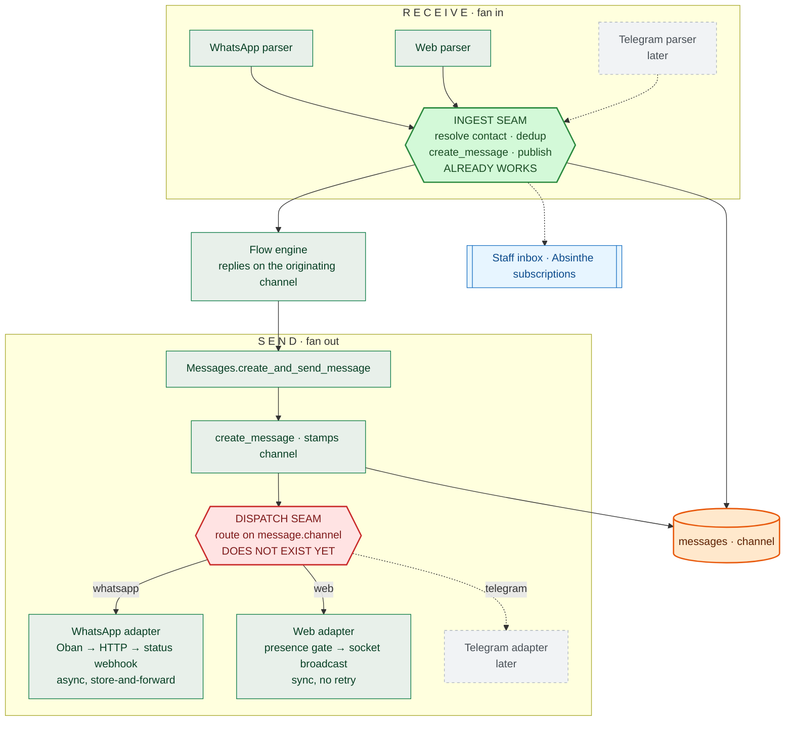
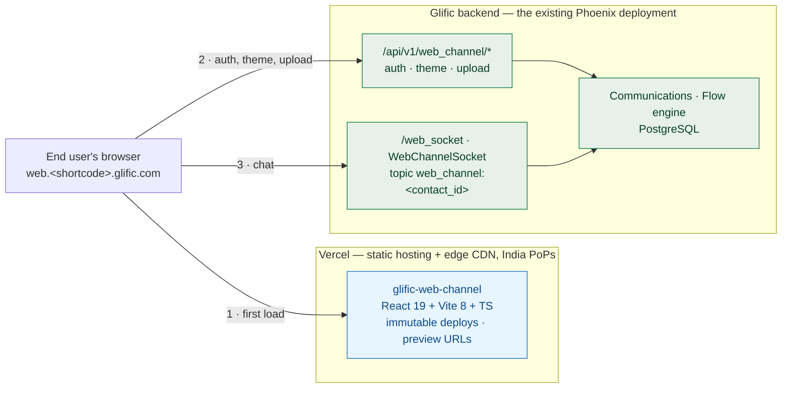
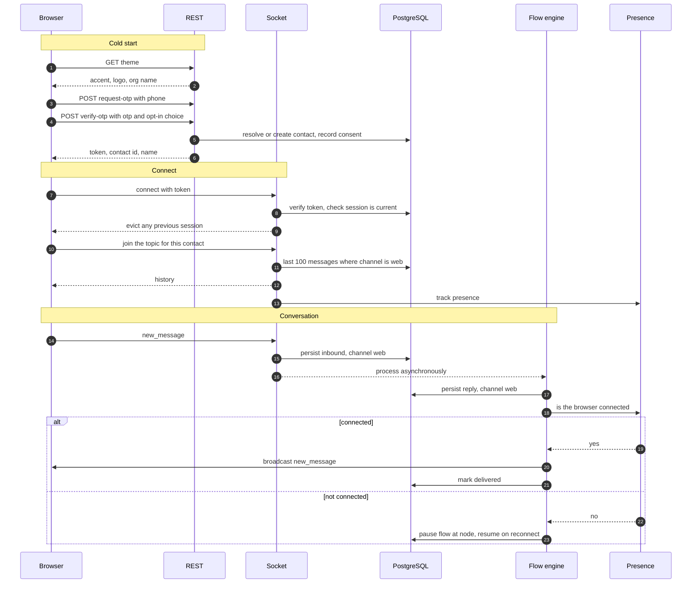
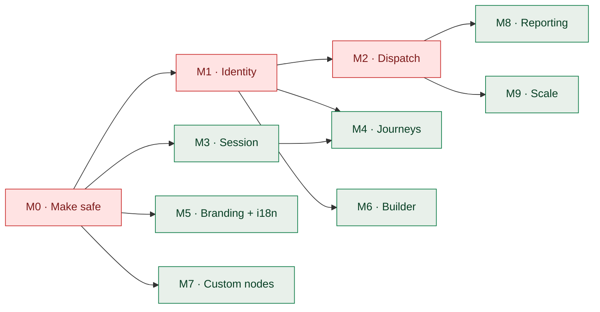

# Omnichannel Messaging — Technical Design

**Status:** Draft for engineering review · **Last updated:** 2026-08-30

> **Rendered version:** <https://claude.ai/code/artifact/381a0eea-5253-4748-987b-3780ecfe78fe>
> — same content with the diagrams rendered. This markdown is the canonical, version-controlled copy.

**Companion docs** (detail this document summarises):

| Doc | Owns |
|---|---|
| [api-auth-design.md](./api-auth-design.md) | JWT contract, signing keys, revocation, the security and scalability reviews. **Partly stale — see Open items.** |
| [custom-ui-design.md](./custom-ui-design.md) | The Blocks envelope contract, built-in blocks, authoring model, cross-channel direction |
| [frontend-hosting-decision.md](./frontend-hosting-decision.md) | Provider comparison behind the Vercel choice, egress model, cost |
| [ngo-api-integration.md](./ngo-api-integration.md) | The external-facing proposal sent to partner orgs |

**Research** (primary sources behind Parts 3 and 4):

| File | Covers |
|---|---|
| [research/telegram-rcs-integration.md](./research/telegram-rcs-integration.md) | Telegram Bot API 10.3 and RCS/RBM, with citations, exact limits, and 18 enumerated gaps. UNVERIFIED items marked |
| [research/web-channel-frontend-inventory.md](./research/web-channel-frontend-inventory.md) | What the widget repo contains today — stack, components, theming substrate, tests |
| [research/glific-infra-inventory.md](./research/glific-infra-inventory.md) | AppSignal, telemetry, CI, Cypress, staging, clustering, pool sizes |

---

# Part 1 — Summary

Glific is a WhatsApp product. This describes the work that makes it **channel-plural** — one contact reachable over WhatsApp, a browser, and later Telegram, through one inbox, one flow engine and one `messages` table — and specifies the web channel, the first channel built on that foundation.

### Status markers

This design spans shipped code, prototype code and intended work, so every non-obvious claim is marked: `[Today]` on `master`, in production · `[Prototype]` on `web-channel-prototype`, working, unmerged · `[Target]` agreed, not yet written · `[Risk]` a known hazard.

### The three claims this document makes

| Claim | Evidence |
|---|---|
| **Adding a channel should cost one parser, one adapter, one dispatch clause.** | The *ingest* seam already delivers this — every provider converges on `Communications.Message.receive_message/2` today. |
| **It does not cost that today, and we can name why.** | The *dispatch* seam doesn't exist. Send routing resolves one handler per *organisation*, so the web channel got a parallel context plus a bypass clause. Channel #3 would add a third. |
| **The web channel is the proof, and Telegram is the test.** | Telegram fits the model once `contact_identities` and `dispatch` exist. RCS does not fit, for reasons that are architectural rather than modular — §3. |

> **The one-sentence version**
>
> The web channel proved the **ingest seam works** and the **dispatch seam doesn't** — and building dispatch properly is the difference between the next channel taking a fortnight and taking a quarter.

### What is being built now

- **The web channel** — an NGO-branded browser chat, for people who have no phone of their own: students on a school's shared device, or on a parent's handset. It reuses Glific's contacts, messages and flows unchanged.
- **The omnichannel foundation underneath it** — a channel discriminator on the message, a per-channel identity model, a capability registry, and channel-neutral flows.
- **Not** a second backend, not message bridging between channels, not WhatsApp Groups (a separate domain — §2.2), and not the embeddable third-party widget, which is deferred (§4.1).

---

# Part 2 — Omnichannel design

*What makes Glific channel-plural, and what each additional channel costs.*

## 2.1 Seams: what adding a channel costs

**A channel is not a subsystem. It is two functions plugged into two seams.** Everything else — the flow engine, the staff inbox, the message store, reporting — is shared and untouched.



### The ingest seam already works `[Today]`

Every inbound provider converges on one provider-agnostic function. The Gupshup controller is three lines, and the shape is exactly right (`lib/glific_web/providers/gupshup/controllers/message_controller.ex:30`):

```elixir
params
|> Gupshup.Message.receive_text()                                    # channel-specific
|> update_message_params(%{organization_id: conn.assigns[:organization_id]})
|> Communications.Message.receive_message()                          # channel-agnostic
```

Gupshup Enterprise and Maytapi follow the same pattern. What it still needs is a `channel` stamped on the normalised params, and contact resolution that isn't phone-only.

**Per-organisation routing is already solved too**, and this is the most underrated asset in the codebase. `GlificWeb.Plugs.SubdomainPlug` resolves the org from the Host header before any provider code runs, so a new channel's webhook at `https://.glific.com/` arrives with `organization_id` populated. No per-bot lookup table, no path tokens, no tenant resolution to write.

### The dispatch seam does not exist `[Today]`

`Communications.Message.send_message/2` resolves the handler from the *organisation*, then picks the function by message *type* (`lib/glific/communications/message.ex:60`):

```elixir
apply(
  Communications.provider_handler(message.organization_id),  # org → module
  @type_to_token[message.type],                              # type → function
  [message, attrs]
)
```

There is no channel dimension in that call. `provider_handler/1` reads a single `services["bsp"]` from a single `organizations.bsp_id` foreign key, so "this message goes to the browser, that one to WhatsApp, same org" is inexpressible.

> **The evidence, and the cost of not fixing it**
>
> The web channel did not get a dispatch clause. It got a **parallel context**, `Glific.Communications.WebMessage`, plus a bypass wedged into a function named after HSM messages:
>
> ```elixir
> defp check_for_hsm_message(%{channel: "web"} = attrs, _contact),
>   do: send_web_channel_message(attrs)
> ```
>
> The reason is `Contacts.can_send_message_to?/3` — WhatsApp's 24-hour session window and template rules — which sits *in front of* the channel abstraction rather than behind it. Every non-WhatsApp channel must route around it. **Channel #2 cost one bypass; channel #3 costs the third.**

### What a channel costs once dispatch exists `[Target]`

| You write | Roughly | You do not touch |
|---|---|---|
| Inbound parser — provider payload → normalised params | 1 module | The `messages` schema — `channel` is a varchar |
| Outbound adapter implementing `MessageBehaviour` | 1 module | The `contacts` schema — identities are their own table |
| Dispatch clause routing that channel | ~3 lines | The flow engine or flow editor |
| Capability declarations | ~1 line each | The staff inbox — it reads `messages` |
| Identity namespace — a row type, no schema change | 1 row type | BigQuery — it emits the `channel` string |
| Ingress — a webhook route or a socket | 1 route | Tenant resolution — `SubdomainPlug` already does it |

***One caveat on "no migration".** That property covers the `channel` column only. `message_type_enum` is a Postgres enum, so a channel that introduces genuinely new *message types* — RCS rich cards, carousels — still needs a migration.*

## 2.2 Design decisions

### The channel lives on the message, not the contact

A contact is a *human*; a channel is a *route*. The same person may be reachable three ways at once, so a channel field on the contact would have to be a set — and even then it could not say which route a particular message took. On the message, every row is self-describing, which is what both the flow engine and the staff inbox need in order to reply correctly.

### Flows are omnichannel until a node narrows them

`flows.channels` records which channels a flow can reach, and it is **computed from the flow definition on every save**, never chosen by the author `[Prototype]`. `Flows.maybe_update_flow_type_and_channels/2` calls `Flow.derive_channels/2` and writes only on change (`lib/glific/flows.ex:501`).

A flow narrows itself: it becomes web-only once a node sends a custom-node template, WhatsApp-only when a node does a broadcast or a templated HSM send, and stays omnichannel otherwise. The migration default — `["whatsapp", "web"]` applied to every existing flow — is the concrete expression of *omnichannel unless proven otherwise*.

Asking authors to declare channels instead would mean a migration decision for every existing flow, a decision from every new author who doesn't think in channels, and genuinely-omnichannel flows marked single-channel by cautious ones.

### Contact identities: one contact, one row per channel

A person reaching an NGO on WhatsApp, on the web and later on Telegram is **one contact** carrying **one identity row per channel** `[Target]`.

```elixir
CREATE TABLE contact_identities (
  id              bigserial PRIMARY KEY,
  contact_id      bigint NOT NULL REFERENCES contacts(id) ON DELETE CASCADE,
  organization_id bigint NOT NULL REFERENCES organizations(id),
  channel         varchar(50)  NOT NULL,   -- 'whatsapp' | 'web' | 'telegram' | …
  identifier      varchar(255) NOT NULL,   -- phone | username | telegram chat id
  verified_at     timestamp,               -- how the link was proven
  inserted_at     timestamp NOT NULL,
  updated_at      timestamp NOT NULL
);
CREATE UNIQUE INDEX contact_identities_org_channel_identifier_index
  ON contact_identities (organization_id, channel, identifier);
CREATE INDEX contact_identities_contact_id_index ON contact_identities (contact_id);
```

- **Per-channel rows are forced by disjoint namespaces.** A phone number, a web username and a Telegram id are three different kinds of thing; one column holds one of them, and a second column per channel is the same problem deferred.
- **Linking is an insert, not a merge.** Attaching a web login to an existing WhatsApp contact is one row, reversible by deleting it, rewriting no message history. Merging two contacts is destructive and is exactly where comparable products have had cross-account vulnerabilities.
- **`contacts.phone` stays**, as the WhatsApp reachability field — not the identity field. It becomes nullable, but never synthetic.

**The price is paid once, and it isn't small.** Making a contact not-necessarily-a-phone touches roughly 34 phone-keyed lookup sites, each of which must be individually classified as *"who is this"* (→ identities) or *"how do I reach them on WhatsApp"* (→ `contacts.phone`). A mechanical rename produces code that compiles and is wrong. Notable breakages: `Contacts.maybe_create_contact/1` does `Repo.get_by(Contact, %{phone: nil})`, which compiles to `WHERE phone IS NULL` and returns an *arbitrary* contact — a cross-contact leak, not just a crash; and `searches.ex:179,259` filters `contact_type in ["WABA","WABA+WA"]`, so a web or Telegram contact is **silently absent from the staff inbox** until that widens.

### Contacts, profiles and identities are three different things

Glific already has `profiles` (1 contact → N profiles), and the overlap with identities is real enough to be worth settling explicitly. They answer different questions:

|  | Question it answers | Mutated by use? | Uniqueness | Chosen by |
|---|---|---|---|---|
| **`contacts`** | Who is authorized and attributed? — the principal | — | `(phone, org)` | — |
| **`contact_identities`** | Which contact is this external name? — the index | No | `(org, channel, identifier)` | The transport, from a token or webhook |
| **`profiles`** | Which persona of this contact is active? — the state | **Yes** — rewrites `contact.fields`, `language_id` | `(name, type, contact_id, org)` | The end user, typing "2" in a flow |

**Decision: keep them separate tables.** Two details make reuse unworkable. First, the profiles unique index *includes* `contact_id`, so you cannot look up a profile by name within an org — which is precisely the query identity exists to serve. Second, `Profiles.switch_profile/2` copies `profile.fields` onto the contact row and `ContactField.maybe_update_profile_field/2` mirrors writes back; the contact row is a working copy of the active profile. An identity must never mutate the contact — and if identity rows lived in `profiles`, every one would be reachable by `fetch_indexed_profile/2`, so an end user typing a number in a flow could switch into an identity.

The clean statement: **identity is per-channel, profiles are per-contact, and each channel can support whichever profiles the org has defined.** Profiles are *not* per-channel — no `profiles.channel` column, and the unused `profiles.type` is not repurposed for it, because that would rebuild the identity table inside profiles.

### A capability registry instead of `channel == "web"`

What a channel can *render* is declared in one registry `[Prototype]` (`lib/glific/channels/channel_capability.ex`):

```elixir
@capabilities %{ blocks: MapSet.new(["web"]) }

def supports?(channel, capability) do
  @capabilities |> Map.get(capability, MapSet.new()) |> MapSet.member?(channel)
end
```

The failure mode this prevents is inevitable otherwise: a feature ships gated on `if channel == "web"`, the check spreads to five call sites, and the second channel that can render it has to find all five. It also enables graceful degradation — on a channel that cannot render a custom node, the message downgrades to its derived plain text and raises a flow notification rather than erroring.

**What it is not for:** `supports?/2` answers "can this channel render X", never "is this the web channel". Presence, sockets and OTP are genuinely web-specific and belong in web-specific code. Conflating the two turns a capability registry into a second, worse channel enum.

### Delivery semantics differ per channel, and the contract must admit it

|  | WhatsApp | Web | Telegram |
|---|---|---|---|
| Transport | HTTPS to the BSP | WebSocket to the browser | HTTPS to Telegram |
| Timing | Async — Oban | Sync — inline broadcast | Async — Oban |
| Recipient offline | Provider queues and retries | **Nothing to deliver to** | Telegram queues |
| Status source | Status webhook | Client ack | **None — no receipts exist** |
| Send eligibility | 24-hour window, HSM rules | None apply | User must `/start` first |

`MessageBehaviour` already types its returns as a union — `{:ok, Oban.Job.t()} | {:error, Ecto.Changeset.t()} | {:error, String.t()}` — and that looseness is the only reason an async and a sync channel can implement the same behaviour. `[Target]`: widen it with `{:ok, :deferred}`, for a send that could not be delivered now and has paused the flow at that node.

### WhatsApp Groups stay off this axis

Groups already have their own table, `wa_messages`, and their own domain. That is not historical accident: the `messages` axis is *one contact, one conversation*, and a group message has many recipients and a group identity that is not a contact. Folding them in would mean a nullable `contact_id` on the hottest table in the schema, or synthetic contacts for groups. Maytapi is also a *provider*, not an identity namespace — it addresses people by phone, exactly as Gupshup does.

## 2.3 Schema changes

Everything the omnichannel foundation needs, in one place. All additive; all rewrite-safe.

| Table | Change | Status |
|---|---|---|
| `messages` | `channel` varchar, default `"whatsapp"`, `NOT NULL`; index on `[:contact_id, :channel]`. Plain string, no PG enum, so new channels need no migration | `[Prototype]` |
| `flow_contexts` | `channel` varchar, default `"whatsapp"`, `NOT NULL`. This is what makes a flow reply on the channel it was triggered from — the inbound message's channel is written onto the context and every outbound send reads it back | `[Prototype]` |
| `flows` | `channels` `{:array,:string}`, default `["whatsapp","web"]`, `NOT NULL`; backfills `["web"]` where `flow_type = 'web_message'`. Derived on save, never authored | `[Prototype]` |
| `contacts` | `channels` `{:array,:string}` with a GIN index — denormalised so the staff inbox can filter without a join. `phone` becomes nullable | `[Target]` |
| `contact_identities` | New table (§2.2) | `[Target]` |
| `message_type_enum` | `:blocks` added for custom nodes. A PG enum — irreversible, and the one place where "no migration" does not hold | `[Prototype]` |
| `interactive_message_type_enum` | `:blocks` added, same caveat | `[Prototype]` |

**Why the defaults matter.** Every existing row reads `"whatsapp"`, and the migrations do not bump `updated_at` — so nothing re-syncs downstream and no existing behaviour changes on deploy. `contact_type` is deliberately left alone: it is written by the Gupshup and Maytapi controllers and read by `reports.ex` and the stats dashboards, so adding `channels` is additive while replacing `contact_type` would be a downstream break for no present gain.

---

# Part 3 — Telegram & RCS — integration exploration

*Neither is being built. Both are here to test the design: Telegram is the channel that fits, RCS is the one that doesn't, and the gap between them is what tells you where the architecture actually ends.*

## 3.1 Telegram — the channel that fits

*Against Telegram Bot API 10.3 (2026-08-24).*

### How it maps to the seams

| Seam | Module | What it does |
|---|---|---|
| Ingest | `…Telegram.Plugs.Shunt` | Verify `X-Telegram-Bot-Api-Secret-Token`; branch on which `Update` field is present; rewrite `path_info` |
| Ingest | `…Telegram.Router` | `/message/{text,photo,document,voice,…}`, `/callback_query`, `/my_chat_member` |
| Ingest | `…Controllers.MessageController` | The standard three-line chain into `Communications.ingest` |
| Dispatch | `Providers.Telegram.Adapter` | `MessageBehaviour`: `sendMessage`, `sendPhoto`, `sendDocument`, `sendVideo`, `sendAudio`/`sendVoice`, `sendSticker` |
| Dispatch | `Providers.Telegram.ApiClient` | Tesla; token from `services["telegram"]` |
| Dispatch | `Providers.Telegram.Worker` | Oban `queue: :telegram` with a rate limit |
| Seam | `Communications.dispatch` | One `channel: "telegram"` clause |
| Config | `ChannelCapability` | `blocks: […, "telegram"]`, `quick_reply`, `location_request_message` |

### What is genuinely free

- **Per-org routing.** Each NGO calls `setWebhook` with `https://.glific.com/telegram`; `SubdomainPlug` populates `organization_id` exactly as it does for Gupshup. No lookup table, no path tokens.
- **Credential storage.** A `providers` row with `shortcode: "telegram"` and per-org `credentials.secrets["bot_token"]`, already encrypted by `Glific.Encrypted.Map` and already surfaced as `organization.services["telegram"]`. **No schema change.**
- **Onboarding is minutes** — @BotFather `/newbot`. No verification, no carrier, no approval.
- **Blocks render natively via Mini Apps** — arbitrary HTTPS HTML/JS with an HMAC-authenticated `initData`. Telegram is the only non-web channel that could render custom nodes properly rather than degrading to text, which makes it the strongest available proof that the Blocks abstraction is real and not web-shaped.

### What isn't free

| Gap | Why it isn't a clause |
|---|---|
| **`contact_identities` is a hard prerequisite** | `contacts` is unique on `(phone, organization_id)` and a Telegram user *has no phone* — it is obtainable only if the user taps a `request_contact` button. The web channel dodged this by inventing phone+OTP; Telegram has no such escape hatch. **Telegram cannot ship before identities.** |
| **Bots cannot initiate** | Users must `/start` first. Broadcasts, triggers and contact import all assume you can message any contact you hold. Acquisition is deep-link only (`t.me/?start=`, ≤64 chars). Every outbound path needs a reachability precondition that does not exist. |
| **No delivery receipts at all** | The exhaustive `Update` type list contains no delivery or read event. `MessageStatus` has `:delivered` and `:read` that can never fire, so a delivery-rate report shows Telegram at 0% rather than N/A. The status model needs a per-channel notion of which states are *observable*. |
| **`answerCallbackQuery` is mandatory** | Telegram shows a spinner until you call it. That is an *outbound API call triggered by an inbound event*, and it is not a message. `MessageBehaviour` is send-only plus parse-only; the ingest seam has no "acknowledge the provider" step. Genuinely new surface. |
| **Rate limits are per-chat** | 1 message/second *per chat*, ~30/s per bot. The `gupshup` Oban queue is plain `gupshup: 10` with no rate limiting. Oban Pro's `rate_limit` with `partition` can express it — config work, not architecture. |
| **Media is per-bot, and the URL is a secret** | `getFile` URLs embed the bot token in the path — never log or persist them. `file_id` is bot-scoped, so one bot per NGO means a shared asset must be re-uploaded per org. |
| **Groups are a separate domain** | The Maytapi precedent is unambiguous — `wa_messages`, its own context, its own workers. Telegram groups would be a third such domain, not a parser clause. |

***Identity detail worth recording now:** persist `chat.id` from inbound updates as the `contact_identities.identifier`. Do *not* synthesise it from `user.id` — that `chat.id == user.id` in private chats is community folklore, never documented. `User.id` is globally scoped (not per-bot), but the docs make **no permanence guarantee** for it, in pointed contrast to `File.file_unique_id` where they explicitly do. Never key on `username`; it is optional.*

## 3.2 RCS — the channel that doesn't fit

RCS is worth examining precisely because it fails, and it fails in ways that are architectural rather than modular. Provider selection is deliberately out of scope here; what follows is about the RCS/RBM API shape itself, which every aggregator wraps.

### The parts that map cleanly

Inbound is *better* suited to Glific's existing model than the web channel was. Messages arrive as a typed union — `text` | `userFile` | `location` | `suggestionResponse` — carrying `messageId` and `senderPhoneNumber`, with separate `DELIVERED` and `READ` events keyed by `messageId`. That is `bsp_message_id` plus the existing `message_event_controller` almost unchanged. The webhook is a Phoenix controller. Suggested replies map onto `quick_reply` well, and `shareLocationAction` is a native `location_request_message`.

> **Where it breaks — three architectural problems**
>
> **1 · Capability-check-then-fallback is a multi-day saga.** RCS requires checking whether a handset supports RCS before sending; a non-capable number returns 404. And the platform does no fallback for you — the documented-safe sequence is *send → await `DELIVERED` or TTL expiry (up to 15 days) → revoke the original → only if the revoke succeeds, send SMS*. `send_message/2` is a synchronous `apply/3` that enqueues one Oban job. It has no pre-send hook, no post-send wait state, no revoke concept — and there is **no cross-channel fallback anywhere in `lib/glific`**. This does not fit the dispatch seam; it needs something above it.
>
> **2 · RCS shares the phone namespace with WhatsApp.** RCS addresses users by E.164. Under `contact_identities` that is fine — same `identifier`, different `channel`, no uniqueness violation, resolving to one contact exactly as intended. The problem is downstream: **for the first time one contact is reachable on two channels at the same address, and nothing decides which to use.** Today `channel` is an *input* to send, stated by the caller. With RCS it becomes an *output* of a routing decision over preference, capability, cost and reachability. **No channel-selection policy exists in Glific**, and `provider_handler/1` cannot express one.
>
> **3 · Rich content needs an enum migration.** Rich cards and carousels have no `messages.type` value, and `message_type_enum` is a Postgres enum. Either overload `:quick_reply`/`:list` and lose fidelity, or ship a migration — and enum values cannot be reversed.

### Commercial friction, briefly

Not our design problem, but it decides whether the engineering is ever worth starting: agent launch requires partner registration, brand verification by a named employee, and **per-carrier** launch approval including a screen recording demonstrating a working STOP flow. India promotional caps are reputation-tiered over 28 days, and every new agent starts at the lowest tier — **2 messages per user per 28 days**, which is likely disqualifying for an NGO broadcast use case unless the agent classifies as transactional.

*One thing worth resolving with a provider rather than designing around: whether India's DLT regime applies to RCS A2P traffic. TRAI's own regulations were full-text searched and contain **zero** occurrences of "RCS"; the claims that it applies come from vendors who sell DLT registration. DLT unambiguously governs the SMS fallback leg.*

## 3.3 What this exploration proves

Two channels, examined against the same design, giving opposite answers — which is more informative than either alone.

|  | Telegram | RCS |
|---|---|---|
| Identity namespace | Telegram `chat.id` — no phone | E.164 — *shares WhatsApp's namespace* |
| Delivery receipts | None | `DELIVERED` + `READ` + typing |
| Can initiate? | No — user must `/start` | Yes, if launched and capable |
| Custom nodes | **Native** via Mini Apps | Partial — `glific/*` only |
| Onboarding | Minutes | Weeks to months, per carrier |
| Fits the two seams? | **Yes**, once identities + dispatch exist | **No** — needs a saga layer and a routing policy above dispatch |

> **The conclusion worth carrying forward**
>
> **Telegram is the channel that would justify building `dispatch` properly. RCS is the channel that would break it again.**
>
> Three things the design does *not* yet accommodate, surfaced by this exercise and worth building toward rather than discovering later: a **per-channel observable-status model** (Telegram has no receipts), a **reachability precondition** on every outbound path (Telegram bots cannot initiate), and an **inbound-triggered outbound acknowledgement** step in the ingest seam (`answerCallbackQuery`). None blocks the web channel. All three are cheap to design for now and expensive to retrofit.

---

# Part 4 — Web channel implementation

*The channel being built now. This is the section that will move into the repo as implementation detail.*

## 4.1 Deployment



**`glific-web-channel` is a standalone repo** — React 19.2.8, Vite 8, TypeScript 6, yarn, Tailwind v4 (CSS-first, no config file), shadcn vendored into `src/components/ui/`, Radix via the unified package, react-hook-form + zod, the `phoenix` JS client and axios. No Apollo. Keeping it out of `glific-frontend` avoids shipping the staff GraphQL schema in a public bundle and avoids entangling two unrelated auth models. It is ~3,100 LOC across 41 files with 67 passing Vitest tests.

### Why Vercel

The widget deploys today as a Docker + nginx static image. Vercel is the `[Target]` because it solves most of the current `glific-frontend` pain in one move: **India edge PoPs** (first load is the whole experience for a chat widget), **immutable versioned deploys** (no more lazy-load chunk 404s after a deploy), **zero-config preview deployments** per PR, and ~1–3 minute builds. Each org's `web..glific.com` points at it by CNAME.

**No new backend service.** Same Phoenix app, same PostgreSQL, same deployment.

> **Tenancy constraint that shapes several later sections**
>
> Today **one deployed widget serves exactly one org**. `VITE_*` variables are inlined at build time, and the backend resolves the org from the request hostname — the client sends no org identifier anywhere. That is why theming must be a *runtime* fetch (§4.8) rather than build args: otherwise every NGO needs its own build, and a colour change becomes a redeploy.

### The embeddable widget is deferred

The widget is a full-page SPA at `/login` and `/chat`. An embeddable build — a script or iframe snippet for a third-party NGO site — needs shadow DOM or scoped Tailwind for style isolation, a host script, `postMessage` plumbing, and origin allowlisting. That is its own project and is explicitly **not in this scope**. What matters now is that the SPA avoids foreclosing it: no reliance on page-level globals, no assumptions about owning the document, and styling that already funnels through scoped tokens.

***One thing to check before the widget:** `check_origin` is driven by `REQUEST_ORIGIN`/`REQUEST_ORIGIN_WILDCARD` in `runtime.exs`, and it gates WebSocket upgrades. A widget on arbitrary customer domains is rejected by it unless the web-channel socket declares its own `check_origin`.*

## 4.2 Schema changes — the full list

Everything the web channel needs, including what §2.3 already covers, so this section stands alone when it moves to the repo.

| # | Change | Detail | Status |
|---|---|---|---|
| 1 | `messages.channel` | varchar, default `"whatsapp"`, `NOT NULL`; index `[:contact_id, :channel]` | `[Prototype]` |
| 2 | `flow_contexts.channel` | varchar, default `"whatsapp"`, `NOT NULL` — carries the reply channel through a flow run | `[Prototype]` |
| 3 | `flows.channels` | `{:array,:string}`, default `["whatsapp","web"]`, `NOT NULL`; backfill from `flow_type` | `[Prototype]` |
| 4 | `message_type_enum` | add `:blocks` | `[Prototype]` |
| 5 | `interactive_message_type_enum` | add `:blocks` | `[Prototype]` |
| 6 | `contact_identities` | New table — one row per human per channel (§2.2) | `[Target]` |
| 7 | `contacts.phone` | Becomes nullable. Gated on the ~34-site lookup audit | `[Target]` |
| 8 | `contacts.channels` | `{:array,:string}` + GIN index — denormalised for inbox filtering | `[Target]` |
| 9 | Session store | `current_session_id` — the one-session-per-contact enforcement point (§4.5). Home is `contact_identities`; a minimal `web_channel_sessions` table until that lands | `[Target]` |
| 10 | `organizations` theme | Per-org accent colour, logo URL and display name for the runtime theme endpoint (§4.8). A JSONB column or a small `web_channel_themes` table | `[Target]` |
| 11 | WhatsApp opt-in consent | Consent value + timestamp on the contact, recorded at OTP time (US3). Existing opt-in fields may suffice — confirm before adding | `[Target]` |
| 12 | `messages.bsp_message_id` → `channel_message_id` | **Rename, not a new column.** Plus a re-scoped unique index and a redefinition of the `message_before_insert_callback` trigger, which references the old name (§4.4) | `[Target]` |

> **#12 — why rename rather than add a column**
>
> A new `web_message_id` would be easier, but it sets a precedent: Telegram then wants `telegram_message_id`, RCS wants `rcs_message_id`, and the schema grows one nullable column per channel for a single concept.
>
> `bsp_message_id` is *already* that concept — "the identifier the other side of the channel assigned to this message" — and it is **already the inbound deduplication mechanism**. `Communications.Message` catches the unique-constraint violation explicitly, logs *"Duplicate inbound message ignored"* and increments an AppSignal counter, because Gupshup delivers webhooks at-least-once. For the web channel the client is simply the other side, so the machinery the design needs is battle-tested rather than new.
>
> Two changes come with the rename:
>
> - **Re-scope the unique index.** It is `(bsp_message_id, organization_id)` today. That is safe for a *provider*-assigned value, but a *client*-supplied one turns it into an attack primitive: contact A claims an id, contact B's message with the same id fails to insert — suppression, plus an existence oracle. It must become `(organization_id, channel, contact_id, channel_message_id)`, which still catches a duplicate webhook because a redelivery carries the same contact too. Keep a separate non-unique index on `channel_message_id` alone: the status-webhook path looks up by that value with no other scoping, and the composite index cannot serve it.
> - **Redefine the trigger.** `message_before_insert_callback` resolves reply context with `WHERE bsp_message_id = NEW.context_id`, so the migration has to rewrite that plpgsql function. This is the only non-mechanical part of the rename.
>
> Also worth changing: the column comment currently reads *"Whatsapp message ID"*.

## 4.3 End-to-end flow

One round trip, from a cold browser to a flow reply.



**The two things this diagram is really saying.** First, the flow engine is untouched — it runs exactly as it does for WhatsApp, and the only difference is that `FlowContext.channel` is `"web"`, so its sends route to the browser. Second, delivery is *presence-gated*: unlike a BSP there is no store-and-forward, so "recipient not connected" is a first-class outcome rather than an error.

*Today the disconnected branch marks the message `bsp_status: :error` with no retry and no flow pause — the message is persisted and silently never delivered. That is the largest functional gap in the prototype and is item 1 in §5.*

## 4.4 APIs — what exists and what's needed

### REST

| Endpoint | Purpose | Status |
|---|---|---|
| `POST /api/v1/web_channel/request-otp` | Send an OTP to a phone number | `[Prototype]` |
| `POST /api/v1/web_channel/verify-otp` | Verify; resolve or create the contact; return the socket token. Gains the WhatsApp opt-in flag (US3) | `[Prototype]` |
| `POST /api/v1/web_channel/upload` | Media upload → GCS, returns a URL for the socket push | `[Prototype]` `[Risk]` |
| `GET /api/v1/web_channel/theme` | Per-org accent, logo, display name (§4.8) | `[Target]` |
| `GET /api/v1/web_channel/me` | `{contact_id, name}` — lets a client that doesn't know its own id derive the socket topic | `[Target]` |
| `POST /api/v1/web_channel/logout` | Ends the session and evicts the socket | `[Target]` |

`[Risk]` All three prototype endpoints sit in the **unprotected** `:api` pipeline, and the source comment on `upload` admits it "should be behind a protected scope". `/theme` is legitimately public (it renders before login); `/me` and `/logout` go on the authenticated pipeline. **OTP endpoints need rate limiting** — none exists today, and US17 requires a resend with sensible limits.

### Socket

Mounted at `/web_socket`, deliberately separate from the staff `/socket` (which carries Absinthe GraphQL subscriptions). The split exists because the principals differ: staff authenticate as a `User`, web end-users as a `Contact`. Topic is `web_channel:`.

| Direction | Event | Payload |
|---|---|---|
| → server | `new_message` | `{body}` — gains `channel_message_id` for idempotency |
| → server | `new_media_message` | `{type, url, content_type?, filename?, caption?}` |
| → server | `new_location_message` | `{latitude, longitude}` |
| → server | `blocks_response` | `{message_id, component, values, summary}` |
| → server | `load_more` | `{offset}` — pages of 100 |
| → server | `update_name` | `{name}` |
| ← client | `new_message` | Serialised message |
| ← client | `contact_updated` | `{name}` — pushed when a flow captures the contact's name |
| ← client | `session_ended` | `[Target]` — sent to a session being evicted (§4.5) |

### Two properties that are not obvious

- **The topic is per-contact, and must stay that way.** A convenience proposal — every client joins `web_channel:me`, the server resolves the contact — was implemented and withdrawn. In Phoenix *the channel topic string is the PubSub topic*: a literal `me` puts every contact in every tenant on one topic, makes the presence gate always true, routes broadcasts where nobody is subscribed, and — worst — makes `join/3`'s `contact_id` comparison constant, quietly emptying the module's only authorization check.
- **Rejection is uniform.** A foreign `contact_id` returns the same `"unauthorized"` whether or not that contact exists, so `join` cannot be used to enumerate contacts.

### Idempotency

Inbound has none today. A retried send from the client can create two messages and **advance a flow twice**. An ack does not fix this — the lost ack *is* the failure mode.

The fix reuses the existing mechanism rather than adding one: the client supplies an id in `channel_message_id` (the renamed `bsp_message_id`), and the unique-constraint handling that already deduplicates at-least-once Gupshup webhooks deduplicates these too. See §4.2 #12 for the rename, the index re-scoping, and why a per-channel column was rejected.

**`bsp_status` is deliberately *not* renamed.** Same instinct, very different blast radius: 111 references in `lib/`, six GraphQL fields across two types with two different enums, exported to BigQuery under *two* names (`bsp_status` and `provider_status`), and consumed by fifteen frontend files. `bsp_message_id` by contrast has 66 internal references, one GraphQL field, **zero** BigQuery exposure, and appears in the frontend only inside simulator mocks. The web channel does not need status anyway — so the naming debt stays recorded (§5 #4) rather than paid here.

## 4.5 Authentication

Two modes, one socket. **OTP** for Glific's own widget; **an NGO-minted JWT** for a partner org embedding messaging in its own product, where Glific never issues credentials to that org's end users.

### The JWT contract

**HS256**, not RSA. Glific generates the signing key and shares it with the org; the org may hold up to five keys at once for rotation, selected by the `kid` header. There is no JWKS endpoint — rotation is `kid`-based.

```elixir
Header  { "alg": "HS256", "typ": "JWT", "kid": "gws_7f3a91c4" }
Payload { "sub":     "member_4471",        // the org's own identifier for this person
          "channel": "web",
          "jti":     "0d1c…",              // session identifier — MANDATORY
          "iat":     1756300000,
          "exp":     1756303600,
          "profile_id": 42,                // optional
          "phone":   "+919876543210",      // optional
          "name":    "Asha Kumari" }       // optional
```

| Rule | Why |
|---|---|
| `verify_strict` with the algorithm pinned to HS256 | Prevents algorithm confusion and `alg: none` |
| `iat` and `exp` both mandatory; TTL capped server-side | An org cannot mint an effectively immortal token |
| The `kid`'s owning org must match the request host's org | The signature proves the org, so a separate `org` claim is redundant — but the cross-check must still happen |
| `sub` + `channel` resolve through `contact_identities` | Identity is the index; the contact is the principal |
| Uniform rejection, with clock leeway | Errors must not distinguish "unknown" from "not yours" |

**The `phone` claim is the sharpest risk.** If the org sends a phone we treat it as verified by them — we do not verify it. It exists so a web user can be linked to an existing WhatsApp contact instead of creating a duplicate. If the phone later changes, we silently ignore it. Multiple people on one phone is not supported through this claim; that is what profiles are for.

### One session per contact

The rule applies to **both** modes. The session identifier is our UUID for OTP logins and the org's `jti` for JWTs — stored in one place, checked by one code path in `connect/3`: **equal** ⇒ same session, allow (so reconnects and multiple tabs work); **different** ⇒ new session, evict the previous socket and store the new identifier.

> **Why enforcement lives in the auth check, not the socket**
>
> The naive approach — `Endpoint.broadcast(socket_id, "disconnect", %{})` — fails twice. It disconnects *every* socket sharing that id, including the one that just connected; and even done correctly, the phoenix JS client auto-reconnects on an unexpected close with the same still-valid token, so the evicted browser displaces the winner and the two flip-flop indefinitely.
>
> **"Newest wins" is a statement about tokens, not sockets.** Because Phoenix subscribes a socket to its id topic in `__init__` — *after* `connect/3` returns — a broadcast issued from inside `connect/3` reaches only the previous socket. And because the new session id is written to the database first, the evicted client's reconnect fails the auth check rather than looping. The database write is the serialisation point, so two simultaneous logins cannot both win.

**Renew** verifies identity only — no other claim is re-checked — and updates the stored session identifier so a later reconnect isn't misread as a new session. Making renew narrow is deliberate: anything it verifies becomes something it can be used to change.

> **Guidance the NGO documentation must carry prominently**
>
> Because `jti` identifies the session, an org must **mint one token per user session and cache it** — *not* mint per page load. The widely-copied Intercom pattern mints a JWT at every page load; implemented that way here, every navigation starts a new session and evicts the previous one, so two tabs fight. The failure is intermittent and reads as an auth bug. The eviction error should say *session replaced*, not *unauthorized*.

### Profiles on the web channel

Profiles are supported from the start. The token may name a `profile_id`; if absent, the contact's `active_profile_id` is used. Glific's own widget never sends one — it mirrors WhatsApp behaviour. Orgs can read profile ids through the existing `profiles` GraphQL query. Flows switch profiles through the existing Switch Profile action.

**Invariant:** a `profile_id` that does not belong to the resolved contact is **rejected**, not ignored — otherwise the claim is a cross-contact profile read.

History is *not* profile-scoped: the topic and the message query are per contact per channel, matching WhatsApp, where several people sharing one handset already share one thread. Renew does not verify the profile.

> **Must not reach production**
>
> The `"9999"` OTP bypass is gated on `Application.get_env(:glific, :web_channel_otp_bypass, false)` — set in `dev.exs` and `test.exs`, absent from `prod.exs`. It is one config flag away from being a universal login for every contact. Prefer a compile-time guard. The upload endpoint being unauthenticated is the other.

## 4.6 Custom nodes

Rich, app-like UI delivered inside a conversation — an image panel, a carousel, a form — rendered by the widget instead of being flattened into text.

> **It is not a new flow node**
>
> Custom nodes are a **fourth interactive message type** on the existing Interactive Messages page, next to Reply buttons / List / Location request. Flows attach them through the existing *Send Interactive Message* node. That reuses template storage, per-language translations, variable substitution and the flow editor unchanged — **zero floweditor fork changes**, so no npm release is on the critical path.

### The contract

A message carries an **opaque typed envelope**: a namespaced `component` plus its props. Two namespaces, deliberately:

- **`glific/*` — built-in blocks** (`image-panel`, `carousel`, `form`). Glific owns the schema, validates it on save, and the widget renders them richly out of the box.
- **`/*` — org namespaces** (e.g. `tap/attendance`). Glific validates only the envelope, never the payload, and renders a generic fallback card. The org's own client registers a renderer at runtime.

Every custom node carries a **required, translatable fallback text**. On a channel that cannot render it, `ChannelCapability.supports?/2` returns false, the message is sent as that plain text, and a flow notification records the downgrade. Nothing errors.

### Responses

A response pushes `blocks_response` with the originating `message_id`, the component, the values and an auto-built summary. The backend matches it to the outbound message, checks it has not already been answered, marks it answered and creates the inbound reply. Unmatched or already-answered responses are dropped — which is what makes the answered state in history truthful rather than cosmetic.

*Permanent-by-choice regardless of branch: the two enum values, the template type name, the envelope field names, and the `glific/*` block names and schemas. Everything else can move.*

**Channel compatibility is derived, shown, and warned about.** Interactive templates are grouped by the channels they render on — *Web + WhatsApp*, *Web only*, later *RCS only* — as a badge on the template. Adding a Web-only template to a flow narrows that flow, and publishing surfaces the warning (US8).

## 4.7 UI library — shadcn

**shadcn/ui on Radix primitives, with Tailwind v4.** Chosen because the components are *copied into the repo* rather than imported as a dependency: no version pin to fight, no upstream breaking change, and every component is editable in place. That matters more than usual here, because NGOs may fork this widget.

Current usage is deliberately thin — six components (`button`, `card`, `dialog`, `input`, `label`, `scroll-area`) and four Radix primitives (`Slot`, `Dialog`, `Label`, `ScrollArea`). Radix gives the Dialog a focus trap and Escape handling for free, which is the kind of accessibility work that is expensive to retrofit and invisible when done right.

**Why not the staff app's toolkit:** the staff console is a different product with a different auth model and a much larger bundle. A public chat widget's first-load size *is* its user experience, and it should not carry the staff GraphQL schema.

*Two oddities in the current vendoring worth tidying: the `shadcn` npm package is a *runtime* dependency whose stylesheet is imported, and 13 sidebar and chart tokens are carried over from the default template and unused.*

## 4.8 Theming — per-organisation branding

**Today there is effectively none** — the only per-org element is the NGO name fetched onto the login screen. No logo, no brand colour, no font override.

**But the substrate is ideal.** The widget contains *zero* hex, rgb or oklch literals and zero inline styles outside `src/index.css`; the whole palette funnels through about twenty CSS custom properties on `:root`. Overriding a handful of them at runtime retheme almost everything, including message bubbles.

### The decision: runtime fetch

`GET /api/v1/web_channel/theme` at boot, writing tokens onto `:root` before first paint. **One build serves every NGO**, and a colour change takes effect on reload rather than requiring a redeploy. Build-time theming would mean a deploy per org — which does not scale to Glific's org count and makes "change our colour" an engineering ticket.

| Controllable | Maps to | Notes |
|---|---|---|
| Accent colour | `--primary` + a derived `--primary-foreground` | The foreground must be **computed**, not supplied — `--primary` is currently near-black, and an org accent without a matching foreground makes button text vanish |
| Logo | Header and login card | Replaces the hardcoded Glific mark |
| Display name | Login card, document title | Extends the mechanism that already exists |

**Scope is deliberately narrow.** Accent, logo and name are what NGOs actually ask for. Full palette control means every org can produce an unreadable widget, and contrast is an accessibility obligation, not a preference. The token structure makes background and radius additive later if wanted.

***Implementation notes.** Values are `oklch()`, so a hex from an admin form needs conversion — or the tokens must accept arbitrary colour syntax. Override the *raw* vars (`--primary`), not the `--color-*` aliases, which are compiled through `@theme inline`. Hold first paint behind the fetch to avoid a flash of default styling. And the dark palette is currently **dead code** — a complete `.dark` block that nothing ever activates; decide whether theming activates it or it is deleted.*

## 4.9 Localisation

There is **no i18n at all** today. Every user-facing string is a hardcoded English literal — *Type a message*, *Send OTP*, *Reconnecting…* — and `index.html` hardcodes `lang="en"`.

That is a sharper gap than it looks, because the *message content* is already multilingual: flows send whatever language the org authored, and Glific contacts carry a `language_id`. So a Hindi conversation currently sits inside English chrome.

**In scope, and early.** Not because translations are urgent, but because extraction is cheap now — 41 files, roughly 40 strings — and expensive after another few thousand lines. The costly-to-retrofit part is threading the contact's `language_id` through to the client and wiring the string catalogue; shipping actual translations can follow whenever an NGO needs one.

*Also outstanding on the same axis: no RTL support (`components.json` sets `"rtl": false`), and time formatting forces 24-hour while otherwise respecting the browser locale.*

## 4.10 Feature tours

**react-joyride**, for introducing features in-product — pointing out the attach button, the location control, a new custom node — without shipping a manual.

> **Package vetting — Medium risk**
>
> Latest 3.2.0 published 2026-07-09; 7,846 stars; 1.37M weekly downloads; MIT; no security advisories; peer deps `react: "16.8 - 19"`, so React 19.2.8 is supported. **The concern is bus factor:** 133 of 134 commits in the last twelve months are by the sole maintainer. Accepted knowingly — the surface area we depend on is small and replaceable. `driver.js` and `@reactour/tour` are the alternatives if that changes; `intro.js` is AGPL-dual and unsuitable.

Keep the integration shallow: a tour definition per feature, a per-viewer "seen" flag, and no coupling between tour steps and component internals beyond stable selectors. Tours should be skippable, must respect `prefers-reduced-motion`, and must not run on first login — a student's first experience should be the conversation, not a walkthrough.

## 4.11 BigQuery

Glific streams tables to each org's BigQuery dataset via a cron-triggered Oban worker, with a hand-maintained schema and an explicit named-key row builder. Two consequences:

1. The Postgres migration is **inert for BigQuery** until the row builder emits `channel`.
2. **Emitting before patching is a silent, per-org failure.** If the row builder emits `channel` to an org whose BigQuery `messages` table lacks the column, `insertAll` returns fatal `insertErrors`, the job raises with `max_attempts: 1` (no retry), and that org's message sync stalls — with no self-heal and no alert, because the schema-patch path is fire-and-forget.

> **Rollout order — not negotiable**
>
> 1. Ship the Postgres migration. *(inert for BigQuery)*
> 2. Add `channel` as a **NULLABLE STRING** to `message_schema`. **Do not touch the row builder.**
> 3. Bulk-patch every BigQuery-enabled org, then **verify each org's table schema individually** — the patch loop does not report failures.
> 4. **Only then** add `channel` to the row builder and deploy.
>
> Never collapse 2 and 4 ahead of 3.

Historical rows read `NULL`; `COALESCE(channel,'whatsapp')` is the documented idiom for report authors, and no existing dashboard breaks. `flows.channels` has a related caveat: the BigQuery `flows` table is insert-only and never re-synced on update, which is exactly why a derived-at-creation value is safe there.

**This is what the reporting user stories depend on.** Per-channel and deduplicated reach (US9) and channel-labelled session metrics (US10) are BigQuery queries over a `channel` column that does not exist downstream yet. Channel emission is deferred to production rollout — off the MVP critical path, but it gates the reporting stories.

## 4.12 Testing plan

### What exists

| Layer | Today |
|---|---|
| Backend unit | ExUnit, 233 files. Tesla.Mock is the standard for external HTTP (85 files). **`GlificWeb.ChannelCase` exists and has zero users** — the web channel is its first consumer |
| Backend coverage | ExCoveralls → Codecov, project target **88.25%**, `if_ci_failed: error`. But `coveralls.json` skips `lib/glific_web/channels/` |
| Widget unit | Vitest, 8 files / 67 tests, all passing. No CI in that repo at all |
| Full-stack e2e | Cypress — 24 specs, a typed ~25-command support layer, two symmetrical cross-repo CI rigs that boot a real backend + frontend + Postgres behind an ngrok tunnel, 3-way sharding, plus a production smoke test every 27 minutes wired to Instatus |
| Load / performance | **None.** No benchee, k6, artillery or locust anywhere |

### Backend — ExUnit on ChannelCase

**Remove `lib/glific_web/channels/` from `coveralls.json`'s skip list.** That skip made sense when the directory held only a thin Absinthe socket declaration; `RoomChannel` contains an authorization check and must not be the one file that can lose coverage without CI noticing.

Cases that matter more than line coverage:

- `join/3` rejecting another contact's topic — and rejecting *identically* for a non-existent id, so it isn't an enumeration oracle.
- **Channel isolation**: a contact with both WhatsApp and web history sees only web on join. This is a security property, not formatting.
- Delivery's three branches — connected, simulator, disconnected.
- Session eviction: second login evicts the first; the evicted token then fails `connect/3` rather than looping.
- A `profile_id` claim belonging to another contact is rejected.
- Custom-node clause ordering: a Blocks message on a non-web channel downgrades; an empty envelope errors rather than reaching the browser.
- `Repo.put_process_state/1` re-established in the channel process — separate from `connect/3`'s.

### End-to-end — Playwright, scoped to the widget

Playwright in `glific-web-channel`, which has no browser tests today. **Scope it there and leave the staff-side flows in Cypress** — the two suites should not overlap. Worth being explicit about the cost: two harnesses, two auth vocabularies, two sets of CI plumbing to maintain, and the existing Cypress rig already boots exactly the environment these tests need. The offsetting arguments are real — native WebSocket inspection, the trace viewer, and a greenfield repo where nothing has to be migrated.

The new problem either way: the widget is a **third repo** that neither existing CI rig clones, so the cross-repo harness needs extending regardless of tool.

Journeys worth covering: first-time OTP → new contact → flow reply (US1) · existing WhatsApp number recognised, no duplicate (US2) · opt-in checkbox recorded and decline not blocking (US3) · reconnect after a dropped socket without duplicate or missing messages · second login evicting the first (§4.5) · a custom node rendering, answering, and showing answered on reload · media upload and playback · OTP resend and rate-limit copy (US17).

### Security testing

Two layers, both automated and run per release rather than once:

- **Static** — a Claude-driven audit across all three repos, targeting the classes a generic scanner misses: cross-tenant leakage through the process-dictionary org scoping, IDOR on any endpoint taking an id, socket authorization, and secret handling. Sobelow should also be *actually enabled* — `.check.exs` currently sets `{:sobelow, false}` and no workflow invokes it, contrary to what the root `CLAUDE.md` claims. Dependency auditing (`mix_audit`) is disabled too.
- **Dynamic** — driven against staging: authenticated-as-A probing B's socket topic, contact enumeration through `join` and OTP, token replay after logout and after eviction, upload endpoint abuse, and OTP brute force.

Explicit non-goal: this does not replace a human review of the auth design. Automated scanning finds implementation slips, not design mistakes — the `web_channel:me` topic error would have passed every scanner.

### Performance

Tool choice is deferred; **what to measure is not** — see §4.14, which names the specific limits and the tests that would establish them.

## 4.13 Monitoring

Glific's observability is AppSignal, with a well-established in-house pattern: `Glific.Appsignal` as the telemetry bridge, per-domain `instrumentation.ex` modules, and `Glific.Appsignal.set_namespace/1` called from each provider shunt. The web channel should follow it exactly rather than invent anything.

> **Two traps to avoid on day one**
>
> **1 · Emitting telemetry is not enough.** All eight existing `[:glific, …]` events have *no permanently attached handler* — they are consumed only by LiveDashboard, while someone has the page open. A new web-channel event without a matching `attach` in `lib/glific/application.ex` produces nothing in production.
>
> **2 · Decide the namespace deliberately.** `ignore_namespaces` excludes the three highest-volume webhook paths from APM sampling. A web-channel namespace would *not* be excluded by default, so every socket event is sampled unless we say otherwise — which at socket volumes is a cost decision, not a detail.

### What to monitor

| Signal | Type | Why it matters |
|---|---|---|
| Connected sockets | Gauge | The single most important number. Nothing measures it today because no Phoenix Channels exist on `master` |
| Joins / leaves | Counter | A leave rate tracking the join rate is a reconnect loop, not usage |
| Disconnect reason | Counter, tagged | Distinguishes normal close from token failure, eviction and transport error |
| Join duration | Distribution | Join runs a 100-row query with a media preload — the most expensive thing a reconnect storm multiplies |
| Presence-gate outcome | Counter | *Connected* vs *absent* on send. A rising absent rate means messages are being silently dropped |
| Undelivered messages | Counter | Directly the §5 item 1 failure. Should be alertable |
| Inbound → reply latency | Distribution | The user-perceived number. Note the existing `[:glific, :message, :sent]` events hardcode `duration: 1` — **no real latency is measured anywhere in Glific today** |
| OTP request / verify / failure | Counter | Failure spikes are either an SMS outage or an attack |
| Session evictions | Counter | A high rate means an org is minting per page load (§4.5) |
| DB pool queue time | Distribution | Already instrumented as `glific.repo.queue_time`. This is the first thing to blow under a reconnect storm |

**Alerts worth having**, given none exist in-repo today: undelivered-message rate above a threshold; connected sockets dropping sharply (a mass disconnect); OTP failure rate spiking; DB pool queue time crossing a bound. Alert rules currently live only in the AppSignal UI and are not version-controlled — worth changing while adding the first ones that matter.

*There is also **no `/health` or readiness endpoint**. If load-balancer socket draining is ever wanted, that has to exist first. LiveDashboard is already mounted in all environments behind basic auth, and is an immediately useful surface for live socket and process inspection.*

## 4.14 Scaling — limits, and what to measure

**Glific runs one replica today.** That makes the constraints below latent rather than live — but two of them become correctness bugs, not performance problems, the moment a second replica appears.

### The blocker: PubSub is node-local

> **This must be fixed before replica two, not after**
>
> `Phoenix.PubSub` is started as `{Phoenix.PubSub, name: Glific.PubSub}` with **no adapter**, so it defaults to PG2 — which broadcasts across *connected BEAM nodes*. But `libcluster` and `dns_cluster` are not dependencies, there is no `Cluster.Supervisor`, and `rel/env.sh.eex` has `RELEASE_DISTRIBUTION` commented out. **Nodes never connect.**
>
> Consequences at two replicas: a web message published on node A never reaches a socket held on node B; `Presence` reports a connected browser as absent, so the send is marked undelivered; and — *independently of the web channel* — `Absinthe.Subscription` rides the same PubSub, so staff inbox subscriptions break for WhatsApp too.
>
> The fix is small and well-trodden: add `libcluster`, uncomment `RELEASE_DISTRIBUTION`, and let PG2 do its job. It is cheap now and an incident later.

### Maximum sockets per node

Two ceilings, and the binding one is not the obvious one.

| Ceiling | Value | Notes |
|---|---|---|
| **BEAM port limit** | ~65,536 | Every TCP socket consumes a port, and so do DB connections and the hackney pools. `+Q` is **commented out** in `rel/vm.args.eex`, so the default applies. **This binds first.** |
| Host file descriptors | — | `ulimit -n` must exceed `+Q`, or the port limit is never reached |
| Memory, 8 GB node | ~100–150k | At an assumed 30–50 KB per connection (two processes plus TCP buffers) against ~5 GB usable. **This number is an estimate and must be measured** — per-connection cost varies several-fold with buffer tuning |

So the practical ceiling today is **roughly 65k sockets per node, set by a limit nobody chose**. Raising `+Q` moves the ceiling to memory, at which point 8 GB plausibly holds low six figures. Neither number should be trusted until measured.

### The real risk is reconnect storms, not steady state

Holding idle sockets is cheap. **Re-establishing them all at once is not.** On a deploy or node restart, every connected client reconnects on the phoenix JS client's backoff, which starts in the tens of milliseconds. Each reconnect costs at least three database round trips — token verification, contact fetch, and the join query for the last 100 messages with a media preload.

At 20,000 connected clients that is ~60,000 queries arriving within a few seconds, against a connection pool of **20**. The pool saturates, queue time climbs, connects begin failing, and failures trigger further retries. **The failure mode is self-amplifying**, and it is reached at a fraction of the socket ceiling.

Mitigations worth designing for now: jittered reconnect backoff on the client; a cheaper join (a cursor rather than an unconditional 100-row replay, which also fixes the duplicate-history problem in §5); routing history reads to `Glific.RepoReplica`, which already exists and is currently used only by `Glific.Searches`; and raising the pool for the web-channel path specifically.

### What to test

| # | Test | What it establishes |
|---|---|---|
| 1 | **Per-connection memory** — ramp idle sockets, sample RSS and BEAM memory | The real KB-per-socket figure, replacing the estimate above |
| 2 | **Socket ceiling** — ramp to failure with `+Q` at default, then raised | Confirms the port limit binds first and quantifies what raising it buys |
| 3 | **Reconnect storm** — connect N, restart the node, measure recovery time and error rate | The dominant operational risk. Run at several N to find where the pool breaks |
| 4 | **Join cost under concurrency** — many simultaneous joins | Isolates the 100-message query as the reconnect-storm amplifier |
| 5 | **Fan-out latency** — inbound → flow → outbound at load, p50/p95/p99 | The user-perceived number, and where flow-engine CPU shows up |
| 6 | **Presence cost** — memory and lookup time as tracked entries grow | Whether the CRDT is affordable or should be replaced with a lighter connected-check |
| 7 | **Two-replica correctness** — cross-node delivery with clustering configured | Verifies the PubSub fix before it is needed in production |

**Where:** `glific-staging` exists and auto-deploys on merge to master, so it is viable. Two caveats — CD runs with `MIGRATIONS: false`, so schema changes need a manual step; and staging's replica count and database tier are not in the repo, so a result there is only predictive of production once those are confirmed to match.

### Future work, in order

1. **Clustering** — libcluster plus distribution. Prerequisite for any second replica.
2. **A lighter connected-check** than the Presence CRDT, which replicates full metadata to every node for a question that is a boolean.
3. **Read routing** — history queries to `RepoReplica`, and connection pooling in front of Postgres.
4. **A thin websocket gateway** split from `glific-core`. The motivation is coupling as much as capacity: one application currently holds sockets, the flow engine and Oban, so a flow-engine CPU spike degrades chat delivery. Out of MVP scope; worth filing.

---

# Part 5 — Technical debt

*Verified, not speculative. Grouped so the list is reviewable in one pass — scattering these across sections is how they stay invisible.*

## 5 Known technical debt

### Data model

| # | Debt | What it costs | Blocks? |
|---|---|---|---|
| 1 | **`contacts.fields` and `profiles.fields` both exist** and are bidirectionally synced — `switch_profile/2` copies profile → contact, `ContactField.maybe_update_profile_field/2` mirrors contact → profile | Two sources of truth for the same data. A reader cannot tell which is authoritative, and every field write has to remember to do both. This is the confusion that made "should identities reuse profiles?" hard to answer | No — but it should be resolved before anything else is layered on profiles |
| 2 | **`profile_id` is populated by database triggers, not by Elixir.** Nothing in `lib/` ever assigns it — instead four plpgsql triggers do, each reading `contacts.active_profile_id`: `message_before_insert_callback` on `messages`, plus `update_profile_id_on_new_flow_context`, `…_new_flow_result` and `…_new_contact_history` | Attribution *works*, including on the web channel, for free. But it is invisible to anyone reading the Elixir — a developer greps for `profile_id`, finds only reads, and reasonably concludes it is dead. It also silently pins attribution to whichever profile was active *at insert time*, which is correct but undocumented | No — and it means "leave `profile_id` unset for web" was never implementable; the trigger sets it regardless |
| 3 | **`profiles.type` is unused.** `Profiles.filter_with/2` handles only `contact_id` and `is_active`; `type` is written from the flow action and never read | A public field in the GraphQL API that means nothing. It is also a tempting place to put a channel — which would rebuild the identity table inside profiles | No |
| 4 | **`bsp_` prefixes on channels with no BSP.** `bsp_status` and `bsp_message_id` now apply to web, and would to Telegram | Naming that actively misleads. Inbound web messages are stamped `bsp_status: :delivered` on a channel where no BSP exists | No. Renaming touches BigQuery and the GraphQL surface, so it needs its own plan |
| 5 | **`searches.ex:179,259` filters `contact_type in ["WABA","WABA+WA"]`** | A web-only or Telegram contact is **silently absent from the staff inbox**. Not a crash — an omission, which is worse | **Yes** — must widen in the same change that adds `contacts.channels` |

### Backend

| # | Debt | What it costs | Blocks? |
|---|---|---|---|
| 6 | **`Communications.WebMessage` is a fork** of `Communications.Message`, not a reuse | Every future ingest fix must be made twice, and one will be missed. It was forked because the original unconditionally does two WhatsApp-specific things: phone-keyed contact resolution, and `set_session_status(contact, :session)` — the 24-hour window, applied to every channel | **Yes** for channel #3. This is the dispatch-seam work |
| 7 | **The bare rescue.** `send_message/2` ends in `rescue _ -> log_error(message, "Could not send message to contact: Check Gupshup Setting")` | Any exception from any adapter is reported to the user as a Gupshup configuration problem. A new channel inherits a misleading error path on day one, and real bugs hide behind it | No, but fix it while building dispatch |
| 8 | **`@type_to_token` has no catch-all** — an unmapped message type raises rather than returning an error | Why the Blocks type must be intercepted upstream. The clause ordering that does so is a correctness requirement enforced only by a comment | No |
| 9 | **Telemetry events have no permanent handler.** All eight `[:glific, …]` events reach only LiveDashboard, while the page is open | Production emits them into the void. Anyone adding an event reasonably assumes it is being collected | No — but it must be fixed before web-channel metrics are trusted |
| 10 | **No real latency is measured anywhere.** `[:glific, :message, :sent]` and `:received` hardcode `duration: 1`, with a source comment saying so | There is no baseline for "how fast is Glific today", so no way to tell whether the web channel made anything worse | No |
| 11 | **Every web-channel action runs as the organisation's root user** | The highest-privilege principal in the tenant performs end-user actions. Sound only because the handlers are narrow and never act on a user-supplied id — an invariant nothing enforces | No, but it should be a named review item on every new handler |

### Infrastructure and CI

| # | Debt | What it costs | Blocks? |
|---|---|---|---|
| 12 | **Sobelow does not run in CI.** `.check.exs` sets `{:sobelow, false}` and no workflow invokes it — contrary to the root `CLAUDE.md`, which claims CI covers it. `mix_audit` is disabled too, and `hex.audit` is never invoked | We believe we have security and dependency scanning that we do not have. The documentation asserting otherwise is the dangerous part | No |
| 13 | **`+Q` is commented out** in `rel/vm.args.eex` | The default BEAM port ceiling (~65k) caps concurrent websockets below what the hardware could hold — a limit nobody chose (§4.14) | Not for MVP; yes at scale |
| 14 | **PubSub has no distributed adapter** and release distribution is commented out | Latent at one replica. At two, web delivery and staff GraphQL subscriptions both break — silently (§4.14) | **Yes** before replica two |
| 15 | **No `/health` or readiness endpoint** | No load-balancer socket draining, no HTTP-level uptime probe. Uptime is currently inferred from a Cypress smoke test running every 27 minutes | No |
| 16 | **`coveralls.json` skips `lib/glific_web/channels/`** | Web-channel code would escape the 88.25% Codecov gate — including the module holding the only socket authorization check. **Being removed** as part of this work | No |
| 17 | **`glific-web-channel` has no CI at all** — no `.github/` directory, no workflow, no coverage upload, despite 67 passing tests | Tests pass only when someone runs them locally | **Yes** before the widget is depended on |

### Widget

| # | Debt | What it costs | Blocks? |
|---|---|---|---|
| 18 | **Dark mode is dead code** — a complete `.dark` palette that nothing ever activates | Maintenance surface with no user. Either wire it to the theme work or delete it | No |
| 19 | **Inconsistent send-failure UX** — a failed text send silently keeps its optimistic bubble; a failed Blocks answer rolls back and shows an error | The user cannot tell whether a message was sent. There is also no send-status indicator and no offline queue | No, but it undermines trust in the channel |
| 20 | **No session-expiry handling** — the localStorage token is trusted until the socket join fails, which surfaces only as a permanent "Reconnecting…" label | An expired session looks like a network problem | No |
| 21 | **Stale `README` and `bunnyshell.yaml`** — the structure section predates `blocks/` and `hooks/`, the documented dev proxy port is wrong, and `BUNNYSHELL.md`'s hostname table doesn't match the yaml | Onboarding friction, and `# CONFIRM` markers left in config | No |

---

# Part 6 — Product user scenarios

*Lifted from the Cross-Channel User Stories companion, with each story mapped to the design section that answers it.*

## 6 User scenarios and coverage

> **Numbering in the source needs a pass**
>
> **US4 is used three times** — once in Epic 1 (shared phone) and twice in Epic 2 (shared contact data; independent flow state). **Epic 5 is absent entirely**, as are US5, US6, US11 and US14–16. The refs below preserve the source labels and disambiguate the collisions as `US4a/b/c`; the gaps may be deliberate or may be missing stories, and that is worth confirming before the plan is cut against them.

### Epic 1 — Fresh & transitioning users: landing and identity

| Ref | Story | Design coverage | Status |
|---|---|---|---|
| US1 `[Risk]` | First-time web visitor with no WhatsApp history completes phone + OTP and lands on a journey. No matching contact ⇒ create one. A declined WhatsApp opt-in never blocks web access | §4.4 OTP endpoints, §4.5 auth. Flow routing is org configuration — a split-by on history, or a default flow for new contacts | `[Prototype]` mostly working |
| US2 `[Risk]` | Existing WhatsApp user tapping a web link is recognised by phone. No duplicate contact. Contact fields, flow variables and collection membership load. **Web starts its own journey** — no replay of WhatsApp progress | §2.2 identities · §2.3 per-channel history. The channel filter on `list_conversation_messages/3` is exactly what makes "own journey" true rather than aspirational | `[Prototype]` |
| US3 `[Risk]` | Explicit, unchecked-by-default WhatsApp opt-in at the OTP step. Consent or decline recorded with a timestamp. If the number has no WhatsApp account, opt-in fails silently without erroring the OTP flow | **New — not previously in this design.** §4.2 #11, §4.4 `verify-otp` | `[Target]` |
| US4a `[Prototype]` | Students sharing a household phone keep separate progress. "Contact profile nodes to be compatible with web channel" | §2.2 profiles vs identities · §4.5 profile support. Profiles are supported from the start; the token may name a `profile_id` | `[Target]` · flagged open in the source |

***One tension to resolve in US2.** The story title says the user wants Glific to "load my existing history", but the acceptance criteria say web starts its own journey with no replay of WhatsApp progress. The criteria are what this design implements — shared *contact* data, separate *conversation*. Worth aligning the wording so nobody builds to the title.*

### Epic 2 — Multi-channel and simultaneous usage

| Ref | Story | Design coverage | Status |
|---|---|---|---|
| US4b `[Risk]` | Contact fields, flow variables and collection membership shared across channels; only the in-progress flow run is channel-specific | §2.1 — one contact, one `contacts` row. This is the core omnichannel property and needs no new work | `[Prototype]` |
| US4c `[Risk]` | Each channel keeps its own active-flow-run pointer. No auto-resume or auto-skip across channels without explicit org configuration | §2.3 `flow_contexts.channel` — the column exists precisely for this | `[Prototype]` |

### Epic 3 — Flow and node compatibility (builder-facing)

| Ref | Story | Design coverage | Status |
|---|---|---|---|
| US7 | NGO staff preview a flow as it will appear on a given channel before publishing | **New work in `glific-frontend`.** The simulator exists for WhatsApp; a channel toggle plus web rendering is the gap. §4.6 custom-node previews are per-namespace and already specified | `[Target]` |
| US8 | Channel-support badge on flows; the flow list grouped by channel; "share responder link" generates a channel-specific link | §2.2 derived `flows.channels` supplies the data. The badge, grouping and link generation are frontend work | `[Target]` · the responder link is genuinely new |

### Epic 4 — Admin visibility and reporting

| Ref | Story | Design coverage | Status |
|---|---|---|---|
| US9 | Per-channel contact counts plus one combined, deduplicated reached / active / engaged figure | §4.11 — depends on `channel` reaching BigQuery, which is deferred to production rollout. Deduplication is natural because one human is one contact | `[Target]` |
| US10 | Session metrics labelled or filterable as web-specific; WhatsApp-only contacts never show blank session fields | §4.11. "Session" means something different per channel — a web socket session versus WhatsApp's 24-hour window — so the labelling is the substance, not cosmetics | `[Target]` |
| US12 | One contact profile showing activity across both channels | §2.1 — already true structurally; the staff UI needs to show the channel per message | `[Target]` |
| US13 `[Prototype]` | Web-channel infrastructure cost alongside WhatsApp/Gupshup cost, attributed per org | **Out of scope for this design.** Ties to the separate Billing & Subscriptions work — the source note asks to confirm one dashboard, not two | Not covered |

### Epic 6 — Failure and recovery

| Ref | Story | Design coverage | Status |
|---|---|---|---|
| US17 `[Risk]` | OTP resend with reasonable rate limiting; a fallback contact path (e.g. a WhatsApp support link) after repeated failures | §4.4. **No rate limiting exists today**, and the login form has no phone-format validation — so this story and the security hardening are the same work | `[Target]` |
| US18 | Recovery after losing access to the verified number | **No committed solution.** There is no email or alternate identity today, so this likely needs a facilitator-assisted path. The source explicitly says not to build silently around the gap — and this design does not | Open · flagged |

> **What the stories add that this design did not already have**
>
> Three things, all in Part 7's plan: **US3's WhatsApp opt-in consent** at the OTP step, which is a genuinely new requirement; **US7 and US8's builder-facing surfaces** — channel preview, badges, grouped flow list, channel-specific responder links — which are frontend work this design had not scoped; and **US17's OTP resilience**, which converges with the rate-limiting hardening the prototype needs anyway.

---

# Part 7 — Implementation plan

*Deployable increments, each one shippable to real users for feedback before the next begins.*

## 7 MVP chunks and estimates

> **What the numbers assume**
>
> - **Two developers working in parallel**, building and reviewing each other's work.
> - **AI-driven implementation** — the build column is compressed accordingly.
> - **The prototype exists and needs refinement, not rewriting.** Where a chunk is mostly prototype hardening, that is stated.
> - **Review & soak is separate** — PR review, staging deployment, and fixing what real use surfaces. AI compresses building far more than it compresses waiting for users to try something, so collapsing these two columns would flatter the plan.
> - Elapsed assumes ~60 combined productive hours per week across the pair.

| # | Chunk | What ships | Build | Review & soak | Total |
|---|---|---|---|---|---|
| M0 | **Make the prototype safe** | Compile-time guard on the `"9999"` OTP bypass · authenticate the upload endpoint · OTP rate limiting, phone-format validation and resend (**US17**) · remove the `channels/` coverage skip and write the ChannelCase suite · CI for `glific-web-channel` · attach the telemetry handler and add the first socket metrics. *Deployable to a pilot org.* | 40 h | 16 h | 56 h |
| M1 | **Identity foundation** | `contact_identities` + backfill · `contacts.phone` nullable · `contacts.channels` + GIN index · the ~34-site semantic audit · widen the `searches.ex` `contact_type` filter so new-channel contacts appear in the inbox · `maybe_create_contact/1` resolves through identities with the existing on-conflict handling. *Phone-less contacts become possible. Unblocks Telegram entirely.* | 80 h | 32 h | 112 h |
| M2 | **Dispatch seam** | `Communications.dispatch` routing on `message.channel` · converge `WebMessage` back into `Communications.Message` · move the session-window check behind the channel abstraction · widen `MessageBehaviour` with `{:ok, :deferred}` and pause/resume flows on reconnect · narrow the bare rescue. *No visible change — except messages to disconnected browsers stop being silently lost.* | 56 h | 24 h | 80 h |
| M3 | **Session & reliability** | One session per contact, enforced in `connect/3` against a stored session id · mandatory `jti` · `channel_message_id` idempotency, including the index re-scoping and the trigger migration · replace the unconditional 100-message join replay with a cursor · send-status and failure UX in the widget · session-expiry handling. *Conversations become trustworthy: no duplicates, no ghost sends, no repeated history.* | 40 h | 16 h | 56 h |
| M4 | **Identity & consent journeys** | **US1** new visitor → new contact → flow · **US2** existing WhatsApp number recognised with no duplicate · **US3** explicit opt-in control, consent and decline recorded with timestamps, silent failure when the number has no WhatsApp · **US4a** profiles on the web channel, including the `profile_id` claim and its ownership check. *The identity stories are complete end to end.* | 32 h | 16 h | 48 h |
| M5 | **Branding & localisation** | Theme storage and admin fields · `GET /theme` · runtime token application with computed foreground contrast · resolve the dead dark-mode palette · i18n extraction across ~40 strings and threading the contact's `language_id` through. *An NGO's widget looks like theirs and speaks the contact's language.* | 48 h | 16 h | 64 h |
| M6 | **Builder surfaces** | **US8** channel badge on flows, flow list grouped by channel, channel-specific responder links · **US7** channel preview toggle in the simulator rendering the flow as web. *NGO staff can tell what a flow will do before publishing it.* | 48 h | 16 h | 64 h |
| M7 | **Custom nodes hardening** | Mostly built. Authoring form and preset gallery · envelope and block-schema validation on save · per-namespace preview · answered-state persistence · fallback-and-notify on unsupported channels. *Rich in-conversation UI authorable by staff.* | 24 h | 12 h | 36 h |
| M8 | **Reporting** | The four-step BigQuery rollout with per-org schema verification · **US9** per-channel and deduplicated reach · **US10** channel-scoped session metrics · **US12** channel shown on the unified contact profile. *NGOs can see what the web channel is actually doing.* | 40 h | 20 h | 60 h |
| M9 | **Scale readiness** | libcluster and distribution · raise `+Q` · `/health` endpoint · the seven performance tests in §4.14 on staging · complete the monitoring set and the first alert rules. *Second replica becomes safe; real ceilings are known rather than estimated.* | 40 h | 24 h | 64 h |
| **Total** | **448 h** | **192 h** | **640 h** |

*At ~60 combined hours per week, **640 hours is roughly 10–11 weeks elapsed** — assuming the pair is not doing anything else, which is the assumption most likely to be wrong.*

### Sequencing and parallelism



**The critical path is M0 → M1 → M2.** Everything else can be scheduled around it, which is what makes two developers useful rather than merely twice as expensive: one carries the critical path while the other takes M3, M5 and M7, none of which depend on identities.

**M1 is the estimate to distrust.** Eighty hours assumes the 34-site audit finds what we expect. Each site has to be individually classified as *"who is this"* or *"how do I reach them on WhatsApp"*, several sit inside thinly-tested per-NGO client modules, and a mechanical substitution produces code that compiles and is wrong. If any chunk overruns, it is this one.

**M0 is the one worth shipping fastest.** Everything in it is either a security fix or a prerequisite for trusting the numbers everything else is judged by — and until it lands, the prototype cannot be put in front of a real user at all.

### What is deliberately not in this plan

- **The embeddable widget** (§4.1) — shadow DOM, host script, origin allowlisting. Its own project.
- **Telegram** — unblocked by M1 and M2, but not scoped here. Once those land it is genuinely a parser, an adapter and a dispatch clause, plus the four named gaps in §3.1.
- **RCS** — needs a saga layer and a channel-selection policy above the dispatch seam (§3.2), and the commercial constraints should be settled before any engineering.
- **US13 web-channel cost visibility** — belongs to the separate Billing & Subscriptions work.
- **US18 recovery after losing the verified number** — no committed solution; likely a facilitator-assisted path. Flagged, not silently designed around.
- **Most of Part 5's technical debt.** Only the items that block — the `contact_type` filter, the `WebMessage` fork, the missing CI, and the coverage skip — are inside these chunks. The rest is recorded so it can be scheduled deliberately rather than discovered.

---

*Draft for engineering review · claims marked `[Today]` `[Prototype]` `[Target]` `[Risk]` · §4 is the section intended to move into the repo as implementation detail*


---

# Open items

Decisions and gaps that are **not** resolved in this document. Recorded so they are scheduled rather
than rediscovered.

## Needs a product answer

- **User-story numbering.** `US4` is used three times in the source (Epic 1 shared-phone; Epic 2
  shared-data; Epic 2 flow-state — disambiguated here as US4a/b/c). **Epic 5 is absent entirely**, as
  are US5, US6, US11 and US14–16. Confirm whether those are deliberate gaps or missing stories.
- **US2's title contradicts its acceptance criteria.** The title says the user wants Glific to "load my
  existing history"; the criteria say web starts its own journey with no replay of WhatsApp progress.
  This design implements the criteria. Align the wording.
- **US18 — recovery after losing the verified number.** No committed solution. There is no email or
  alternate identity today, so it likely needs a facilitator-assisted path. Flagged, not designed around.
- **US13 — web-channel cost visibility.** Belongs to the separate Billing & Subscriptions work. The
  source asks to confirm one dashboard, not two.

## Needs an engineering decision

- **GraphQL deprecation strategy for the `bsp_message_id` → `channel_message_id` rename** (§4.2 #12).
  The field is exposed once in `message_types.ex:51` and consumed by our own frontend only in simulator
  mocks — but it is still a public API change. Proposal: expose both names in Absinthe for one release,
  with `bsp_message_id` deprecated, rather than a hard cut. Not decided.
- **Whether the dark-mode palette is wired to theming or deleted** (§4.8).
- **Whether `+Q` is raised now or at the point a second replica is added** (§4.14).

## Stale elsewhere in this directory

`api-auth-design.md` predates several decisions recorded here and should be reconciled or superseded:

- §10.3 still poses *"Open: profiles, and several people sharing one phone"* — **resolved** in §2.2
  and §4.5 of this document.
- Its changelog entry #7 recommends scoping an idempotency key `(web_message_id, organization_id)`.
  That is superseded twice over: the scoping must include `contact_id`, and it is no longer a new
  column at all — it is the `bsp_message_id` rename (§4.2 #12, §4.4).
- It does not carry the one-session-per-contact rule, the mandatory `jti`, or the `profile_id` claim.

## Corrected since earlier drafts

Recorded because each was stated wrongly at some point and someone may have read it:

- **`profile_id` is not a dormant column.** Four plpgsql triggers populate it from
  `contacts.active_profile_id` — on `messages`, `flow_contexts`, `flow_results` and
  `contact_histories`. Attribution works today, including on the web channel. See §5 #2.
- **The socket topic is per-contact, not a literal `me`.** A `web_channel:me` proposal was
  implemented and withdrawn; in Phoenix the channel topic *is* the PubSub topic, so a literal would
  put every contact in every tenant on one topic and empty the only authorization check. See §4.4.
- **A new channel does not always avoid a migration.** That property covers the `channel` varchar
  only — `message_type_enum` is a Postgres enum, so new *message types* still need one. See §2.1.
