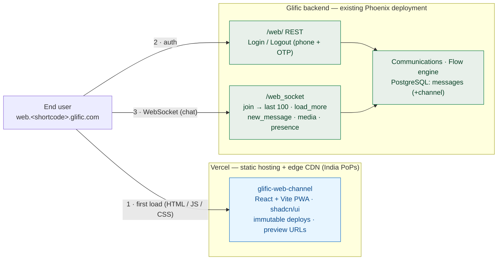

# Glific Web Channel — Technical Design

**Status:** Draft for review · **Author:** Vignesh Rajasekaran

Single consolidated technical design for the web channel — an NGO-branded, browser-based chat channel
that reuses Glific's contacts, `messages` table, and flow engine, with a channel discriminator on the
message and a presence-gated websocket transport.

**Companion docs:**
[Frontend hosting decision](./frontend-hosting-decision.md) — the full provider
comparison behind the Vercel choice below ·
[Custom UI messages](./custom-ui-design.md) — rich UI as JSON on the web channel: built-in
`glific/*` blocks (image panel, carousel, form) pre-rendered by the widget, plus opaque
org-namespace components (`tap/*`) rendered by the org's own client; the envelope contract,
authoring model, and the cross-channel direction for future channels (RCS/Telegram) ·
[API authentication](./api-auth-design.md) — how a partner org's own app authenticates its
end users: NGO-minted HS256 JWTs verified by Glific (`kid`-scoped per-org signing keys), the
`phone`/`username` contact identity split, revocation, and session expiry on a live socket.

---

## 1. Deployment architecture

- **New frontend repo `glific-web-channel`** (React + TypeScript + Vite), built independently of the
  staff app. A separate repo keeps the public bundle small, free of the staff GraphQL schema, and easy to
  host/fork.
- **Hosted on Vercel.** The static PWA is served from Vercel's edge CDN; custom DNS points each org's web
  channel (`web.<shortcode>.glific.com`) via CNAME at Vercel. **We go with Vercel first because it solves
  most of the current Glific-frontend pain in a single move** — India edge PoPs (fast first load),
  immutable/versioned deploys (no more lazy-load chunk 404s), zero-config preview deployments, and fast
  ~1–3 min deploys. Full comparison, cost model, and the phased rationale (incl. when to revisit Google
  CDN / Cloudflare) live in the [frontend hosting decision](./frontend-hosting-decision.md).
- **Backend contract — the `/web/` scope.** The frontend talks to the existing Glific backend through a
  dedicated URL scope, `/web/`:
  - a **WebSocket API** for sending/receiving messages (`join` → last 100, `load_more`, `new_message`,
    `media`, `presence`);
  - separate **Login / Logout REST** APIs for the web channel. Auth itself — the two modes,
    token contract, and revocation — is specified in
    [API authentication](./api-auth-design.md).
- All `/web/` endpoints (socket + REST) are namespaced under `/web/`, isolated from the staff GraphQL/REST
  surface. **There is no separate backend service** — the same Phoenix deployment serves them, and data
  resides in the existing PostgreSQL.

### Design decisions & alternatives considered

- **New repo vs. inside Glific** — a separate `glific-web-channel` repo. The end-user auth model is
  fundamentally different from the staff app (phone + OTP, not staff logins), so keeping it separate avoids
  entangling two auth models; it is also far easier for orgs to fork and modify. *Alternative considered:*
  building inside the existing Glific frontend — rejected because it couples the two auth models and
  complicates org forks.
- **Frontend framework — shadcn/ui** — chosen to try a newer, more modern stack; it ships
  chat-application building blocks out of the box, a big head start for a chat UI. *Alternative
  considered:* reusing the staff app's existing framework — passed over in favour of a fresh,
  chat-oriented toolkit.
- **Not a Phoenix umbrella app** — although the web channel shares the database and flow engine with the
  backend, we deliberately avoid an umbrella structure. *Alternative considered:* a Phoenix umbrella —
  rejected because the shared database and flow engine already couple the two; an umbrella would add
  structure without buying real isolation.
- **WebSockets over polling for chat** — real-time chat rides the stack's native subscription
  capabilities (Absinthe), giving a seamless, push-based experience. *Alternative considered:* HTTP
  long-polling — rejected as higher-latency and clumsier when first-class subscriptions are already
  available.

> **NOTE:** Anything below this is still being iterated on.

---

## 2. Component architecture

One picture: **send + receive**, the **web** channel sitting next to **Gupshup**, with the seams
highlighted. This is the *post-cleanup* target shape, not today's code. Adding a channel = one parser +
one `dispatch` clause; everything else is shared.

```mermaid
flowchart TB
  BEHAV["MessageBehaviour — send contract (cleanup C)<br/>send_text / send_image / ... · implemented by BOTH adapters<br/>returns &#123;:ok, Oban.Job&#125; async · &#123;:ok, Message&#125; sync · &#123;:ok, :deferred&#125; paused"]:::seam

  subgraph SEND["S E N D"]
    E1["Glific.Messages.create_and_send_message"]:::mod
    E2["create_message — persist + set channel"]:::mod
    CHSEAM{{"CHANNEL SEAM (cleanup A)<br/>Communications.dispatch — route by message.channel"}}:::seam

    subgraph GSEND["Gupshup send · ASYNC (channel = whatsapp)"]
      BSPSEAM{{"BSP SEAM<br/>provider_handler(org)<br/>Gupshup vs Gupshup Enterprise"}}:::seam
      G1["Gupshup.Adapter.send_text/... — build payload"]:::mod
      G2["Gupshup.Worker — Oban :gupshup"]:::mod
      G3["ApiClient — HTTP POST /msg"]:::ext
      G4["ResponseHandler — set status"]:::mod
    end

    subgraph WSEND["Web send · SYNC (channel = web)"]
      W1["Communications.WebMessage.send_message"]:::mod
      W2["Web.Adapter.deliver"]:::mod
      W3{"Presence.list(topic)<br/>connected?"}:::mod
      W4["Endpoint.broadcast — web_channel:contact_id"]:::ext
      WP["flow pauses · :deferred (T3)"]:::oos
    end
  end

  subgraph RECV["R E C E I V E"]
    subgraph GRECV["Gupshup receive"]
      GR1["POST /gupshup — webhook"]:::ext
      GR2["Shunt -> MessageController"]:::mod
      GR3["Gupshup.Adapter.parse_text/...<br/>(renamed from receive_*, cleanup B)"]:::mod
    end
    subgraph WRECV["Web receive"]
      WR1["RoomChannel.handle_in(new_message) — socket"]:::ext
      WR2["Web.Adapter.parse_text/..."]:::mod
    end
    INGEST{{"INGESTION SEAM (cleanup A)<br/>Communications.ingest — provider-agnostic<br/>contact upsert -> dedup -> create_message -> publish"}}:::seam
  end

  MSG[("messages<br/>+ channel discriminator")]:::db
  INBOX[["staff inbox · Absinthe subscriptions"]]:::sink
  FLOW["process_message — flow engine (out of scope)"]:::oos
  MAY["Maytapi / WhatsApp groups<br/>SEPARATE DOMAIN -> wa_messages<br/>off the messages-channel axis (cleanup D)"]:::dim

  E1 --> E2 --> CHSEAM
  CHSEAM -->|"channel = :whatsapp"| BSPSEAM --> G1 --> G2 --> G3 --> G4
  CHSEAM -->|"channel = :web"| W1 --> W2 --> W3
  W3 -->|"connected"| W4
  W3 -.->|"absent"| WP
  E2 --> MSG
  G4 -->|"update bsp_status :enqueued -> :sent"| MSG
  W4 -->|"mark :sent optimistic"| MSG

  GR1 --> GR2 --> GR3 --> INGEST
  WR1 --> WR2 --> INGEST
  INGEST -->|"create_message · channel = whatsapp or web"| MSG
  INGEST -.-> INBOX
  INGEST -.-> FLOW

  G3 -.->|"LATER · status webhook (delivered/read)"| GR2
  W4 -.->|"LATER · client ack over socket (delivered/read)"| WR1

  G4 -.-> INBOX
  W2 -.-> INBOX

  BEHAV -. "implemented by" .-> G1
  BEHAV -. "implemented by" .-> W2

  classDef seam fill:#fff3bf,stroke:#f08c00,stroke-width:2px,color:#5c3c00
  classDef mod fill:#e8f0ea,stroke:#0b7a45,color:#073f24
  classDef ext fill:#f1f3f5,stroke:#868e96,stroke-dasharray:4,color:#343a40
  classDef db fill:#ffe8cc,stroke:#e8590c,stroke-width:2px,color:#5c2000
  classDef oos fill:#ffe3e3,stroke:#e03131,stroke-dasharray:5,color:#8b0000
  classDef sink fill:#e7f5ff,stroke:#1971c2,color:#0b4a8b
  classDef dim fill:#f1f3f5,stroke:#adb5bd,stroke-dasharray:3,color:#868e96
```

**Legend:** yellow hexagon = **seam** (dispatch/convergence point) · green = business-logic module ·
grey dashed = external hop (HTTP/socket/webhook) · orange cylinder = database table · blue = fan-out sink
(staff inbox) · red dashed = out of scope (flow engine) / deferred · faint dashed = separate domain
(Maytapi/groups).

- **Browser** runs a phoenix JS client (Socket / Channel / Presence), joining `web_channel:<contact_id>`.
- **Phoenix web layer** (`/web_socket`, separate from the staff `/socket`): web login/logout endpoints;
  `WebChannelSocket` + `WebChannel.RoomChannel` + `Presence`.
- **CHANNEL SEAM (send)** — `Communications.dispatch` routes by `message.channel`: `:whatsapp` → Gupshup
  (async: Oban → HTTP → status webhook), `:web` → Web (sync: presence-gate → socket broadcast → client
  ack). This is the main web/Gupshup split.
- **Send contract** — `MessageBehaviour` is a single send contract implemented by BOTH adapters; its union
  return (`{:ok, Oban.Job}` async · `{:ok, Message}` sync · `{:ok, :deferred}` paused) is what lets the
  two delivery models coexist.
- **INGESTION SEAM (receive)** — every channel's parser converges on one provider-agnostic
  `Communications.ingest` (contact upsert → dedup → `create_message` → publish); only the per-channel
  parse step differs.
- **Presence gate** — on web send, connected → socket broadcast + `:delivered`; absent → pause the flow at
  the node (resume + deliver on reconnect).
- **Flow engine** — runs with `FlowContext.channel = "web"`; channel-scoped continuation (switch-over).
- **Staff Chat Inbox** — reads the same `messages` table; staff replies route back as `channel:"web"`
  (fan-out via Absinthe subscriptions).
- **Single PostgreSQL** — `messages` (+channel discriminator), `contacts` (shared), `flow_contexts`
  (+channel). Maytapi / WhatsApp groups stay a SEPARATE domain (`wa_messages`), deliberately off the
  messages-channel axis.

---

## 3. Impact on existing BigQuery schema & safe introduction

Glific streams several tables to each org's BigQuery dataset via a cron-triggered Oban worker. The schema
is hand-maintained in Elixir and the row-builder is an explicit named-key map. Two consequences:

1. The Postgres migration is **inert for BigQuery** until the row-builder emits the channel. Nothing
   downstream changes today.
2. **Emit-before-patch is a silent, per-org failure.** If the row-builder emits `channel` to an org whose
   BigQuery `messages` table lacks the column, `insertAll` returns fatal `insertErrors`, the job raises
   with `max_attempts: 1` (no retry), and that org's message sync stalls with no self-heal and no alert
   (the schema-patch path is fire-and-forget).

**Safe rollout order:**

1. Ship the Postgres migration (rewrite-safe). *— inert for BigQuery*
2. Add `channel` as a **NULLABLE STRING** to `message_schema`. *— do NOT touch the row-builder yet*
3. Bulk-patch every BigQuery-enabled org, then **VERIFY** each org's table schema (the patch loop is
   fire-and-forget).
4. **ONLY THEN** add `channel` to the row-builder and deploy.

Never collapse steps 2+4 ahead of 3. Historical rows read `channel = NULL` in BigQuery (the migration
doesn't bump `updated_at`); document `COALESCE(channel,'whatsapp')` for report authors — no existing
dashboard breaks. `flows.supported_channels` caveat: the BigQuery `flows` table is insert-only (never
re-synced on update), which is exactly why `supported_channels` is immutable at creation. For now,
BigQuery channel emission is **deferred to the production rollout** — off the critical path and requiring
the sequence above.

---

## 4. Open questions

1. **Authentication & session** (needs its own design). How end-users authenticate on the web channel
   (phone + OTP? a delegated/embedded model later?), the token/session model, OTP delivery (an India SMS
   provider), rate limiting on the public endpoints, and what an embeddable-widget future would require.
   Deliberately unspecified in this draft — **blocks build**.
2. **Find a seam for introducing web messages** — clearly map the messaging paths from Gupshup and Maytapi
   to identify how `web_message` is introduced seamlessly. Maytapi has already deviated slightly from
   Gupshup, so confirm whether it can be brought back in line.
3. **Scaling the backend — tracked as an open issue.** A thought experiment (500K concurrent sockets +
   daily fetch) concluded that *holding the sockets is cheap* (~2–4 nodes of memory); the real drivers are
   the **flow-engine CPU** and a **coupling risk** (one app holding sockets + flows + Oban). Likely
   direction: split a thin websocket gateway from `glific-core`, use a lighter connected-check than the
   Presence CRDT, and route daily-fetch reads to `RepoReplica` + PgBouncer. Out of scope for the MVP; to
   be filed as a GitHub issue for later.
4. **`supported_channels` array vs a `flow_type` enum** — confirm the model and migration path (a PG enum
   value cannot be reversed).
5. **`send_broadcast` across mixed channels** — recipients may sit on different channels; default: reach
   each recipient on their own available channel.
6. **"Update WhatsApp Group" stop-and-notify** — does the end-user see anything when the flow stops, or is
   the notification staff-only?
7. **Media pipeline** (voice notes, images, files over the socket) — storage (GCS), size limits, accepted
   formats, and how media is persisted alongside messages.
