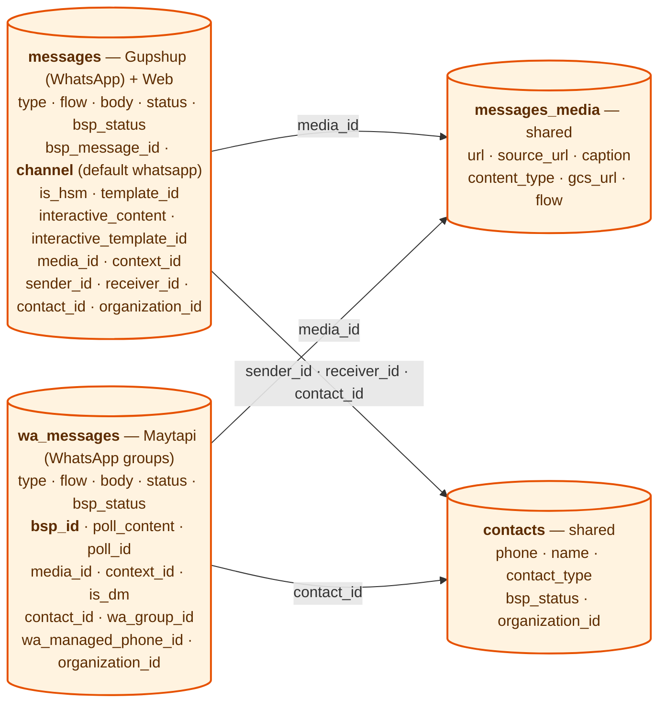
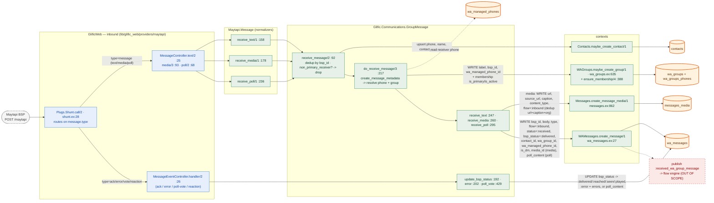

# T1 Spike — Message Send/Receive Flow Map (Gupshup & Maytapi)

> **Epic:** Web Channel — Phase 0 · **Ticket:** T1 (Spike)
> **Purpose:** map how messages are **sent** and **received** for the two existing WhatsApp providers —
> **Gupshup** (WhatsApp) and **Maytapi** (WhatsApp groups) — down to the database tables they write, so the
> web channel can plug into the same seam. This is a *read-only* code map; the **flow engine**
> (`process_message`, `FlowContext`, `Flows.*`) is deliberately **out of scope** and traced separately.

Every message type is covered: **text · media (image/audio/video/document/sticker) · HSM/template · interactive (list/quick-reply)**.

---

## How to read this document

Because GitHub's mermaid renderer degrades on very large single graphs, the map is split into **one diagram per path**
(reference · inbound · outbound · groups · overview) rather than one giant graph. They share the same visual language:

| Element | Meaning |
|---|---|
| **Blue box** | Web layer — Plug / Phoenix controller (`lib/glific_web/…`) |
| **Green box** | Business-logic function — `Module.function/arity` + `file:line` (`lib/glific/…`) |
| **Grey dashed box** | External hop — HTTP call to the BSP (Gupshup/Maytapi API) |
| **Orange cylinder** | Database table (key columns only — *not* the full schema) |
| **Red dashed box** | Out of scope — the flow engine boundary |
| **Solid arrow** | Call / data flow. Labels on arrows into a table = **fields written** on that hop |
| **Dotted arrow** | Async hand-off or status transition |

**Enum values used in the labels** (from `lib/glific/enums/constants/enums.ex`):
- `flow` → `:inbound` \| `:outbound`
- `status` / `bsp_status` (same `MessageStatus` enum) → `:enqueued :sent :delivered :read :received :error :contact_opt_out :reached :seen :played :deleted`
- `type` → `:text :image :audio :video :document :sticker :location :contact :list :quick_reply :hsm :poll :location_request_message :whatsapp_form_response`

---

## 1. Database tables (the destinations)

Three tables receive message writes. The **central design fact** of this spike: Gupshup writes the **shared `messages`**
table; Maytapi forks into a **parallel `wa_messages`** table. `messages_media` and `contacts` are shared by both.

**Why it matters for the web channel:** Maytapi's `wa_messages` fork means a *whole* parallel persistence + inbox +
BigQuery path. The web channel instead reuses `messages` with the existing **`channel`** discriminator (already present,
defaulting to `"whatsapp"`) — so it inherits the staff inbox, search, and warehouse sync for free. Note `wa_messages`
has **no** `is_hsm` / `template_id` / `interactive_content` columns → **HSM and interactive do not apply to groups**.

---

## 2. Gupshup — INBOUND (receive) + status callbacks

Webhook `POST /gupshup` → a `Shunt` plug routes on `type` + `payload_type` → per-type controller → provider normalizer
→ `Communications.Message.receive_message/2` → persist. The controller **always** replies `200 ""`; the flow engine is
dispatched asynchronously afterwards (out of scope).

```mermaid
flowchart LR
  IN(["Gupshup BSP<br/>POST /gupshup"]):::ext

  subgraph WEB["GlificWeb — inbound HTTP (lib/glific_web/providers/gupshup)"]
    SHUNT["Plugs.Shunt.call/2<br/>shunt.ex:28<br/>routes on type + payload_type"]:::ctrl
    MC_T["MessageController.text/2<br/>message_controller.ex:30"]:::ctrl
    MC_M["MessageController.media/3<br/>message_controller.ex:72"]:::ctrl
    MC_I["MessageController.interactive/3<br/>message_controller.ex:96"]:::ctrl
    MC_L["MessageController.location/2<br/>message_controller.ex:108"]:::ctrl
    EVT["MessageEventController.update_status/3<br/>message_event_controller.ex:59"]:::ctrl
  end

  subgraph GMSG["Glific.Providers.Gupshup.Message (normalizers)"]
    RT["receive_text/1 · message.ex:120"]:::mod
    RM["receive_media/1 · message.ex:146"]:::mod
    RI["receive_interactive/1 · message.ex:211"]:::mod
    RL["receive_location/1 · message.ex:166"]:::mod
  end

  subgraph COMM["Glific.Communications.Message"]
    RCV["receive_message/2 · :194"]:::mod
    DO["do_receive_message/3 · :208<br/>merges flow=:inbound,<br/>bsp_status=:delivered, status=:received"]:::mod
    CRT["receive_text/1 · :240"]:::mod
    CRM["receive_media/1 · :251 (Repo.transaction)"]:::mod
    CRL["receive_location/1 · :306"]:::mod
    UBS["update_bsp_status/3 · :166 err / :182 ok"]:::mod
  end

  subgraph PERSIST["Glific.Messages / Glific.Contacts"]
    MKC["maybe_create_contact/1 · contacts.ex:449"]:::mod
    CM["create_message/1 · messages.ex:181"]:::mod
    CMM["create_message_media/1 · messages.ex:862"]:::mod
  end

  CONTACTS[("contacts")]:::db
  MESSAGES[("messages")]:::db
  MEDIA[("messages_media")]:::db
  LOC[("locations")]:::db
  FLOW["process_message<br/>(flow engine — OUT OF SCOPE)"]:::oos

  IN --> SHUNT
  SHUNT -->|"text / quick_reply"| MC_T --> RT --> RCV
  SHUNT -->|"image/file/audio/video/sticker"| MC_M --> RM --> RCV
  SHUNT -->|"button_reply / list_reply"| MC_I --> RI --> RCV
  SHUNT -->|"location"| MC_L --> RL --> RCV
  SHUNT -->|"type = message-event"| EVT --> UBS

  RCV --> DO
  DO -->|"upsert phone, name, contact_type=WABA"| MKC --> CONTACTS
  DO --> CRT
  DO --> CRM
  DO --> CRL

  CRT -->|"WRITE body, type=:text/:list/:quick_reply,<br/>interactive_content (jsonb, if interactive),<br/>flow=:inbound, bsp_status=:delivered, status=:received,<br/>bsp_message_id, context_id, channel=whatsapp,<br/>sender_id=contact, receiver_id=org, contact_id=contact"| CM --> MESSAGES
  CRM -->|"WRITE url, source_url, caption,<br/>content_type, flow=:inbound<br/>(dedup by url+caption+org)"| CMM --> MEDIA
  CRM -->|"WRITE + media_id FK, type=:image/:audio/:video/:document/:sticker"| CM
  CRL -->|"WRITE type=:location, flow=:inbound"| CM
  CRL -->|"WRITE longitude, latitude, message_id, contact_id"| LOC

  UBS -->|"UPDATE WHERE bsp_message_id:<br/>bsp_status :enqueued->:sent->:delivered->:read"| MESSAGES
  EVT -.->|"failed: bsp_status=:error, errors=payload<br/>+ process_errors (1002 no-number / 471,1003 suspend org)"| MESSAGES

  CM -.->|"async Task.start + poolboy"| FLOW

  classDef ext fill:#f5f5f5,stroke:#888,stroke-dasharray:4,color:#333
  classDef ctrl fill:#e7eefc,stroke:#1565c0,color:#0d47a1
  classDef mod fill:#e8f0ea,stroke:#0b7a45,color:#073f24
  classDef db fill:#fff3e0,stroke:#e65100,stroke-width:2px,color:#5d2c00
  classDef oos fill:#fbe9e7,stroke:#c62828,stroke-dasharray:5,color:#8b0000
```

**Inbound notes**
- Every received type sets the same trio: `flow=:inbound`, `bsp_status=:delivered`, `status=:received` (`communications/message.ex:216`).
- **Divergences:** media inserts `messages_media` first and links `media_id` (inside a `Repo.transaction`, so a failed message insert rolls back the media — no orphans); location writes a `locations` row instead; interactive stores the reply **title in `body`** and the full reply in **`interactive_content`** (jsonb) and otherwise reuses the text insert path.
- **Idempotency:** inbound dedup relies on `unique_constraint [:bsp_message_id, :organization_id]`; a duplicate Gupshup re-delivery is swallowed as `:ok` (logged + counter), never surfaced as an error.
- **Status callbacks** are bulk `Repo.update_all` keyed on `bsp_message_id`; they mutate only `bsp_status` (+`errors` on failure) + `updated_at`. There are no `delivered_at`/`read_at` columns.
- **Dropped:** `contact`/vCard and any unmapped payload type hit `DefaultController.unknown/2` → `200 ""` with **no** DB write.

---

## 3. Gupshup — OUTBOUND (send)

The row is **persisted first** (`status=:enqueued`), then an **Oban job** does the HTTP call; the response
handler updates the row (`status=:sent`, `bsp_status=:enqueued`) — or `:error`. Later provider webhooks (§2) push
`bsp_status` on to `:sent/:delivered/:read`. HSM takes a separate HTTP endpoint (`PartnerAPI.send_template`).

```mermaid
flowchart LR
  FLOWIN["called by flow engine / staff reply<br/>— OUT OF SCOPE"]:::oos

  subgraph MSGS["Glific.Messages (create + persist)"]
    CASM["create_and_send_message/1<br/>messages.ex:282"]:::mod
    CFI["check_for_interactive/2<br/>messages.ex:304"]:::mod
    CASH["create_and_send_hsm_message/1<br/>messages.ex:625"]:::mod
    CFH["check_for_hsm_message/2<br/>messages.ex:351"]:::mod
    DSM["do_send_message/2 · messages.ex:366<br/>sets sender_id=org contact, flow=:outbound"]:::mod
    CM["create_message/1<br/>messages.ex:181"]:::mod
  end

  subgraph COMM["Glific.Communications.Message"]
    SM["send_message/2 · :42<br/>provider_handler -> Gupshup;<br/>@type_to_token dispatch"]:::mod
    HSR["handle_success_response/2 · :100"]:::mod
    HER["handle_error_response/2 · :145"]:::mod
  end

  subgraph GMSG["Glific.Providers.Gupshup.Message (payload builders)"]
    ST["send_text/2 :23"]:::mod
    SIMG["send_image/2 :32"]:::mod
    SAUD["send_audio/2 :48"]:::mod
    SVID["send_video/2 :61"]:::mod
    SDOC["send_document/2 :76"]:::mod
    SSTK["send_sticker/2 :89"]:::mod
    SINT["send_interactive/2 :101"]:::mod
    SMSG["send_message/3 :277<br/>+ create_oban_job/3 :305"]:::mod
  end

  subgraph WORKER["Gupshup.Worker (Oban)"]
    WCS["create_changeset/2 :26<br/>queue :gupshup / :gupshup_high_tps"]:::mod
    WP["perform/1 :45 -> process_gupshup/4"]:::mod
  end

  API["ApiClient.send_message/2 :65<br/>POST api.gupshup.io/wa/api/v1/msg"]:::ext
  PAPI["PartnerAPI.send_template/2 · partner_api.ex:194<br/>POST APP_URL/template/msg"]:::ext
  RH["ResponseHandler.handle_response/2<br/>response_handler.ex:21"]:::mod

  MESSAGES[("messages")]:::db
  MEDIA[("messages_media")]:::db

  FLOWIN --> CASM
  FLOWIN --> CASH
  CASM --> CFI --> CFH --> DSM
  CASH --> CFH
  DSM --> CM
  CM -->|"WRITE type, body, flow=:outbound, status=:enqueued,<br/>bsp_status=nil, channel=whatsapp, uuid,<br/>sender_id=org, receiver_id=contact, contact_id=contact<br/>— hsm: is_hsm=true + template_id<br/>— interactive: interactive_content + interactive_template_id<br/>— media: media_id"| MESSAGES
  CM -.->|"media only: UPDATE caption"| MEDIA
  CM --> SM
  SM --> ST & SIMG & SAUD & SVID & SDOC & SSTK & SINT
  ST & SIMG & SAUD & SVID & SDOC & SSTK & SINT --> SMSG
  SMSG --> WCS --> WP
  WP -->|"text / media / interactive"| API --> RH
  WP -->|"is_hsm=true"| PAPI --> RH
  RH -->|"2xx"| HSR
  RH -->|"4xx"| HER
  HSR -->|"UPDATE bsp_message_id, bsp_status=:enqueued,<br/>status=:sent, sent_at"| MESSAGES
  HER -->|"UPDATE bsp_status=:error, status=:sent, errors"| MESSAGES

  classDef ext fill:#f5f5f5,stroke:#888,stroke-dasharray:4,color:#333
  classDef mod fill:#e8f0ea,stroke:#0b7a45,color:#073f24
  classDef db fill:#fff3e0,stroke:#e65100,stroke-width:2px,color:#5d2c00
  classDef oos fill:#fbe9e7,stroke:#c62828,stroke-dasharray:5,color:#8b0000
```

**Outbound notes**
- The dispatch key is `message.type` via `@type_to_token` (`communications/message.ex:26`): `:list`/`:quick_reply`/`:location_request_message` all map to `send_interactive`; media types map to their `send_*`.
- **HSM** carries `is_hsm=true` + `template_id` on the row; `template_uuid`/`template_type`/`params` ride only in the Oban `attrs` (not columns) and select the `PartnerAPI.send_template` HTTP branch inside the worker.
- **messages_media is never INSERTed on send** — the media row is created upstream (upload/template import); the send path only *updates* its parsed caption and sets `messages.media_id`.
- `contacts` is **read-only** here: org sender via `Partners.organization_contact_id/1`, receiver via `Contacts.get_contact/1`.
- Failure modes: a 4xx sets `bsp_status=:error` but returns `:ok` (no Oban retry); only transport timeouts return `{:error, …}` to trigger a retry; a provider-handler exception sets `status=:error` (`communications/message.ex:81`).

---

## 4. Maytapi — SEND & RECEIVE (WhatsApp groups)

The **parallel stack**: its own communications context (`GroupMessage`), its own builders/worker/queue (`:wa_group`),
and its own table (`wa_messages`, keyed by `bsp_id` not `bsp_message_id`). **HSM/template and interactive are NOT
wired** here — `@type_to_token` (`wa_group_message.ex:31`) only has text/media/poll; anything else raises and is
rescued into an error. Supported: **text, media (image/audio/video/document/sticker), poll**.

### 4a. Maytapi — outbound (send)

```mermaid
flowchart LR
  ENTRY["Maytapi.Message.create_and_send_wa_message/3 · message.ex:25<br/>(collection fan-out: send_message_to_wa_group_collection/2 :71)<br/>callers = flow / wa_group_action — OUT OF SCOPE"]:::oos

  subgraph MMSG["Glific.Providers.Maytapi.Message"]
    CWM["create_wa_message/3 :37"]:::mod
    APD["add_poll_details/1 :53"]:::mod
  end

  subgraph WACTX["WAMessages / Communications.GroupMessage"]
    WCM["WAMessages.create_message/1<br/>wa_messages.ex:27"]:::mod
    GSM["GroupMessage.send_message/2 · wa_group_message.ex:46<br/>@type_to_token dispatch"]:::mod
  end

  subgraph MWA["Maytapi.WAMessages (payload builders)"]
    WST["send_text/2 :14"]:::mod
    WSI["send_image :23 · audio :38 · video :51<br/>document :66 · sticker :81"]:::mod
    WSP["send_poll/2 :94"]:::mod
    WOJ["create_oban_job/2 :154"]:::mod
  end

  MWP["WAWorker.perform/1 · wa_worker.ex:33<br/>Oban queue :wa_group -> process_maytapi/3 :72"]:::mod
  MAPI["ApiClient.send_message/3 :90<br/>POST api.maytapi.com/api/PRODUCT/PHONE_ID/sendMessage"]:::ext
  MRH["ResponseHandler.handle_response/2<br/>response_handler.ex:24"]:::mod

  WAMSG[("wa_messages")]:::db
  WAPOLL[("wa_polls")]:::db

  ENTRY --> CWM
  CWM -.->|poll: read poll_content| APD
  APD -.-> WAPOLL
  CWM --> WCM
  WCM -->|"WRITE type=:text/media/:poll, body, flow=:outbound,<br/>status=:enqueued, bsp_status=:sent, uuid,<br/>contact_id, wa_group_id, wa_managed_phone_id,<br/>media_id (media), poll_content + poll_id (poll)"| WAMSG
  WCM --> GSM
  GSM --> WST & WSI & WSP
  WST & WSI & WSP --> WOJ --> MWP
  MWP --> MAPI --> MRH
  MRH -->|"2xx: UPDATE bsp_id, bsp_status=:enqueued,<br/>status=:sent, sent_at"| WAMSG
  MRH -->|"4xx/err: UPDATE bsp_status=:error, status=:sent,<br/>errors + create_notification"| WAMSG

  classDef ext fill:#f5f5f5,stroke:#888,stroke-dasharray:4,color:#333
  classDef mod fill:#e8f0ea,stroke:#0b7a45,color:#073f24
  classDef db fill:#fff3e0,stroke:#e65100,stroke-width:2px,color:#5d2c00
  classDef oos fill:#fbe9e7,stroke:#c62828,stroke-dasharray:5,color:#8b0000
```

### 4b. Maytapi — inbound (receive) + ack/error events

Note the extra inbound gating unique to groups: **dedup by `bsp_id`**, a **non-primary-receiver drop** (so only the
group's primary managed phone ingests), and **lazy group/membership creation** (`wa_groups` + `wa_groups_phones`).

**Maytapi notes**
- Outbound insert sets `bsp_status=:sent` (from the "sent" string), *then* the 2xx handler flips it to `:enqueued` and sets `status=:sent` + `bsp_id` — the opposite starting point from Gupshup (which inserts `bsp_status=nil`).
- Self-echo: when Maytapi replays the org's own sent message (`fromMe=true`), `receive_*` keeps `flow=:outbound`/`status=:sent`; genuine inbound is `flow=:inbound`/`status=:received`. `bsp_status` on receive is always `:delivered`.
- `wa_managed_phones` is read (receiver resolution) and only written by the separate phone-health `StatusController`.
- Reactions/poll-votes update side tables (`wa_reactions`, `wa_messages.poll_content`); they don't create message rows.

---

## 5. Synthesis — the two stacks & the extensibility seam

Both existing channels are **async BSP**: persist → enqueue Oban → HTTP → response handler updates status → (later)
provider webhook pushes delivery status. They differ only in *where they persist* — Gupshup into shared `messages`,
Maytapi into parallel `wa_messages`. The **seam** that lets a new channel join is `MessageBehaviour`: its `send_*`
callbacks already return a **union**, so a synchronous channel (web) can return `{:ok, Message.t()}` instead of an
Oban job — no queue, no HTTP, no webhook.

```mermaid
flowchart TB
  APP["Glific.Messages<br/>create_and_send_message / _hsm"]:::mod
  D1["Glific.Communications.Message<br/>provider_handler -> BSP"]:::mod
  D2["Glific.Communications.GroupMessage<br/>hardcoded Maytapi"]:::mod

  subgraph GSTACK["Gupshup — WhatsApp (async BSP)"]
    G1["Providers.Gupshup.Message"]:::mod
    G2["Gupshup.Worker · Oban :gupshup"]:::mod
    G3["ApiClient / PartnerAPI · HTTP"]:::ext
  end
  subgraph MSTACK["Maytapi — WhatsApp groups (async BSP)"]
    M1["Maytapi.WAMessages"]:::mod
    M2["Maytapi.WAWorker · Oban :wa_group"]:::mod
    M3["ApiClient · HTTP"]:::ext
  end

  SEAM["MessageBehaviour — the send seam<br/>send_* returns a UNION:<br/>&#123;:ok, Oban.Job.t()&#125; = async BSP (Gupshup, Maytapi)<br/>&#123;:ok, Message.t()&#125; = synchronous (web channel)"]:::seam

  MESSAGES[("messages<br/>+ channel discriminator")]:::db
  WAMSG[("wa_messages<br/>PARALLEL table")]:::db
  MEDIA[("messages_media · shared")]:::db

  WEB["Providers.Web.Message (T2/T3)<br/>synchronous socket deliver -> {:ok, Message}"]:::oos

  APP --> D1
  D1 -->|":gupshup"| G1 --> G2 --> G3
  D2 --> M1 --> M2 --> M3
  APP --> MESSAGES
  D2 --> WAMSG
  MESSAGES --> MEDIA
  WAMSG --> MEDIA

  G1 -. implements .-> SEAM
  M1 -. implements .-> SEAM
  SEAM -. web adds sync member .-> WEB
  WEB -. reuses .-> MESSAGES

  classDef ext fill:#f5f5f5,stroke:#888,stroke-dasharray:4,color:#333
  classDef mod fill:#e8f0ea,stroke:#0b7a45,color:#073f24
  classDef db fill:#fff3e0,stroke:#e65100,stroke-width:2px,color:#5d2c00
  classDef oos fill:#fbe9e7,stroke:#c62828,stroke-dasharray:5,color:#8b0000
  classDef seam fill:#fff9c4,stroke:#f9a825,stroke-width:2px,color:#5d4200
```

---

## 6. Key findings for the web channel (T2+)

**1. The seam is one behaviour with a union return — web is the first synchronous member.**
`MessageBehaviour.send_*` already returns `{:ok, Oban.Job.t()} | {:ok, Message.t()}`. Gupshup/Maytapi return the Oban
job; `Providers.Web.Message` returns `{:ok, Message.t()}` after a live socket broadcast — **no Oban queue, no HTTP,
no provider webhook**. Everything downstream of the send fork already tolerates this.

**2. Reuse `messages`; do not fork a `web_messages` table.** Gupshup writes shared `messages`; Maytapi forked
`wa_messages` and thereby duplicated its inbox query, status lifecycle, and (separately) its BigQuery sync. The web
channel takes Gupshup's path — a `channel` discriminator on `messages` (already present) — so it inherits the staff
inbox, search, and warehouse for free. `messages_media` and `contacts` are reused unchanged.

**3. Persistence primitives are shared and channel-agnostic.** Both inbound (`create_message/1`, `messages.ex:181`)
and outbound (`do_send_message/2` → `create_message/1`) already flow through the same insert. The web channel adds a
`channel: "web"` attr and otherwise reuses them. Inbound media reuse (`create_message_media/1`, `messages.ex:862`,
deduped by url+caption+org) also works as-is.

**4. Where the web fork attaches (mirrors the WhatsApp forks precisely):**

| Concern | WhatsApp (Gupshup) | Web channel (T2/T3) |
|---|---|---|
| Outbound routing | `send_message/2` → `provider_handler` (`communications/message.ex:42`) | add a `check_for_hsm_message(%{channel: "web"})` branch in `messages.ex` → `Communications.WebMessage.send_message`, **before** the WhatsApp session-window/HSM gate |
| Outbound delivery | persist `:enqueued` → Oban → HTTP → `:sent` | persist → **presence check** → connected: socket broadcast + `:sent`/`:delivered` inline; absent: **pause** (T3) |
| Inbound entry | `Shunt` → controller → `receive_message/2` | Phoenix Channel `handle_in` → `WebMessage.receive_message` → `create_message(channel:"web")` |
| Inbound flow handoff | `publish_data(:received_message)` → `process_message` (async) | same — but **T2 stops before `process_message`**; T3 re-enables it |
| Table | `messages` | `messages` (same, `channel="web"`) |

**5. The status lifecycle is the one place web MUST diverge.** BSP flow is `:enqueued → :sent` (API 2xx) `→ :delivered/:read`
(webhook). Web has **no webhook** — *presence is the delivery signal*: connected → set delivered inline; absent → the
flow **pauses** (T3), it is not marked `:error` like an undeliverable BSP send. This is the core behavioural change and
belongs in `WebMessage.send_message` + the flow-pause work, not in the shared `create_message`.

**6. HSM & interactive scope.** HSM/template and interactive live **only** on the Gupshup→`messages` stack
(`is_hsm`+`template_id`, `interactive_content`+`interactive_template_id`); Maytapi groups support only text/media/poll.
For web (T4), the **interactive path is reusable** (`interactive_content` is channel-neutral jsonb — buttons render in
the web UI); **HSM/templates are a WhatsApp session-window construct** and likely a no-op on web, though the columns
exist and won't break. This confirms the T4 rule: all nodes run on web except the WhatsApp-group node.

**7. A third communications context, not a third provider dispatch.** Maytapi is reached via a *hardcoded* context
(`GroupMessage`) rather than through `provider_handler`. `WebMessage` follows the same shape — a dedicated context that
calls `Providers.Web.Message` directly — so `provider_handler/1` (which resolves the org's BSP credential) stays
untouched.

---

*Scope reminder: this map ends at persistence and the `process_message` boundary. The flow engine (how a stored
inbound message drives a flow, and how flow-driven sends originate) is traced separately in T3.*
